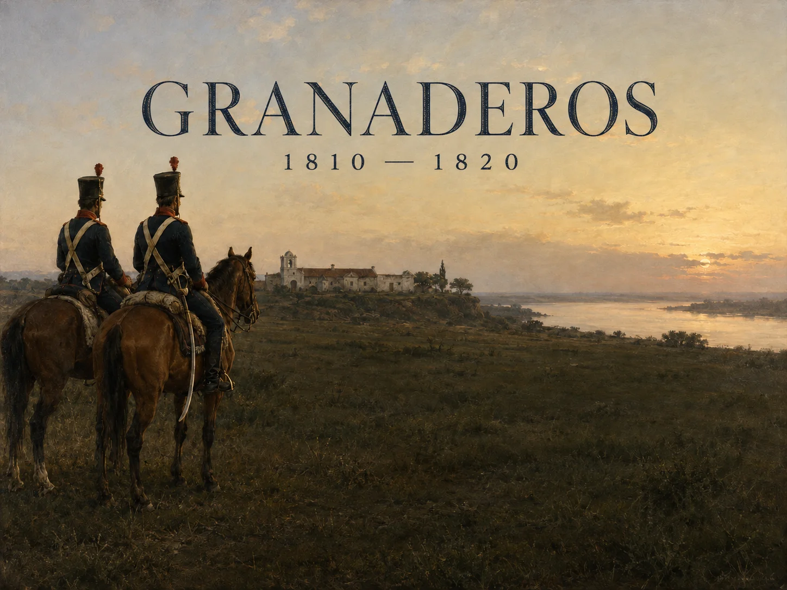

# Granaderos

**Raise an army. Keep it supplied. Lead it into battle.**



A browser strategy and turn-based tactical game set during the **Argentine War of Independence (1810–1820)**. Recruit historical figures, manage a campaign across the provinces, and command your squad through smoke, musket fire, and cavalry charges.

Inspired by **Jagged Alliance 2 v1.13**, Granaderos connects decisions at your campaign desk to the soldiers and supplies you take onto the battlefield. Player-facing content is **Spanish**; code and documentation are English.

**Playable and in development.** The complete design has not yet passed its completion audit. See the [progress ledger](docs/PROGRESS.md) for implemented systems, evidence, and remaining work.

[Run locally](#run-locally) · [Gameplay](#how-you-play) · [Artwork](#faces-of-the-campaign) · [Development](#development)

## How you play

The campaign is fought on two scales: a strategic map where you prepare your forces, and tactical maps where every action spends precious time and ammunition.

| At the campaign desk | On the battlefield |
| --- | --- |
| Recruit officers and volunteers, equip squads, and pay stipends. | Move and fight with a limited action-point budget. |
| Secure provinces and protect the routes that keep them supplied. | Balance musket fire and slow reloads against melee and mounted charges. |
| Turn raw materials into uniforms, weapons, and artillery. | Account for smoke, misfires, terrain, and lines of sight. |
| Negotiate with factions and prepare defenses against raids. | Bring surviving soldiers and remaining ammunition back to the campaign. |

Battles have lasting consequences: casualties and spent supplies affect what you can do next. A successful advance needs recruits, production, diplomacy, and a route home as much as it needs a winning volley.

## From Retiro to the Andes

The campaign follows five stages inspired by San Martín's military preparations:

1. **Retiro** — gather the horses, muskets, and materials needed to organize the force.
2. **San Lorenzo** — fight the river encounter on its authored tactical map.
3. **Yatasto** — secure the northern campaign and negotiate its support.
4. **El Plumerillo** — fund the foundry and prepare equipped infantry and artillery.
5. **The Andean preparations** — meet the military and diplomatic requirements that unlock San Martín and complete the campaign objectives.

Thirteen strategic sectors connect the campaign's theaters, with fourteen authored tactical maps including San Lorenzo. This is a historical interpretation built around the [supplied game design](docs/specification/original.txt); logistics, geography, and events are adapted for play.

## Faces of the campaign

<table>
  <tr>
    <td align="center"><br><strong>Martín Miguel de Güemes</strong></td>
    <td align="center"><br><strong>Juan Bautista Cabral</strong></td>
    <td align="center"><br><strong>Juana Azurduy</strong></td>
  </tr>
</table>

The roster includes thirteen historical operatives with distinct attributes, equipment, and recruitment conditions, alongside civic volunteers and a custom officer system.

The title painting and portraits above are **original game artwork, not gameplay screenshots**. AI-generated paintings and portraits are retained with their prompts and source files; likenesses and uniform details are artistic interpretations. See the [artwork documentation](assets/README.md) and [portrait references](assets/portrait-references.md) for provenance and historical limitations.

## Run locally

Requires **Node.js 22.13.0 or newer** and npm.

```sh
git clone https://github.com/fsodano/granaderos.git
cd granaderos
npm ci --prefix web
npm run dev
```

Open **http://localhost:3000**. Campaign saves are stored in your browser; use **Guardar** to export a portable save file.

The playable version uses JavaScript and React. You do not need the engine submodule or an original JA2 installation to run or build the browser game.

## Development

Run these commands from the repository root after installing the web dependencies:

```sh
npm test             # Rules, campaign, maps, and integration checks
npm run typecheck    # TypeScript validation
npm run build        # Static production artifact in dist/
```

Automated checks verify rules and integration; they do not establish that a human has completed the campaign. Remaining release work includes broader gameplay fidelity, animation and dialogue coverage, historical review, balance, and an end-to-end playthrough.

| Path | What lives here |
| --- | --- |
| [web/](web/) | Spanish browser interface and installed artwork |
| [game/](game/) | Tactical rules, campaign systems, authored maps, and save validation |
| [assets/](assets/) | Original art, generation prompts, references, and reproducible exports |
| [tests/](tests/) | Rules and integration checks |
| [docs/](docs/) | Design, implementation notes, and verification records |
| `engine/`, `native/`, `patches/`, `mod/` | Upstream source and earlier native conversion work retained for reference |

For more detail, read the [campaign systems guide](docs/WEB-SYSTEMS.md), [tactical verification notes](docs/tactical-verification.md), and [requirement audit](docs/REQUIREMENT-AUDIT.md).

## Contributing

Start with the [progress ledger](docs/PROGRESS.md) to find outstanding work and its acceptance criteria. Make changes on a feature branch and submit a pull request with relevant verification evidence. Keep generated assets reproducible from committed source inputs, and distinguish automated checks from actual gameplay verification.

[VERSION](VERSION) follows Semantic Versioning. Development milestones use prerelease versions; **1.0.0** requires the full supplied specification to pass its completion audit.
