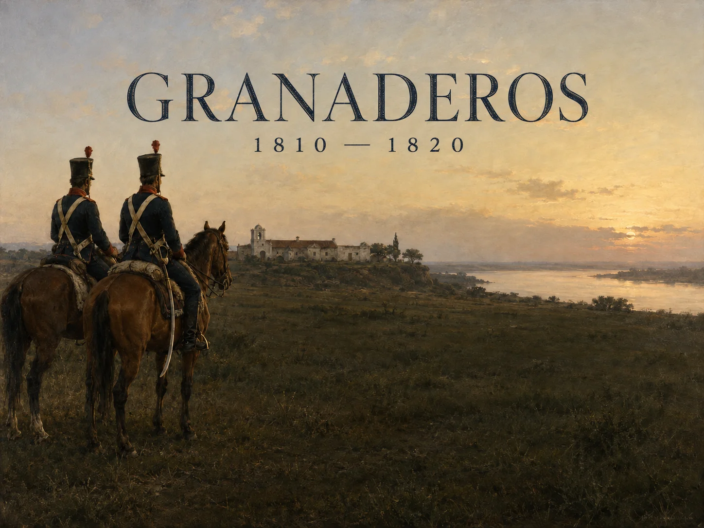
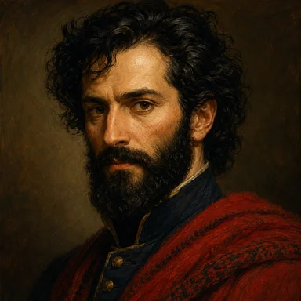
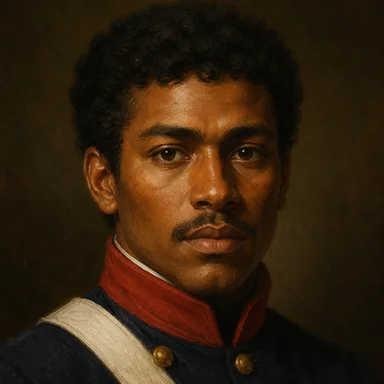

# Granaderos

**Raise an army. Keep it supplied. Lead it into battle.**



Granaderos is a browser strategy and turn-based tactical game set during the Argentine War of Independence. Recruit a force, manage funds and alliances, and command individual soldiers in battle. The game draws on **Jagged Alliance 2 v1.13** and adapts its systems to the weapons and conditions of the period.

The game interface is **Spanish**. Code and documentation are English.

**Playable and in development.** The full game and story editor are not complete. Read the [published progress ledger](docs/verification/published-progress.md) for delivered features, verification evidence and open acceptance work. The [development-workspace acceptance record](docs/verification/gameplay-completion.md) covers separate work that has not all reached `main`.

[Play in your browser](https://fsodano.github.io/granaderos/) · [Run locally](#run-locally) · [Gameplay](#gameplay) · [Development](#development) · [Documentation](docs/README.md)

## Play in your browser

Open [Granaderos on GitHub Pages](https://fsodano.github.io/granaderos/). No installation is required. Choose **Nueva campaña** to start a campaign or **Combate de San Lorenzo** to start a separate battle.

The game saves progress in your browser. Use **Guardar** to export a save file and **Importar partida** to load it. Browser storage is separate for GitHub Pages and localhost. Export and import a save to move your campaign between them.

## Run locally

Install **Node.js 22.13.0 or newer** and npm. Then run:

```sh
git clone https://github.com/fsodano/granaderos.git
cd granaderos
npm ci --prefix web
npm run dev
```

Open [localhost:3000](http://localhost:3000), or the address shown by the development server.

Choose **Nueva campaña** to start at the Retiro desk. Retiro is the only controlled sector. Hire combatants or create your own free character; the first person in service advances the opening chapter without an extra academy payment. Hires use the quoted contract price and must arrive before joining the force. **Combate de San Lorenzo** starts a separate battle.

The game saves campaign progress in browser storage. Use **Guardar** to export a portable save file and **Importar partida** to load one.

The title screen also opens the [story editor](docs/development/story-editor.md) at `/story` and the [sector editor](docs/development/sector-editor.md) at `/editor`.

The browser game uses JavaScript and React. It does not require the engine submodule or an original JA2 installation.

## Gameplay

The campaign connects strategic decisions to persistent tactical encounters. Soldiers retain their wounds and equipment. Casualties and spent ammunition affect later decisions.

| On the campaign map | On the battlefield |
| --- | --- |
| Hire combatants, form squads and pay contracts. | Explore sectors and enter turn-based combat on contact. |
| Secure routes, buy equipment and fund the army. | Manage action points, ammunition, reloads and weapon condition. |
| Train militia, repair equipment and treat wounded soldiers. | Use terrain, lines of sight, smoke and posture. |
| Negotiate alliances and defend captured sectors. | Fight with firearms, blades, cavalry and crew-served artillery. |

The campaign uses pesos as its only strategic resource. Town income, paid quests and recovered cash fund recruitment, equipment and preparations. There are no material stockpiles, production chains, resource convoys or horse care. Start a new campaign after the economy update; earlier economy saves are not converted.

Land cells and city districts can be selected, reached and explored with their own saved scenes. Open-water cells do not support land travel.

The campaign begins with Retiro under your control. Its chapters follow San Lorenzo, the northern campaign and Yatasto, El Plumerillo, and preparations for the Army of the Andes. Maps and events are historical interpretations adapted for play.

Use the in-game **Manual de campaña** for an introduction. See the [tactical controls](docs/gameplay/tactical/TACTICAL-HOTKEYS.md) for keyboard and mouse commands, and the [documentation index](docs/README.md) for system guides and verification records.

## Faces of the campaign

<table>
  <tr>
    <td align="center"><br><strong>Martín Miguel de Güemes</strong></td>
    <td align="center"><br><strong>Juan Bautista Cabral</strong></td>
    <td align="center"><br><strong>Juana Azurduy</strong></td>
  </tr>
</table>

Historical figures serve alongside fictional paid volunteers and a custom character. Their attributes, equipment and recruitment conditions differ.

The images above are **game artwork, not gameplay screenshots**. AI-generated paintings and portraits have retained prompts and source files. Likenesses and uniform details are artistic interpretations. See the [artwork documentation](assets/README.md) and [portrait references](assets/portrait-references.md) for provenance and limitations.

## Development

Run these commands from the repository root after installing the web dependencies:

```sh
npm run test:quick   # Routine development checks
npm test             # All checks, including complete campaign routes
npm run typecheck    # TypeScript validation
npm run build        # Build and validate the static export in dist/
```

Use the [development guide](docs/development/getting-started.md#checks) to select focused, quick or complete checks. Run the complete suite before a release or a change to shared gameplay rules.

Start with the [published progress ledger](docs/verification/published-progress.md) for tested scope and remaining work. The [verification index](docs/verification/README.md) also preserves separate development-workspace records. Automated checks cover specific scenarios; complete campaign acceptance also requires gameplay evidence.

| Path | Contents |
| --- | --- |
| [web/](web/) | Browser interface, editors and installed artwork |
| [game/](game/) | Tactical rules, campaign systems, maps and save validation |
| [assets/](assets/) | Artwork sources, prompts, references and exports |
| [tests/](tests/) | Rules and integration checks |
| [tools/](tools/) | Build, asset and verification tools |
| [docs/](docs/README.md) | Guides, design documents and verification records |
| `engine/`, `native/`, `patches/`, `mod/` | Upstream source and earlier native conversion work |

Read the [development guide](docs/development/getting-started.md) for setup, build outputs and verification guidance. The browser implementation is the primary game; the earlier native conversion has separate build and runtime requirements.

For contributions, identify the relevant acceptance criteria in the [published progress ledger](docs/verification/published-progress.md) and [documentation index](docs/README.md). Submit a focused pull request with verification evidence. Keep generated assets reproducible from their source inputs and state which behavior was checked in the browser.

[VERSION](VERSION) records the development version. A 1.0.0 release requires the supplied specification to pass its completion audit.
