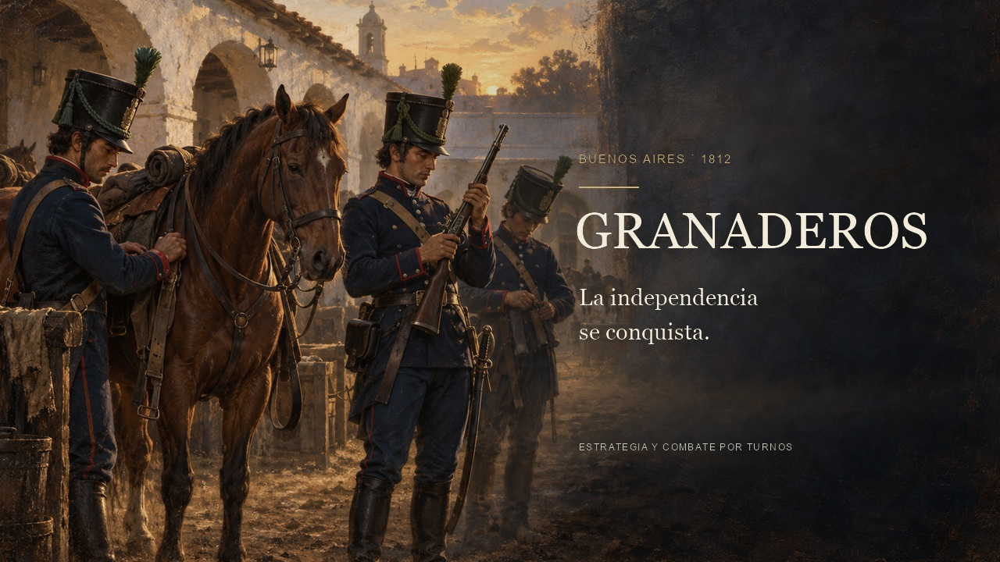

# Granaderos — La independencia se conquista

Tráiler histórico de 56 segundos con 44 segundos de grabación real del juego, textos en español y música original. La apertura muestra una ilustración de los preparativos de los Granaderos en Buenos Aires, en 1812. El video presenta el reclutamiento, el mapa de campaña, el equipo y el combate táctico de San Lorenzo. Muestra una versión en desarrollo.

[](granaderos-intro.mp4?raw=true)

- [Ver o descargar el video](granaderos-intro.mp4?raw=true).
- [Leer los textos del video](captions.es.srt).
- [Consultar el montaje y las fuentes](manifest.json).
- [Consultar la grabación y las acciones](source/capture-manifest.json).
- [Consultar la ilustración, su instrucción de generación y sus referencias](source/artwork-source.json).

Los cinco clips de `source/` son grabaciones en movimiento de la interfaz normal del juego. Se tomaron en un navegador y un origen local separados para conservar las partidas del usuario. El manifiesto de captura registra la fecha, la revisión exacta, el navegador, las acciones y los intervalos seleccionados. El montaje conserva la velocidad de las acciones. La franja de títulos se agrega fuera de la imagen del juego; la grabación se reduce de forma proporcional para conservar la interfaz completa.

La apertura y el cierre usan una **ilustración creada con IA**, no una fotografía histórica ni una captura del juego. Las personas, los edificios y el equipo son interpretaciones artísticas. La referencia del [Museo Municipal Retorno a la Patria](https://tunuyan.gov.ar/vivitunuyan/parque-tematico-sanmartiniano/museo-municipal-retorno-a-la-patria/uniforme/) guía la casaca recta, los botones, el penacho verde y las botas del uniforme temprano. La creación del regimiento en 1812 está documentada por el [Ministerio de Defensa](https://www.argentina.gob.ar/noticias/taiana-encabezo-el-acto-por-el-210deg-aniversario-de-la-creacion-del-regimiento-de). El combate del 3 de febrero de 1813 está documentado por el [Ejército Argentino](https://www.argentina.gob.ar/noticias/205o-aniversario-del-combate-de-san-lorenzo).

`score.py` genera música original con síntesis de cuerdas y percusión. No utiliza muestras ni música externa. El video no presenta esa música como audio capturado del juego. Las fuentes tipográficas pertenecen al sistema y no se distribuyen con el video.

## Volver a generar el video

Requiere Python 3.9 o posterior, Pillow, NumPy y FFmpeg con H.264 y AAC. Desde la raíz del repositorio:

```sh
python3 -m pip install Pillow numpy
python3 assets/video/intro/render.py --preview
python3 assets/video/intro/render.py
```

La vista previa se guarda en `.cache/intro-video/contact-sheet.jpg`. El renderizador actualiza el video, la portada, la vista previa animada, los subtítulos y el manifiesto. Las grabaciones originales seleccionadas y la ilustración se conservan en `source/`.

Para volver a grabar el juego en macOS, instalá las dependencias web y Playwright. Usá un origen separado del que contiene tus partidas. La grabación requiere Google Chrome y FFmpeg.

```sh
npm ci --prefix web
npm install --prefix .cache/trailer-capture-deps --no-save playwright
npm --prefix web run dev -- --host 127.0.0.1 --port 3210
```

En otra terminal, desde la raíz del repositorio:

```sh
GRANADEROS_CAPTURE_ORIGIN=http://127.0.0.1:3210 \
PLAYWRIGHT_MODULE="$PWD/.cache/trailer-capture-deps/node_modules/playwright/index.mjs" \
node assets/video/intro/capture.mjs
```

En Linux, asigná también la ruta de Chrome o Chromium a `CHROMIUM_EXECUTABLE`. Si el puerto indicado está ocupado, elegí otro puerto libre y actualizá `GRANADEROS_CAPTURE_ORIGIN`.

En macOS se usan Georgia y Arial. En Linux se usan DejaVu Serif y DejaVu Sans. Para elegir otras fuentes, asigná sus rutas a `INTRO_SERIF` e `INTRO_SANS`. Un cambio de fuente puede modificar el aspecto del video.

El archivo final usa MP4, H.264, color YUV 4:2:0, 30 cuadros por segundo y audio AAC estéreo. La vista previa animada del README enlaza a la descarga del video completo. Las fuentes conservadas permiten revisar qué partes son ilustración y qué partes son grabación del juego.
