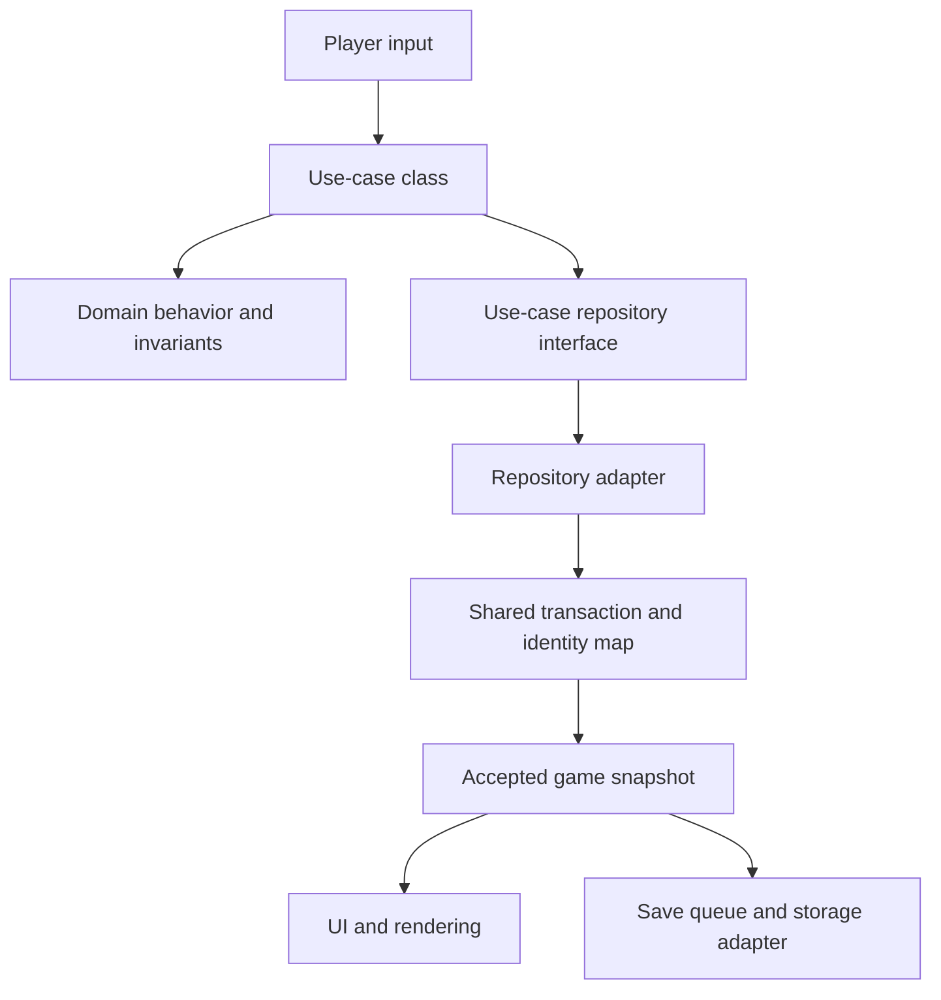

# Understand the game from the player to the source

[Architecture guide](README.md) · [C4 views](c4.md) · [Source map](system-map.md)

This overview explains how Granaderos connects strategic campaign management and tactical sector visits across one continuing world, who owns each piece of state, and how player intentions travel from the browser interface through application use cases and domain objects to storage. It is the starting point for the [architecture guide](README.md) and connects directly to the [C4 views](c4.md), the [system map](system-map.md), the [use-case catalogue](use-cases/README.md), and the [runtime flows](runtime-flows.md).

## 1. One force, two scales

Granaderos lets you manage a force on a campaign map and control individual combatants inside a sector. The campaign map governs where squads travel, which localities they control, and how game time affects service contracts, wounds, treasury funds, and supplies. A sector visit shows physical terrain, buildings, residents, equipment, and local encounters.

A sector visit can be peaceful exploration or include one or more combat episodes. The same characters and items continue across both scales with one authoritative owner per fact:

- `Character` owns persistent identity, `Health` (current and maximum hit points, bleeding, and bandaged wounds), `CharacterAbilities` (ratings, traits, and capabilities), `ServiceContract`, and strategic `locationId`.
- `Squad` and `Journey` own strategic squad membership and physical route progress between sectors; during an active or suspended `SectorSession`, local coordinates on the sector grid belong to the sector visit and synchronize with strategic location on entry and exit.
- `Inventory` and `ItemCustody` own item quantities, pocket placement, and the single authoritative custodian (`character`, `container`, `ground`, or `corpse`) for every item.
- `SectorParticipant` references a `Character` by `characterId` and owns only visit-local action points (`ActionPoints`). Read models, retained sector caches, and `ResidentPositionReference` projections never create a second owner of character health, inventory, position, or item custody.

Domain rule ownership is separate from state ownership. The
[`actor-condition.ts`](../../packages/game/domain/personnel/actor-condition.ts)
module owns the critical-health threshold, unconsciousness, field capability,
and condition-refresh effects.
[`medical-patient.ts`](../../packages/game/domain/personnel/medical-patient.ts)
owns care presence and acceptance, and
[`completed-victory.ts`](../../packages/game/domain/combat/completed-victory.ts)
owns the decision that the field has been won. The retained root modules
[`actor-condition.js`](../../packages/game/actor-condition.js),
[`medical-patient.js`](../../packages/game/medical-patient.js), and
[`battle-outcome.js`](../../packages/game/battle-outcome.js) re-export those
domain rules.
[`care-rules.ts`](../../packages/game/domain/personnel/care-rules.ts) owns
default treatment and rest tuning and the default strategic bleeding
percentage. [`campaign-care-rules.js`](../../packages/game/campaign-care-rules.js)
selects campaign-authored values and uses those domain defaults; the shared
[`campaign-rules-schema.js`](../../packages/campaign-format/campaign-rules-schema.js)
defines and validates the authored fields.

[`captive-service.ts`](../../packages/game/domain/personnel/captive-service.ts)
owns the remaining service time on a captured combatant's `ServiceContract` and
the contract reconstruction at release. The retained
[`prisoner-custody.js`](../../packages/game/prisoner-custody.js) re-exports
those rules and keeps `prisonerStatus`, a query over campaign character and
detention records. The query delegates its service-hours calculation to the
domain rule.

[`militia-patrol.ts`](../../packages/game/domain/personnel/militia-patrol.ts)
owns default patrol tuning and `validateCampaignPatrol`, the rule that checks
whether a saved scene's patrol settings agree with the campaign package or the
domain defaults. It also owns the patrol-turn decision, waypoint selection (the
map position the patrol moves toward), and reachable-cell choice. The retained
[`militia-patrol-rules.js`](../../packages/game/militia-patrol-rules.js)
keeps the campaign-content lookup and re-exports the domain defaults and scene
consistency rule. The shared
[`campaign-rules-schema.js`](../../packages/campaign-format/campaign-rules-schema.js)
continues to own the authored field contract and structural validation.
The domain's `canAct` check owns patrol eligibility for movement and the
retained sight filter. [`militia-patrol.js`](../../packages/game/militia-patrol.js)
uses that check for sight-query observers and opponents, asks tactical map code
for visibility and reachable cells, then assembles the move order.

[`targeted-combat.ts`](../../packages/game/domain/combat/targeted-combat.ts)
owns aimed-shot eligibility, available body regions, region profiles and
labels, aiming penalties, and effects; it uses
[`BodyRegion`](../../packages/game/domain/combat/body-region.ts) for region
modifiers and physical impact. [`tactical-space.ts`](../../packages/game/domain/sector-sessions/tactical-space.ts)
owns tactical-level and cell-space rules, while
[`tactical-grid.ts`](../../packages/game/domain/sector-sessions/tactical-grid.ts)
owns the label for a tactical cell. The retained
[`targeted-combat.js`](../../packages/game/targeted-combat.js) and
[`tactical-grid.js`](../../packages/game/tactical-grid.js) modules re-export
their domain rules.
[`tactical-planning-space.ts`](../../packages/game/domain/sector-sessions/tactical-planning-space.ts)
owns planning-point normalization, movement-order construction, and
same-surface hand reach. The retained
[`tactical-planning-space.ts`](../../packages/game/tactical-planning-space.ts)
re-exports those helpers.
[`weapon-reload.ts`](../../packages/game/domain/combat/weapon-reload.ts) owns
reload-round cost, stored-progress validation, and planning beside
`ReloadWork` (partial loading work) and `ReloadRules` (reload multipliers) in
[`reload-work.ts`](../../packages/game/domain/combat/reload-work.ts); the
retained [`weapon-reload.js`](../../packages/game/weapon-reload.js) re-exports
those domain functions.

[`projectile-air-drag.ts`](../../packages/game/domain/combat/projectile-air-drag.ts)
decides whether a weapon has a usable air-drag profile (the fraction retained
at the weapon's range) and how much energy remains after each distance. This
rule sits beside the launch-energy calculation in
[`projectile-energy.ts`](../../packages/game/domain/combat/projectile-energy.ts)
and impact rules in
[`kinetic-impact.ts`](../../packages/game/domain/combat/kinetic-impact.ts). The retained
[`projectile-air-drag.js`](../../packages/game/projectile-air-drag.js) uses the
shared
[`projectile-profile-schema.js`](../../packages/campaign-format/projectile-profile-schema.js)
to validate profile records, validates the associated energy profile, and
re-exports the domain API.
[`material-intervals.ts`](../../packages/game/domain/combat/material-intervals.ts)
owns the ordering and merging of geometry-derived intervals for each material
object, including overlapping or touching intervals, and creates the entering
and leaving events read by the flight.
[`projectile-cover.js`](../../packages/game/projectile-cover.js) traces the shot
through map geometry, collects those intervals, and consumes the domain events;
air retention applies only outside active material.

## 2. Follow one player intention

Start a campaign. The game loads a published `CampaignDefinition` and runs `CreateGameSessionUseCase` to initialize a new `GameSession` with a stable session ID and revision `0`. At headquarters, recruit a combatant through `RecruitCombatantUseCase`. `RecruitmentService` checks the candidate, charges `Treasury` once, starts a `ServiceContract`, admits the character into `ForceRoster`, and places the combatant either into an eligible local `Squad` with a free slot or into the controllable reserve at that safe recruitment site.

Order a journey. `Journey` records the squad's route and physical segment progress. When a squad reaches a hostile sector boundary, `ArrivalDecision` pauses campaign time and requires `FightOnArrival` or `WithdrawOnArrival`. Choosing withdrawal starts a journey with `JourneyPurpose.Withdrawal` without advancing time. The player can invoke `RedirectJourney` immediately at zero elapsed time or after travel has progressed; completed distance, elapsed time, and spent fatigue remain part of the journey.

Enter a sector. `EnterSectorUseCase` admits a `SectorEntryRequest` and constructs a `SectorSession` from the map definition, participating characters, and retained `Sector` state. `SectorDeployment` places participants on authorized entry cells when deployment is required. Exploration can transition into combat, opening a `CombatSession` where participants spend `ActionPoints` on orders through `ExecuteSectorOrderUseCase` and advance phases through `EndSectorTurnUseCase`.

Leave or resolve the visit. Finishing or leaving reconciles participant health, physical inventories, ammunition, and sector consequences into the campaign snapshot in one transaction. Inactive and retained sectors continue to evolve as `WorldTimeline.advanceTo` moves game time forward: residents follow `ResidentRoutine` and collect eligible unattended supplies, and each `Corpse` is removed 72 game hours after death while transferring remaining recoverable equipment to sector ground custody once and preserving the character's death record.

## 3. Name the four different kinds of data

The table below distinguishes each data `Concept`, `What it owns`, and a concrete `Example` so authoring drafts, published definitions, live gameplay progress, and transient visuals are never conflated.

| Concept | What it owns | Example |
| --- | --- | --- |
| `CampaignDefinition` | Validated immutable authored facts and allowlisted scenario settings in `packages/campaign-format` | A published sector map, character definition, dialogue tree, or weapon profile |
| `CampaignProject` | An editable authoring draft, resource bytes, and undo history in `apps/campaign-editor` | An unfinished sector map or portrait awaiting package validation |
| `GameSession` and game state | Accepted player progress, canonical identities, and active or suspended `SectorSession` state | Recruited combatants, journeys, service contracts, `Health`, `Inventory`, and `CombatSession` |
| Presentation | Temporary visible output and animation state projected from accepted simulation state | A walking clip, camera frustum, sound effect, or floating damage indicator |

The campaign editor mutates `CampaignProject` drafts. Exporting a validated project produces a `CampaignPackage` admitted by `CampaignDefinition`. The browser loader in [`apps/web/lib/campaign-library.ts`](../../apps/web/lib/campaign-library.ts) reads the package and invokes `createCampaignCompiler()` from [`packages/game/public/campaign-compiler-api.ts`](../../packages/game/public/campaign-compiler-api.ts); [`CampaignCompiler`](../../packages/game/application/campaign-compiler/) applies runtime playability rules and resolves content. The static exporter uses the same public compiler entry. Editor playtests run inside an isolated game session without mutating the authoring draft or the player's saved campaign. Presentation adapters project accepted simulation state and never decide combat outcomes or spend ammunition.

## 4. Read an operation through its layers

The flowchart below shows how a migrated player command moves from `Player input` through `Use-case class`, `Domain behavior and invariants`, `Use-case repository interface`, `Repository adapter`, and `Shared transaction and identity map` to produce an `Accepted game snapshot` for `UI and rendering` and the `Save queue and storage adapter`.

```mermaid
flowchart TB
  Input["Player input"] --> UseCase["Use-case class"]
  UseCase --> Domain["Domain behavior and invariants"]
  UseCase --> Repository["Use-case repository interface"]
  Repository --> Adapter["Repository adapter"]
  Adapter --> Work["Shared transaction and identity map"]
  Work --> Snapshot["Accepted game snapshot"]
  Snapshot --> UI["UI and rendering"]
  Snapshot --> Save["Save queue and storage adapter"]
```

Every use case owns one narrow repository interface with a matching stem (for example, `RecruitCombatantUseCase` depends on `RecruitCombatantRepository`). Repository adapters share `GameUnitOfWork`, `DomainIdentityMap`, and `GameSnapshotMapper` beneath those interfaces so all domain objects in one transaction reference the same canonical `Character`, `Squad`, `Sector`, and `Inventory` instances. When the use case finishes, `dispatchCampaign` validates the draft itself, then `GameUnitOfWork.commit()` stores the snapshot and advances `gameRevision` by one. A refusal aborts the transaction and leaves prior state untouched.

For restoration, `RestoreGameUseCase` reads saved text through `RestoreGameRepository`. `GameSnapshotMapper` decodes the portable save, validates clocks and cross-system relationships, and rebuilds domain objects through their static `restore` factories without repeating creation-only effects such as starting equipment issuance or contract charges.

Read-only use cases (`GetRecruitmentCandidatesUseCase`, `GetVisibleCharactersUseCase`, and `GetSaveStatusUseCase`) query the same logical model through read-only repository interfaces and return narrow view records (such as `{ characterIds }` or `SaveStatus`) rather than mutable domain objects, without advancing `WorldTimeline`.

## 5. Find the code that implements each role

The table below maps each architectural `Role` to its `Source` path in the repository.

| Role | Source |
| --- | --- |
| Domain entities, value objects, state machines, policies, and services | [`packages/game/domain`](../../packages/game/domain/) |
| Personnel condition, care eligibility, captive service, and tactical field-victory rules | [`actor-condition.ts`](../../packages/game/domain/personnel/actor-condition.ts), [`medical-patient.ts`](../../packages/game/domain/personnel/medical-patient.ts), [`captive-service.ts`](../../packages/game/domain/personnel/captive-service.ts), [`completed-victory.ts`](../../packages/game/domain/combat/completed-victory.ts) |
| Care defaults and campaign-authored values | [`care-rules.ts`](../../packages/game/domain/personnel/care-rules.ts) owns default treatment/rest tuning, including `restHealingHours`, and the default strategic bleeding percentage; [`campaign-care-rules.js`](../../packages/game/campaign-care-rules.js) reads authored campaign values and uses those defaults; [`campaign-rules-schema.js`](../../packages/campaign-format/campaign-rules-schema.js) owns authored-field validation |
| Militia patrol rules and content lookup | [`militia-patrol.ts`](../../packages/game/domain/personnel/militia-patrol.ts) owns default tuning, saved-scene consistency, patrol eligibility, waypoint selection, and reachable-cell choice. [`militia-patrol-rules.js`](../../packages/game/militia-patrol-rules.js) reads authored settings; [`militia-patrol.js`](../../packages/game/militia-patrol.js) uses the domain `canAct` check in its sight filter, asks tactical map code for visibility and reachable cells, then assembles the move order; [`campaign-rules-schema.js`](../../packages/campaign-format/campaign-rules-schema.js) owns the authored-field contract and structural validation |
| Projectile and material interval rules | [`projectile-air-drag.ts`](../../packages/game/domain/combat/projectile-air-drag.ts) decides whether a weapon has a usable profile and calculates energy retention by distance. [`material-intervals.ts`](../../packages/game/domain/combat/material-intervals.ts) orders and merges geometry-derived intervals and creates entering/leaving events. [`projectile-air-drag.js`](../../packages/game/projectile-air-drag.js) validates profile/energy records with [`projectile-profile-schema.js`](../../packages/campaign-format/projectile-profile-schema.js) and re-exports the domain API; [`projectile-cover.js`](../../packages/game/projectile-cover.js) traces shots, collects intervals, and consumes the domain events |
| Refill price input | [`workshopServiceQuote`](../../packages/game/workshop-service.js) passes the effective campaign `dressingPrice` to [`refillCost`](../../packages/game/equipment.js); the helper has no default price |
| Aimed-shot, reload, tactical cell, and movement-order rules | [`targeted-combat.ts`](../../packages/game/domain/combat/targeted-combat.ts), [`weapon-reload.ts`](../../packages/game/domain/combat/weapon-reload.ts), [`tactical-grid.ts`](../../packages/game/domain/sector-sessions/tactical-grid.ts), and [`tactical-planning-space.ts`](../../packages/game/domain/sector-sessions/tactical-planning-space.ts); [`targeted-combat.js`](../../packages/game/targeted-combat.js), [`weapon-reload.js`](../../packages/game/weapon-reload.js), [`tactical-grid.js`](../../packages/game/tactical-grid.js), and [`tactical-planning-space.ts`](../../packages/game/tactical-planning-space.ts) re-export these domain rules |
| Application use cases and narrow repository contracts | [`packages/game/application`](../../packages/game/application/) |
| Repository adapters, unit of work, identity map, and snapshot mappers | [`packages/game/infrastructure`](../../packages/game/infrastructure/) |
| Declared public composition entry points for game, editor, and persistence | [`packages/game/public`](../../packages/game/public/) |
| Compatibility orchestration, retained queries, and procedural adapters | [`packages/game/`](../../packages/game/) (`campaign.js`, `tactical.js`, `world.js`, `time.js`, `save.ts`); [`prisoner-custody.js`](../../packages/game/prisoner-custody.js) keeps the campaign-record `prisonerStatus` query and re-exports captive-service rules; `militia-patrol-rules.js` keeps campaign-content lookup, while `militia-patrol.js` uses the domain eligibility check, supplies map data, and assembles move orders; `projectile-air-drag.js` keeps shared profile validation and re-exports domain rules; `projectile-cover.js` traces shots, collects geometry-derived material intervals, and consumes events from `material-intervals.ts`; `actor-condition.js`, `medical-patient.js`, `battle-outcome.js`, `targeted-combat.js`, `tactical-grid.js`, `tactical-planning-space.ts`, and `weapon-reload.js` re-export domain-owned rules |
| Player UI, Three.js tactical renderer, and browser composition | [`apps/web/app/page.tsx`](../../apps/web/app/page.tsx), [`apps/web/lib`](../../apps/web/lib/) |
| Independent campaign editor application, domain, and storage adapters | [`apps/campaign-editor`](../../apps/campaign-editor/README.md) |
| Shared published campaign-file schemas and `CampaignDefinition` | [`packages/campaign-format`](../../packages/campaign-format/README.md) |
| Installed campaign packages, art sources, and trusted scenario implementations | [`content/campaigns`](../../content/campaigns/), [`content/assets`](../../content/assets/README.md) |

The `packages/game/` root retains compatibility and procedural modules for
internal game callers. `prisoner-custody.js` keeps the campaign-record
`prisonerStatus` query and re-exports the captive service rules.
`actor-condition.js`, `medical-patient.js`, `battle-outcome.js`,
`targeted-combat.js`, `tactical-grid.js`, `tactical-planning-space.ts`,
`weapon-reload.js`, and `projectile-air-drag.js` re-export their domain-owned
rules. `militia-patrol-rules.js` keeps campaign-content lookup and re-exports
domain patrol defaults and scene validation; `militia-patrol.js` supplies
tactical visibility and reachability data, uses the domain `canAct` eligibility
check in its sight filter, and assembles the domain-selected move order.
`projectile-air-drag.js` also validates shared profile records.
[`material-intervals.ts`](../../packages/game/domain/combat/material-intervals.ts)
owns material-interval ordering, merging, and event construction;
[`projectile-cover.js`](../../packages/game/projectile-cover.js) supplies
intervals from its geometry trace and consumes those events.
`care-rules.ts` owns care defaults, including
`restHealingHours`; `campaign-care-rules.js` selects authored care values or
those defaults. [`workshopServiceQuote`](../../packages/game/workshop-service.js)
supplies the effective dressing price to
[`refillCost`](../../packages/game/equipment.js), which has no default price.
See [C4 levels 1–3](c4.md) and the
[system map](system-map.md) for how these modules interact.

## 6. Know what saving guarantees

An accepted operation updates in-memory progress and advances `gameRevision`. The autosave queue (`useCampaignAutosave`) then serializes the campaign and active sector snapshot pair through `SaveGameUseCase` and `GameSnapshotMapper`. Details on save envelopes, terrain compaction, Web Lock ownership, and restoration validation live in [persistence](persistence.md).

The browser game (`apps/web`) and campaign editor (`apps/campaign-editor`) deploy as static browser files staged by `npm run build` (documented in [build and tooling](build-and-tooling.md)). All game rules execute locally in the browser main thread and Web Workers.

Continue with [C4 levels 1–3](c4.md) for visual boundary diagrams, or jump to the [system map](system-map.md) and [runtime flows](runtime-flows.md) to trace a concrete operation end to end.
