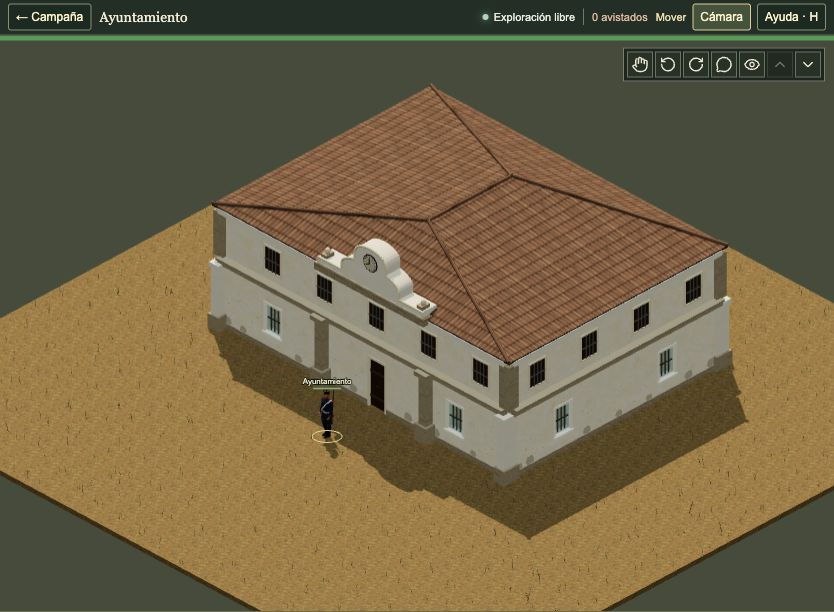
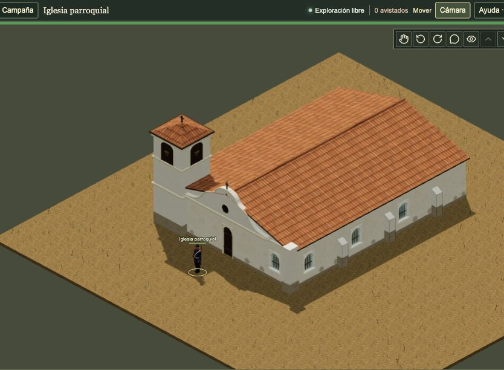
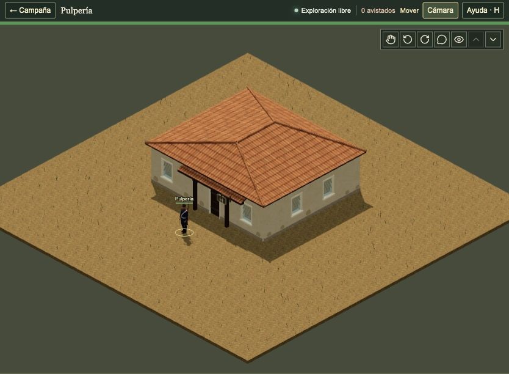
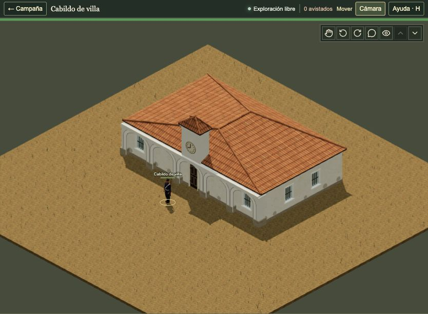
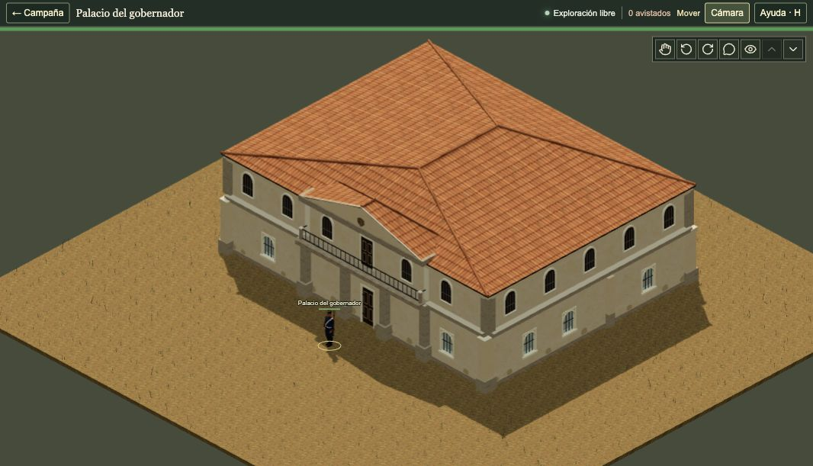
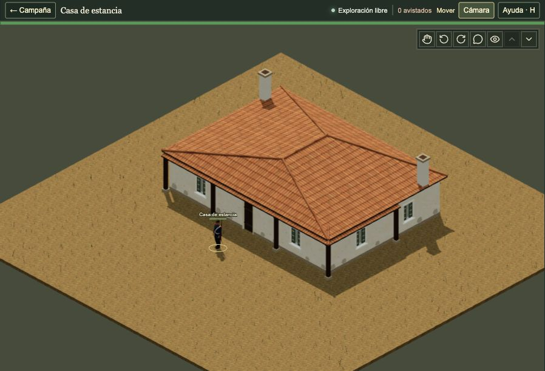

# Building exterior pictures

[Art records](README.md) · [Graphics gallery](tactical-reference-gallery-2026-10-08.md)

These are actual native Three.js catalogue screenshots from the current main
graphics source `755475a0cd6e`. Each uses the original roof, exterior view,
0° building rotation and 100% tactical zoom. A soldier gives scale. The town
hall and cabildo are separate templates. The empty catalogue ground is a
review fixture; it is not a populated town map.

## Ayuntamiento / town hall

## Iglesia parroquial / church

## Pulpería

## Cabildo de villa

## Palacio del gobernador

## Casa de estancia

[Capture record](../../artifacts/building-exteriors-2026-10-09/capture.json) pins the
image bytes and source. These are screenshots, with no generated image edits.
Only the capture framing changed. Building assets, renderer and gameplay remain
unchanged. This picture-only delivery adds no test or build run.
