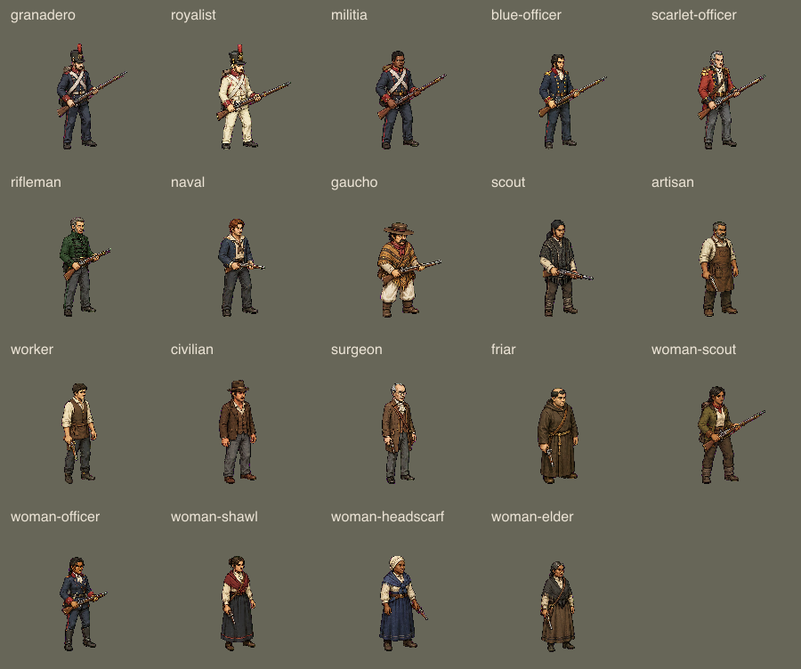

# Illustrated character sprites

The game uses a library of **19 shared appearances**. The library follows the
approved illustrated pixel art style: adult proportions, defined faces, dark
contours, and clear cloth shadows. Each appearance combines a gender, body type,
skin tone, hair colour and style, headwear, and general clothing.

The 48 paid mercenaries and 13 historical operatives select plausible appearances
from this library. The six custom portrait choices also select shared bodies.
An explicit saved `spriteAppearance` takes priority and stays stable through
movement, combat, changes of stance, and loading a save.

The [roster comparison](../../assets/previews/illustrated-sprites/roster.png)
pairs all 61 portraits with their assigned body. Six assignments were refined
after this review to better match age, skin tone, build, or general clothing.



## Coverage

The complete library contains **328 atlases and 7,856 selected frames**, with
eight directions per atlas. Eighteen appearances have all 18 applicable states:

- Idle, walk, run, fire, reload, and strike.
- Crouched idle and movement.
- Armed prone idle, crawl, fire, and reload.
- Unarmed prone idle and crawl.
- Death and unconscious breathing.
- Mounted idle and movement, including the horse.

The noncombatant traveller has four states: idle, walk, death, and unconscious
breathing. This accounts for the remaining four atlases.

`game/sprite-appearances.js` defines the appearances and roster mapping.
`game/sprite-state.js` selects the action. `game/sprite-render.js` reads the exact
published atlas and its frame timing. A missing or invalid atlas has an explicit,
inspectable legacy fallback; the complete library must not need that fallback
for any applicable state.

The appearance traits describe shared presets. They are not separately composited
hair, body, and clothing layers.

## Source and export process

The approved visual reference is
[approved-style.png](../../assets/source/illustrated-sprites/approved-style.png).
Authored sources and exact generation prompts are in
`assets/source/illustrated-sprites/`. The source package includes selected sheets,
their prompts, required pose references, and final calibration records. Rejected
candidates are excluded. `sources.json` identifies the selected source regions
and remains the authority for packing.

Idle source sheets contain eight views. Animation source sheets contain four
authored phases for four directions; a second sheet covers the other directions.
Targeted correction sheets replace only the selected direction and phase.
Movement generally uses four phases at 5 fps. Action and breathing timing comes
from each atlas's metadata.

The packer removes the magenta export key and creates transparent RGBA atlases.
Explicit white exports use `exportKey: "white"`; connected white backgrounds and
edge spill are removed while enclosed ivory clothing remains opaque. Packing
does not generate new poses or mirror directions.

Standing frames use 156 raster pixels per cell, drawn at 52 map units. Wider
prone, weapon, and horse cells add transparent padding without changing the
person's map scale. Reviewed source scales and anchors correct size drift,
raised weapon bounds, and different correction-sheet dimensions. Body size is
checked against head, torso, and boot landmarks, not muzzle flashes or ramrods.

The packer rejects clipped frames, missing directions, duplicate slots, and
animation frames without explicit anchors. The packing test also checks that
every selected raster frame is distinct and that transparent margins remain.
Publishing verifies atlas hashes, copies the files to both runtime asset folders,
and generates `game/illustrated-sprite-atlases.js`.

```sh
node tools/pack-illustrated-sprites.mjs
node tools/audit-illustrated-sprites.mjs --require-complete
node tools/preview-illustrated-sprites.mjs
# Inspect the packed art before publishing.
node tools/publish-illustrated-sprites.mjs
npm test
npm run typecheck
npm run build
node tools/preview-tactical-sprites.mjs assets/previews/illustrated-sprites/battlefield
```

The interactive review is
[assets/previews/illustrated-sprites/index.html](../../assets/previews/illustrated-sprites/index.html).
It has appearance, action, direction, zoom, pause, and frame controls. The tactical
preview tool renders the actual React scene and the currently selected atlas.

## Verification

The final coverage audit passed with 328 expected and 328 packed atlases, no
missing states, and no invalid assets. All focused sprite tests passed, including
packing every selected source frame, checking transparent margins and distinct
frames, validating the published files, and checking runtime selection and timing.
TypeScript and the production build passed. The static export contains 607 files
and 518 verified asset references.

The [final browser report](../../assets/previews/illustrated-sprites/browser/final-sprite-qa.json)
records 39 passing checks against the complete 328-atlas build. These cover all
18 states on the shawl appearance, all 19 shared idle appearances, appearance and
stance retention through save import and reload, and six visible appearances at
100% and 300% zoom. The north-facing unconscious pose uses the correct row and
changes breathing frames. No browser errors or failed requests were recorded.
The checks used a fresh, isolated browser context and did not access the user's
saved game.

The [300% battlefield screenshot](../../assets/previews/illustrated-sprites/browser/variety-3x.png)
shows the shared bodies in the game. The browser report lists additional action
screenshots.

PR verification uses a separate worktree based on `origin/main` at `c0653ec`.
All 263 tests pass in that worktree, with no skipped or failed tests.
The browser report and battlefield previews were regenerated there. The PR
contains only sprite art, runtime selection and timing, related tools, tests,
and documentation. Other gameplay changes remain outside this PR.
