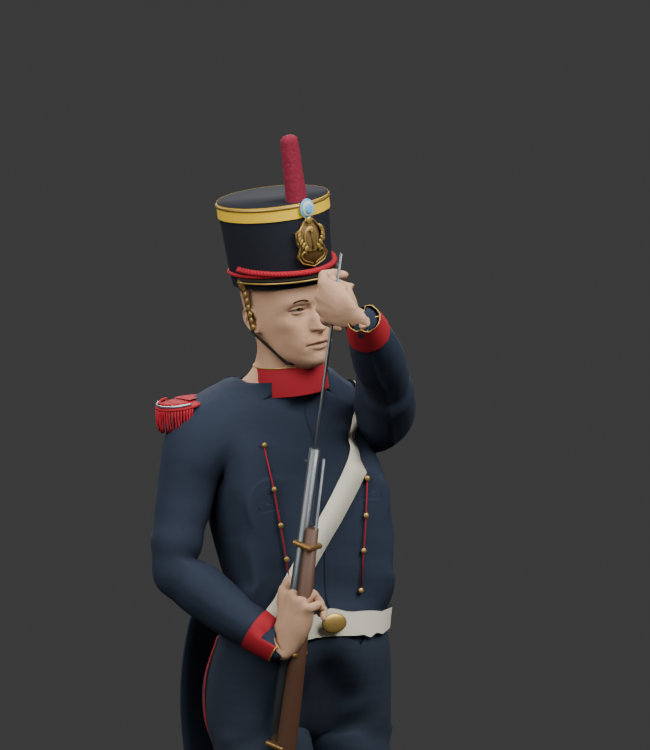
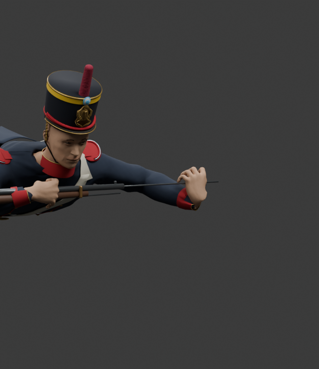

# Firearm fitting review — 2026-10-07

The supplied [Escopeta Criolla reference](../../web/public/art/weapon-1804.png) shows one barrel. Its existing [firearm definition](../../game/firearm-definitions.js) has capacity one. The 1804 equipment mesh now follows both authorities. This does not add a second charge or alter loading work.

The first selected export removed the extra barrel and fitted the 1804 part centres to its existing length. A wider exported mesh check then found the same location error on the other stretched guns: local mesh vertices were scaled, but the separate centres of sights, bands and lock plates were not.

| Rifle | Old metal beyond its muzzle | Corrected barrel end behind its muzzle |
| --- | ---: | ---: |
| Fusil Baker, 1802 | 45.51 mm | 4.55 mm |
| Tercerola, 1803 | 186.36 mm | 3.80 mm |
| Trabuco Naranjero, 1807 | 355.38 mm | 2.90 mm |

The Brown Bess and Charleville sights were respectively 108 and 90 mm behind their intended scaled centres. The stretched 1806 pistol lock was 9.1 mm behind its scaled centre. The same grip-local length factor now applies once to each mesh part's centre and vertices. Tube-authored guards, cocks, stocks and barrels keep their measured shape. The Trabuco flare and both 1808 bores remain present.

The selected export replaces only the nine firearm meshes. All **17 other equipment items retain byte-identical mesh data and transforms**. All firearm attachment roots, muzzle markers, complete equipment metadata, animation banks, native bodies and loading contacts remain unchanged. The source fitting tests compare all exported vertex positions against the already measured single-barrel source proportions, including the intentional Trabuco flare and two 1808 barrel offsets.

These source views show the actual timed ramrod at **2.784 seconds** in the single-barrel 1804. The tool is explicitly attached to its authored hand socket, and the review renderer checks its muzzle axis before rendering. They supplement the reference and contact checks; they do not substitute for a browser review.

| Standing rod stroke | Prone rod stroke |
| --- | --- |
|  |  |

The loading interval, markers, AP costs, capacity, ammunition consumption, finite supplies and item ownership stay unchanged. **23 focused firearm/contact checks pass**, native asset verification passes with 334 clips per anatomy, and the whitespace check passes. The fitted equipment bank is 600676 bytes with SHA256 `237c0e3dd3e7a3af5fbb0c05ee94a3aa95c25951b346877e43c9af4fb673edf5`.
