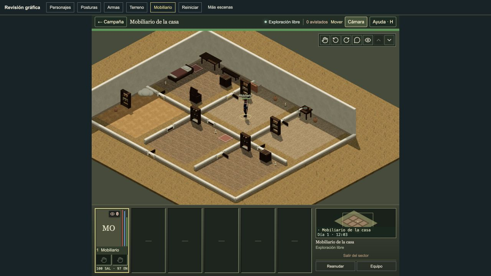
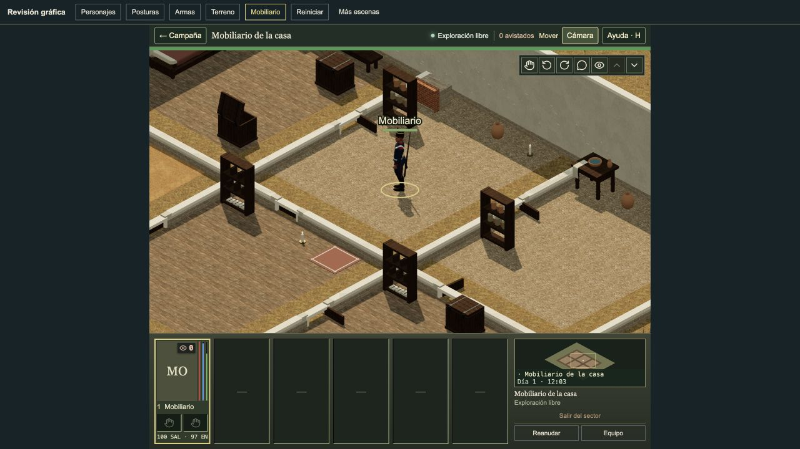

# Hearth and cookware review

The hearth opening now faces into its room. The pot has an open rolled rim and bail. Root accepted the actual Battlefield through CUA at 44 and 88 pixels. The pot is visible at both sizes; its bail is quiet at 44 pixels.

Both final views use I13 `{x:12,y:8,tacticalLevel:0}`, the default camera and paused 12:03. Both guards stand after ordinary resume and pause. BEFORE includes extra H7 → I7 bed steps, then H12 → H17 → I13. AFTER uses I7 → H12 → H17 → I13. Both metrics files have no browser errors. Photographs and metrics are pinned in [live-review.json](../../artifacts/hearth/live-review.json).

| View | Before | After |
| --- | --- | --- |
| 44 pixels |  |  |
| 88 pixels |  |  |

At 44 pixels, both views have 114 draw calls, 109 cached geometries and 43 textures. Triangles change from 68,160 to 68,712 (+552). At 88 pixels, both have 99 draw calls; triangles change from 126,086 to 126,638 (+552). BEFORE close retains 109 geometries and 43 textures from its earlier LOD2 view. AFTER close has 102 and 28. These different retained LOD histories do not prove a memory or geometry reduction. Snapshot FPS does not prove sustained performance.

A default hearth changes from 168 to 720 triangles (+552). Low firebox cases reach at most 756 triangles. Cookware uses one shared iron batch and reusable geometry caches. For an authored low firebox of 0.4 m, the complete visible assembly reaches 0.424 m. The authored game obstacle height stays 0.4 m. Blocking and cell footprint are unchanged. The measured room fixture retains draw counts because it shares materials. This does not prove zero new drawing batches for every possible chunk. There is no lid.

Seven source/test files change from the exact corrected piece 14 prefix. All other 11,324 inputs and the engine pin remain exact. The complete patch includes front cookware, inward direction, the admitted-origin guard and cache signature. Authored rotations, matching building/room/level, room admission, collision, footprints and door clearance remain authoritative. Character geometry, animation banks, images, textures, equipment, gameplay, saves and input orders do not change. The JSON-encoded [implementation patch](../../artifacts/hearth/implementation.patch.json) pins the exact source and raw patch bytes. Do not apply a second orientation patch.

Affected checks passed 70/70 in 6.156 seconds. Typecheck passed in 22.505 seconds. Production build passed in 31.053 seconds and measured 1,377 export files and 1,045 asset references with the exact source identity. These successful checks are retained because every source input remains identical.

The first standard 900-file quick run failed under generic Python 3.14.6 and Pillow 12.1.1. It reported 6,770 passes, 18 runner failures and five NumPy skips in 2,240.703 seconds. [failed-runtime.json](../../artifacts/hearth/failed-runtime.json) keeps that run explicitly failed. The eight failed files then passed 80/80 under Python 3.9.6, Pillow 11.2.1 and NumPy 1.26.4 in 817.387 seconds, with no failures or skips. Root authorized one standard quick retry under that required runtime. No code or asset fix, new apparel test or repeated typecheck/build was made.

The corrected-runtime standard quick passed 6,851/6,851 checks in 900 files in 2,616.424 seconds. It selected 900 of 908 files, retaining only the eight standard exclusions. It used four workers and no extra filters, with no failures, skips or cancellations. The complete source/runtime/dependency proof passed after the run. All 11,331 input files remain exact. The two full quick runs and original failed runtime are recorded separately in [delivery.json](../../artifacts/hearth/delivery.json). The installed root source, runtime and dependencies passed the [root equivalence proof](../../artifacts/hearth/root-final-equivalence.json). The uninitialized engine state passed a separate [root engine proof](../../artifacts/hearth/root-engine-state-proof.json). The private helper was executed before merge; it is not part of this compact bundle. See the [delivery plan](../plans/tactical-reference-graphics.md) for the final PR and merge state.
