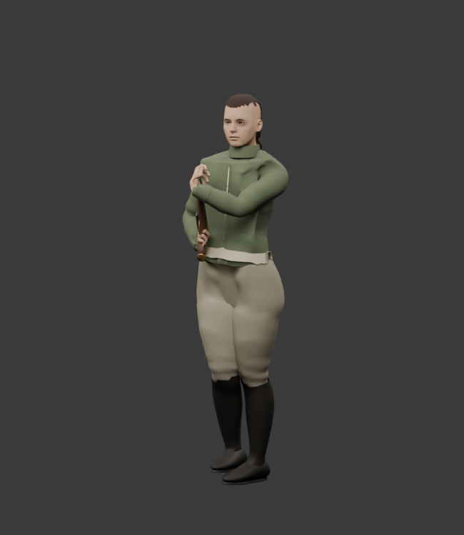
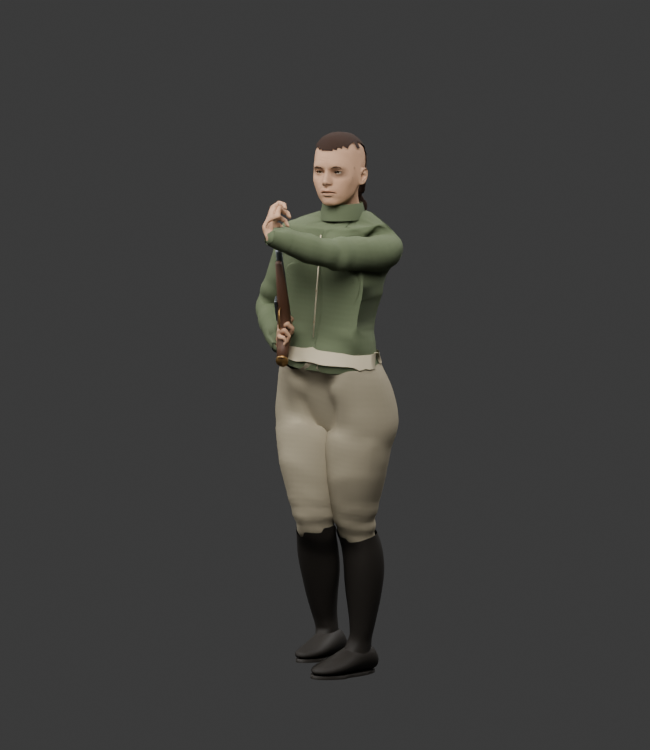
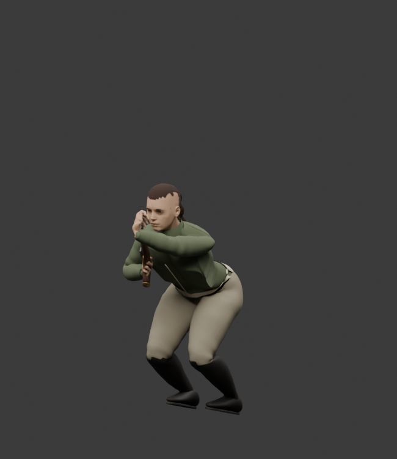
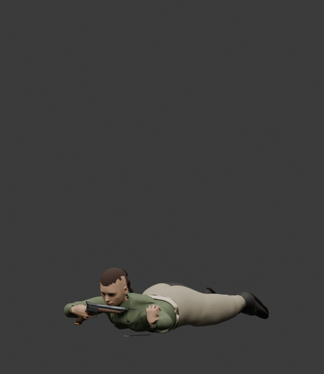

# Pistol loading contact review — 2026-10-07

Each pistol now uses its own muzzle and the native supporting and loading palms. The second pistol uses a reflected body motion and a fitted tool socket. Each charge of the two-barrel pistol follows its own physical bore; interrupted work resumes on that bore.

The previous standing pose left the loading palm 20.6–72.2 mm from the muzzle for the male and female 1805/1806 combinations. The corrected exported checkpoints, across both anatomies and all four postures, have a maximum muzzle-contact gap of **0.69 mm** and a maximum ramrod centre offset of **1.13 mm**. The barrel stays at least **16.66 cm** from the head pivot during the checked loading strokes. The native support feet have no measured drift.

The rod uses the existing mesh at the actual 25–28.25 cm pistol barrel length. A second reflection preserves its proper rotation and positive dimensions when the other hand works. Native meshes, bone positions, skin bindings and anatomy remain unchanged.

The current [Granadero reload sprite](../../web/public/art/illustrated/granadero-reload.png) and [woman scout reload sprite](../../web/public/art/illustrated/woman-scout-reload.png) show the shared rifle sequence: cartridge reach, muzzle contact, rod strokes, then ready recovery. They guide the sequence and bent arm support. Their long rifle does not supply pistol dimensions. The new source views use the actual 1806 equipment geometry:

| Muzzle contact | Standing rod stroke | Crouched rod stroke | Prone rod stroke |
| --- | --- | --- | --- |
|  |  |  |  |

These are source renders. The contact and mirrored-hand checks also use the published GLB bodies, equipment and animation banks in the actual actor runtime. The earlier live UI check confirmed one cartridge per loaded pistol, one final state commit, and input blocking during both charges. A new live body/rod review remains required after this source export; this document does not claim that view is complete.

The 4.8-second native loading interval, phase boundaries, AP costs, ammunition consumption and finite supplies stay unchanged. Tests use real reload orders for all four pistol bores and for partial second-barrel work. Hidden, replaced and pocketed guns cannot establish loading evidence.

Validation: **156 focused tests pass**, native asset verification passes with 334 clips per anatomy, and the type, calibration and whitespace checks pass. All 314 non-pistol clips per anatomy, native rig/mesh data, non-pistol metadata and unrelated asset records are identical to the stable riding snapshot. The two-barrel 1804 rifle remains a separate follow-up.
