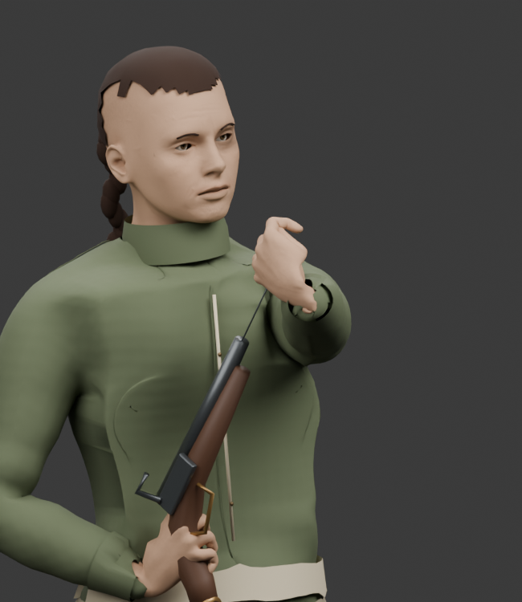
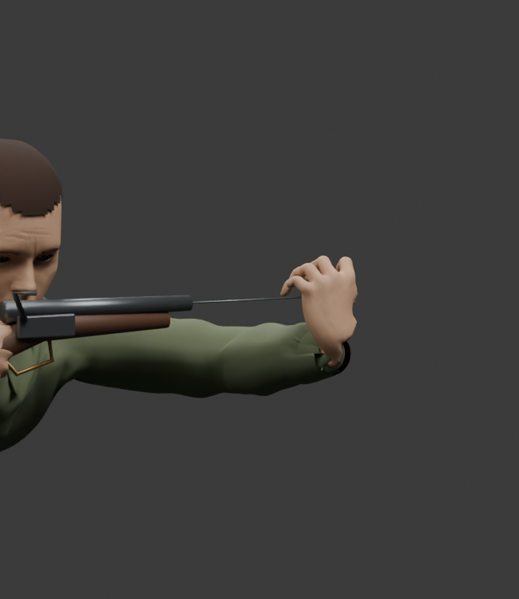

# Pistol loading contact review — 2026-10-07

Each pistol now uses its own muzzle and the native supporting and loading palms. The second pistol uses a reflected body motion and a fitted tool socket. Each charge of the two-barrel pistol follows its own physical bore; interrupted work resumes on that bore.

The previous standing pose left the loading palm 20.6–72.2 mm from the muzzle for the male and female 1805/1806 combinations. The corrected exported checkpoints, across both anatomies and all four postures, have a maximum muzzle-contact gap of **0.69 mm** and a maximum ramrod centre offset of **1.13 mm**. The native support feet have no measured drift.

The face check now uses the actual published, deformed skin triangles, including the nose, jaw and neck. A capsule encloses each full barrel with its widest **15 mm radius**. Both working hands, both physical 1808 bores, all charge clips and all four postures pass **45 native poses per combination**, including every 30 Hz sample during gun approach and recovery. The minimum measured surface gap in this check is **34.50 mm** for the male body and **43.76 mm** for the female body. This replaces the earlier head-pivot clearance as contact evidence.

The rod uses the existing mesh at the actual 25–28.25 cm pistol barrel length. A second reflection preserves its proper rotation and positive dimensions when the other hand works. Native meshes, bone positions, skin bindings and anatomy remain unchanged.

The current [Granadero reload sprite](../../web/public/art/illustrated/granadero-reload.png) and [woman scout reload sprite](../../web/public/art/illustrated/woman-scout-reload.png) show the shared rifle sequence: cartridge reach, muzzle contact, rod strokes, then ready recovery. They guide the sequence and bent arm support. Their long rifle does not supply pistol dimensions. The new source views use the actual 1806 equipment geometry:

| Muzzle contact | Standing rod stroke | Crouched rod stroke | Prone rod stroke |
| --- | --- | --- | --- |
|  |  |  |  |

These are source renders. The contact and mirrored-hand checks also use the published GLB bodies, equipment and animation banks in the actual actor runtime. The live UI check on the committed pistol bank confirmed one cartridge per loaded pistol, one final state commit, and input blocking during both charges. The separate four-bore exploration scene loaded both 1808 guns from eight to four reserve cartridges and loaded the offhand alone from eight to six. Screenshots of all four rod strokes and the female offhand were viewed. The source previews have now been rebuilt with the actual timed rod at **2.784 seconds**. The review renderer explicitly changes the prop from bone parenting to object parenting when it attaches to an empty socket, then checks its visible rod axis and muzzle fit. That source-render defect did not affect the published runtime tool.

The close views make the actual short rod visible outside the sleeve. They use the same source pose, item and timed cue as the full body views:

| Standing tool detail | Prone tool detail |
| --- | --- |
|  |  |

The 4.8-second native loading interval, phase boundaries, AP costs, ammunition consumption and finite supplies stay unchanged. Tests use real reload orders for all four pistol bores and for partial second-barrel work. Hidden, replaced and pocketed guns cannot establish loading evidence.

Pistol export validation: **156 focused tests passed**, native asset verification passed with 334 clips per anatomy, and the type, calibration and whitespace checks passed. All 314 non-pistol clips per anatomy, native rig/mesh data, non-pistol metadata and unrelated asset records were identical to the stable riding snapshot at that boundary. The follow-up adds **three face surface checks**, which pass in about 11 seconds, and the corrected source views. The supplied 1804 reference and capacity-one rule use a single bore; its independent equipment correction is described in the [firearm fitting review](firearm-fitting-3d-review-2026-10-07.md).
