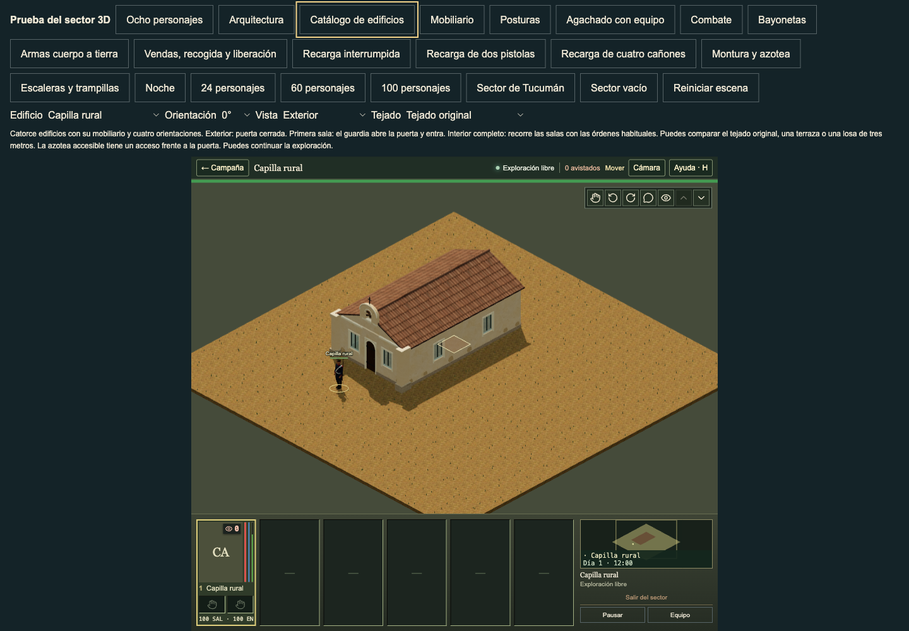

# Chapel pier edges: current source comparison

The ordinary chapel front already had its two supported corner piers. Their smooth edges made the shafts and capitals blend into the adjacent wall. The current direct `pier()` source draws each `ArchitectureVolume` face with a 0.45-unit border in its palette shadow colour, and its exposed cap with a 0.5-unit border. This small correction restores those local edges on the retained native piers.

Private review base: main `12b281c5`. The affected source and retained geometry are identical on main `dfe41950`. This cut owns only the chapel edge helper, its call site, focused tests and this comparison record. The current source sprite sets the dimensions and paint. The supplied playtest references are readability examples; they do not supply historical chapel decoration.




The paired normal camera views show a clearer shaft edge and separate foot and capital. The native shaft still projects 33.0 cm beyond the actual wall. Every existing pier position, normal, metric UV, light attribute, base pigment and texture recipe is byte-identical before and after in 40 compiled cases: four rotations, five paints and original or closed-slab roofs. The source plaster exception remains at 0.36 opacity, with the separate warm stone foot at 0.60. Native lighting remains responsible for the broad face shading; this correction does not tint the full faces again.

The local cylinders reproduce the source stroke diameters: 17.95 mm on face edges and 19.95 mm on the cap. Complete strokes stay inside their actual intact wall cells, including clipped edited-corner fallbacks, and never enter the ground. The cap stroke adds its own 9.97 mm half-width above the retained coping plane. The upper-route exclusion measures that complete hull. Usable upper cells omit the occupied pier, and room disclosure removes it with the ordinary facade cutaway.

Validation: 19 affected chapel and nave-edge checks pass; 25 further surface, door, placement and window checks pass. TypeScript passes. The five new tests read the actual current React source formulas and measure complete stroke bounds, palettes, normal camera ray visibility, metric UVs, day/night lighting, standing door crossings and window approaches. They cover all four rotations, five authored paints, edited corner openings, original roofs, slabs, terraces, legal roof routes, a short 1.8 m slab, lower upper cells, legacy selection and ordinary disclosure. Input state is unchanged. The original helper fails three of these five checks: absent source edges, absent camera edge separation and absent source stroke hull. The original failure evidence remains in the private review artifacts.

Two old pier assertions needed a measured update. The coping ray now samples 0.350 tiles outside the front wall, inside the new border but still outside the actual 0.16-tile eave, and continues to require the original coping material and exact plane height. The complete top-bound assertion adds the source cap stroke's half-width. Their previous failures are retained in the private artifacts; neither the coping height nor the pier body was altered.

Live review: 12 original before views and 36 after views pass without browser errors. Each set uses normal catalogue controls and visits exterior, partial and interior states at all four rotations. The after sets include original roofs, closed slabs and legal roof routes. The normal 0-degree front, 90-degree exterior, closed slab, accessible roof and disclosed interior were visually checked. This record confirms the local edge correction. It does not claim full visual parity or complete building polish; the previously disclosed source/native window-aperture proportion difference remains.

Focused checks:

```sh
node --test tests/three-chapel-pier-edges.test.mjs tests/three-chapel-piers.test.mjs tests/three-chapel-placement.test.mjs tests/three-church-nave-edges.test.mjs
node --test tests/three-building-surfaces.test.mjs tests/three-building-doors.test.mjs tests/three-building-placement.test.mjs tests/three-rectangular-window-bars.test.mjs tests/three-parish-window-bars.test.mjs
npm run typecheck
```

Normal browser reproduction:

```sh
node tools/verify-three-catalog.mjs --full capilla
node tools/verify-three-catalog.mjs --full --roof=slab capilla
node tools/verify-three-catalog.mjs --full --roof=roof-route capilla
```
