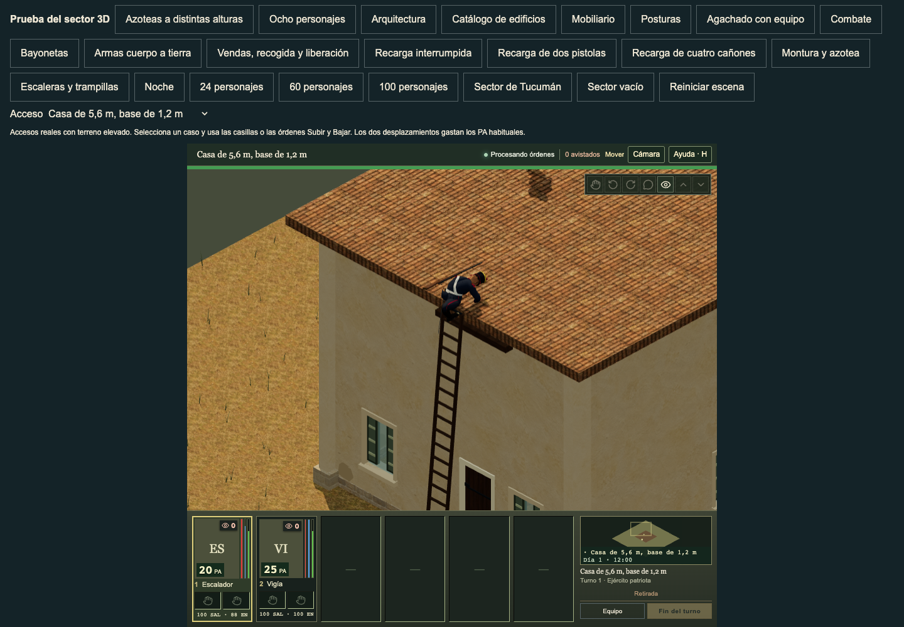
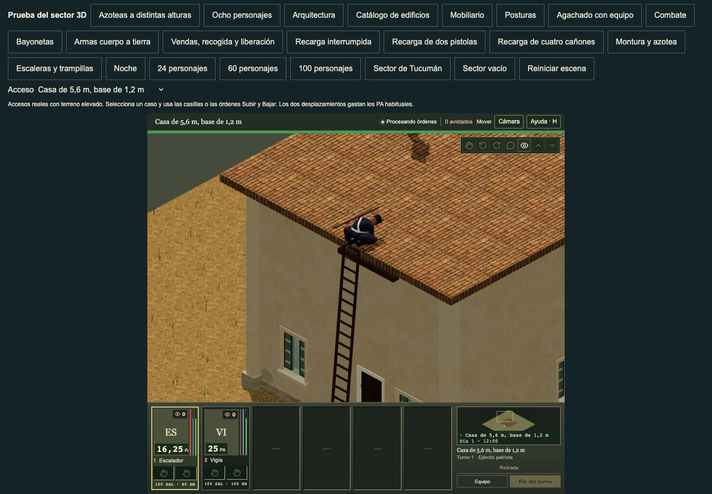
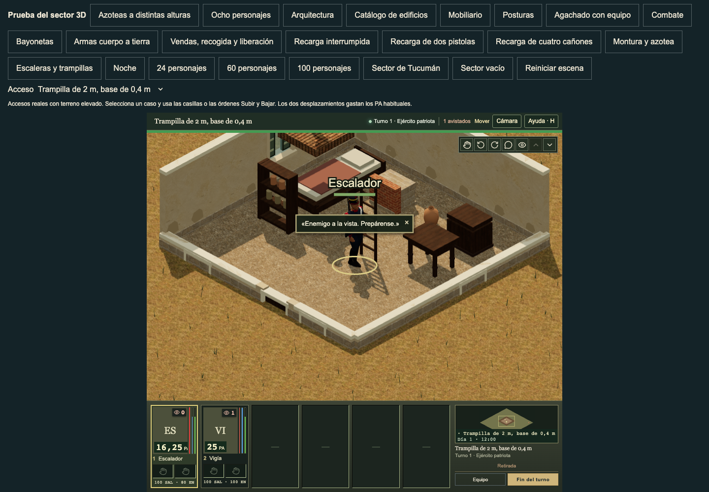

# Planted roof fingertip floor correction

This cut changes only the existing index, middle, ring and pinky rotation channels in `life.climbUp` and `life.climbDown`, for both native anatomies. It reduces the final native .10-radian roof curl by .052 radians. Relief starts at source roofWeight .90 and fades with the existing hand release. All source key times and linear interpolation stay unchanged. This is a bounded floor correction, not complete palm support or natural climbing acceptance.

The source-key gate follows the near-flat hand turn. It leaves the earlier turn unchanged; native 60 Hz interpolation remains between the retained keys. The previously tried uniform relief worsened a turning fingertip, so that trial was rejected. Its source and failing receipt are retained here.

The complete weighted hand and arm scan covers both anatomies, all three LODs, ascent and descent, heights 2/3/4.2/5.6 m, a raised 1.2 m foundation, and actual same-cell, cardinal and diagonal links. Its 144 cases contain 43,524 dense poses with 240 Hz samples over the crest and release. Shrinking intervals cover native finger-key boundaries. All six focused checks pass. The full planted hand clears the finite roof half-plane by at least **0.269246 mm**, improved from the earlier **−4.047586 mm** planted fingertip witness. No sampled new floor penetration or complete arm peak is introduced. Root, pelvis, arm, wrist, thumb, foot and all other native channels, body dimensions, world transform, animation time, timeScale and held phase are exact.

The dense approach scan retains a **−5.708082 mm** male LOD2/native 3 m cardinal descent turn penetration before and after; the earlier sparse scan reported only −1.818933 mm. The arm speed peak remains **16.636867 m/s** before and after. These are open mechanics limits. The roof half-plane scan is conservative and excludes the real same-cell hatch; it is not a full authored-slab triangle intersection claim.

The main palm remains unsupported. The earlier primary-hand vertex measure has a 23–24 mm gap. A separate native 3 m/.90 downward-facing main-palm triangle scan finds first patch points **20.804–30.497 mm** above the roof across anatomy/LOD/side, with 36.55–66.62 cm² of downward-facing skin. Those surfaces are not used as an acceptance test for this finger-only cut. Actual palm placement and hand-plane alignment remain open. Rapid native crest/leg pace and the measured low-ceiling headwear collision also remain open.

`build-climb-palm-support.py` transplants named channels into the current banks. It verifies all 334 motion names/order, all 332 unrelated clips, every other channel, original clocks/interpolation, rig/mesh/skin and original binary prefix. Both preservation checks and manifest canonicalization complete before installation. It refuses symlink outputs and double application. It retains the old finger samplers so `climb-palm-before.mjs` can reconstruct the exact native predecessor in memory without a second public bank. The portable rebuild proof recovers the old banks byte for byte and reproduces the final reviewed outputs twice.

The normal UI checker uses visible scene controls, paid Subir/Bajar orders and ordinary DOM telemetry. It makes no state, time or pose injection. Before/current routes cover four authored access cases and eight paid actions plus four resets. Both retain AP 100→80→65, energy 100→88→80, saved cells/levels/elevations, and selected reset cases. Each UI set verifies all 386 served model responses against the actual private files. The screenshots show intact full-body presentation; a sub-millimetre fingertip gap is too small for normal screenshots to prove independently.

The code predecessor is merged crest main `1e89f1db`; current main `724a9c72` only adds grass world surfaces. Clinical ActorRuntime `075a40c9`, crest contact `d333d244`, body phase `f15bd357`, geometry `5b3e8b6b` and all input banks remain exact. The cut modifies no ActorRuntime, clinical helper, gameplay, collision, roof, doorway, hatch or saved cell.

Checks:

- `node --test tests/characters-climb-roof-fingers.test.mjs`
- `python3 tools/verify-climb-palm-source-rebuild.py`
- `python3 -m py_compile assets/source/characters-3d/authoring/climb_palm_support.py tools/characters-3d/build-climb-palm-support.py tools/characters-3d/build-library.py`
- `web/node_modules/.bin/tsc --noEmit -p web/tsconfig.json`
- `node tools/verify-three-climb-palm-route.mjs` with the normal local review URL and installed Playwright/Chrome paths.

Use the named builder on the current banks when composing newer source work. Do not overwrite newer whole banks with the proof snapshots. All unrelated motion and asset data must stay exact.

## Independent root integration

Implementation `e8cce206cdd5cd1aca890b6f6dc486495d0fe0ed` composes the reviewed named finger channels onto main `724a9c7236ff2dfe314cd7031abd3595d3ad8afe`. The input cut is retained locally at `/tmp/granaderos-root-climb-roof-finger-cut-20261008-1129`, with freeze SHA `99d49ea82892056694ca463f2a8c44d8436c3e1abf0c7fafad2d75ce8a0543ed`.

The root rejected the cut's stale whole `build-library.py` snapshot. The current-main driver remains byte exact apart from two lines that run the new finger post-pass only after fresh animation jobs. Private source staging, strict manifest checks, concurrent-write protection and final cloth packing remain intact. The public review runner also has one whitespace cleanup. These two composition differences are recorded in [root-source-and-ui.json](root-source-and-ui.json); the final animation banks and other reviewed outputs match the frozen cut.

Fourteen affected fingertip/pipeline checks pass in 125.01 seconds, and six private-job staging checks pass in 4.25 seconds. These include actual source worker and receipt failures that retain the released tree. TypeScript, Python compilation, native-library, locomotion-profile, documentation and all 38 baseline checks pass. The named source rebuild reconstructs the predecessor and reproduces both current banks and the manifest twice. Production build `a5daddccfea4` verifies 1,248 files and 1,041 static references; full source identity is `a5daddccfea42e918098e92035d86c7928d03c68f4edfb196f663488475644d1`.

The root compared all 10,845 predecessor Git blobs outside the explicit cut; every byte and the engine Gitlink remain exact. Before/current ordinary browser runs each pass eight paid actions and four selected-case resets, with 386 exact served native responses and no errors. Root, body phase, clinical ActorRuntime and crest contact source pins stay exact. The root viewed the ascent pair, current descent and low-room return. Screenshots establish the live route and whole body; the dense weighted-surface proof establishes the small finger clearance. The retained palm gap and earlier turn penetration remain open.

