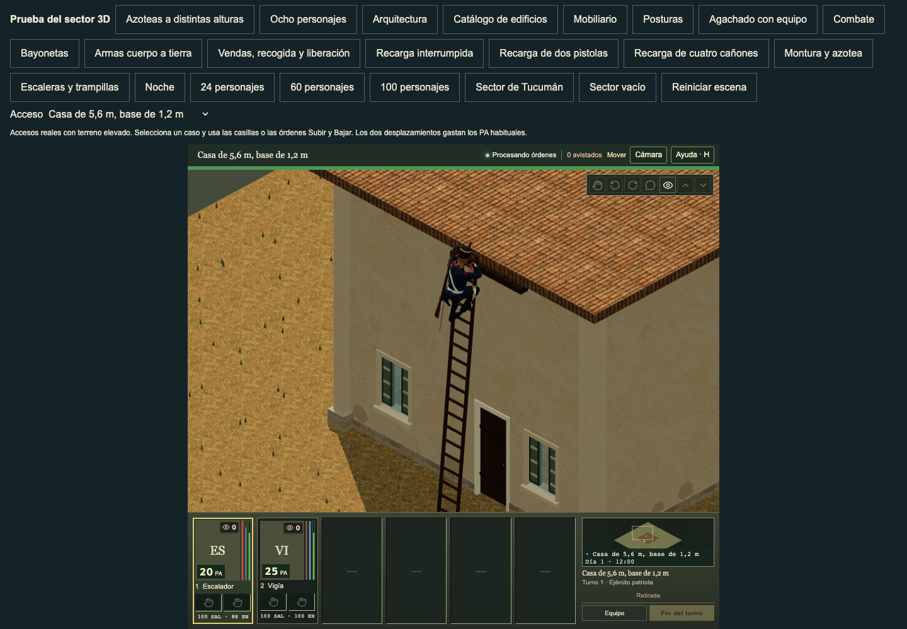
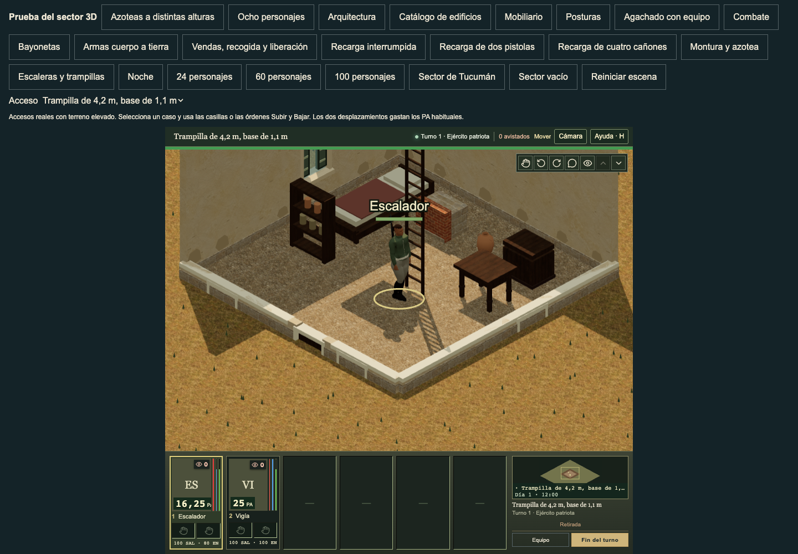

# Remove native pose jumps between ladder rungs

This bounded runtime change removes the measured pose jumps between ladder rungs on authored ladders whose rung count differs from the native reference. It does not claim complete climb continuity or final body-motion acceptance.

## Change

The existing rung-count mapping alternates the native limbs but also wraps native Root translation, spine bending and limb twist. The old solver retained that wrapped bend and axial rotation. Its endpoints could meet the ladder while weighted sleeves, boots and garments jumped.

The fitter now derives bend poles and limb rotations from the actual native source bind directions. During the rung section, it blends the exact existing Root translation and three spine quaternion tracks toward their paid-phase samples. It enters the source contact frames smoothly and returns to the original crest pose during the last half-step. Native files, joint offsets, scales, Root rotation, pelvis channels, all unrelated channels, clocks and saved actor travel remain unchanged. This is a runtime adaptation of existing source tracks; selected body poses are deliberately different on adapted ladders. The original 3 m cardinal reference remains exact.

ActorRuntime has one changed line: the existing climb-fit call receives its AnimationClip and effective blend weight. All current gait, standing gesture, prone, melee, cloth, restore and action timing hooks remain in their original positions. Gameplay geometry and saved rules are untouched. The .65 m foot/fading-hand fallback and finite target handling remain intact.

## Physical check

The portable comparison uses the accepted reachable-hand predecessor (SHA-256 165cb6b4bb6668dfb5ed4a6ac8e3d565c91bb8021bd2c4bfde8defa55fd194ff), real published rigs and animations. It covers 96 anatomy/LOD/direction/height/span cases, 4,104 poses and 144 native-mapped rung wraps. Heights are 2, 3, 4.2 and 5.6 m; both same-cell and cardinal spans are tested on raised foundations.

Across each wrap at paid fraction ±0.000001, maximum complete visible surface motion is 612.642730 mm before and 0.043070 mm current. Maximum Root world movement is 30.985900 mm before and 0.014907 mm current. Shrinking intervals confirm continuous motion rather than a smaller fixed jump. The maximum measured full-surface wrap speed is 3.3328 m/s; each check uses an independently bounded 8 m/s limit and shrink-ratio check. The scan includes all weighted body, complete footwear, head and clothes. Separate checks cover all eight native appearances at all three LODs, real held/stowed rifle/pistol/sabre/lance/medical items and worn overlays.

The 110 focused checks pass in 9.99 s. They include held phase, 0/16.7/33.3 ms first arrivals, entry/fade boundaries, missing/nonfinite native track fallback, actual hand/rung contact, whole boot roof clearance, exact reference poses, action/mixer clocks and saved actor world transforms. TypeScript passes. No broad suite or performance claim is included.

## Ordinary route

The unchanged `verify-three-varied-roof-climbs.mjs` opens the visible renderer sandbox and uses normal Subir/Bajar controls. Eight paid actions and four case resets pass. Tested scenes: 5.6 m wall/base 1.2 m, 4.2 m same-cell hatch/base 1.1 m, 6 m return/base 1.7 m, and 2 m same-cell hatch/base 0.4 m. AP is 100→80→65 internally (25→20→16.25 on the HUD); energy is 100→88→80. Ground/roof cell, tactical level and elevation checks pass. The route records page errors and failed HTTP responses: none. It does not assert all console messages.

The before/current rung images were viewed. The current limb pose is coherent at the observed rung. Screenshots are real browser frames, with ordinary overlay phase metadata that can lag the image by one frame. They are evidence of the normal route and visible posture, not a synchronized sub-frame continuity proof. The CPU geometry check provides that proof. The private UI tree keeps the accepted renderer inputs from its prior hand-review basis; the source cut changes no architecture. Root must repeat the route on its current clean renderer before publication.

## Retained defects

At paid fraction .76, an even-rung contact plan still forces the two feet onto the source left/right crest indices. The last actual step can finish in the opposite parity. The complete visible crest jump remains: worst before 547.461850 mm, current 547.461851 mm. All 96 comparisons are unchanged or improved within 0.001 mm. This cut fades to the old fitter before that boundary; it does not conceal or accept this failure. A separate parity-aware physical crest correction is next.

Fourteen broader palm-floor cases remain below the proposed −4 mm acceptance limit; worst current is approximately −4.047597 mm. Existing low-ceiling/headwear clearance is also outside this change. Complete climb, crest, palm and ceiling acceptance remains open.

The rejected body/pole-only surface proof, unbounded crest trial and old native-body-exact assertion are retained. The assertion was replaced by a measured comparison to an exact bounded blend of native paid/remapped body tracks because a body-phase change is necessary to remove the old Root jump; all preserved dimensions/clocks/unrelated channels remain explicitly checked.

## Reproduce

From the repository root, with the normal web dependencies installed:

```sh
node --test tests/characters-climb-phase-continuity.test.mjs tests/characters-tall-climbing-contact.test.mjs tests/characters-climbing-support.test.mjs tests/climb-playback-timing.test.mjs
npm run typecheck
node tools/verify-three-climb-phase-preservation.mjs --before-helper=docs/art/reviews/climb-rung-phase/reachable-hand-before.ts.txt
```

The existing visible UI checker uses `GRANADEROS_REVIEW_URL`, `GRANADEROS_REVIEW_OUTPUT`, `PLAYWRIGHT_MODULE` and `CHROMIUM_EXECUTABLE`. Select the normal Azoteas a distintas alturas scene. No private pose injection is used.

Actual model and native-bank hashes are in `native-input-pins.json`. Male bank: 49f5d77abe97ae560f46060f93d3fdd31661eda97e47dfdf029216ade2beeb27. Female bank: 509a9c2c1ab0cb2a7d38c8f50cb7809cfa9f6c4cc946c69652b6918fdeb1ac10. This package contains no bank, mesh, gameplay geometry, manifest or architecture changes.

## Root integration

The root installed the exact frozen seven-file implementation on main `3541734ead91327c7941aba9de395180d83acb56` and committed it as `629b6366a572e09d2bd85bfc44b12917e9d65ca6`. All 110 affected checks pass in 11.02 seconds. The independent 96-case/4,104-pose comparison repeats the 144 repaired wraps, exact preserved dimensions/clocks and fourteen open broader palm-floor failures. TypeScript, native/profile verification, documentation and all 38 baseline checks pass. Production build `a943545c8220` verifies 1,247 files and 1,040 static references; its full game-source digest matches the committed candidate. All 106 published native/profile files and all eight preceding window-paint files remain exact.

The current main renderer passes eight paid climbs/returns and four case resets. All 179 source/native pins remain exact before and after; 386 served pinned native responses match disk bytes. Both new phase/fit modules are actually served. There are no page, console or HTTP errors. The root viewed the retained before/current rung pair, the current main up-rung capture and the raised hatch return. These normal frames retain the ordinary overlay timing limit described above. The crest, palm and ceiling limits remain open. Full independent receipts are in `artifacts/three-climb-rung-phase-current-review/`.




The two copied text-only diagnostic receipts have trailing whitespace removed; their raw originals remain in the frozen root package. All other frozen files remain exact. This normalization changes no assertion, source or result.
