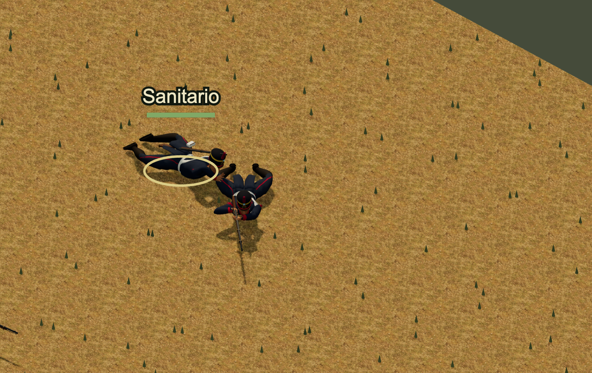
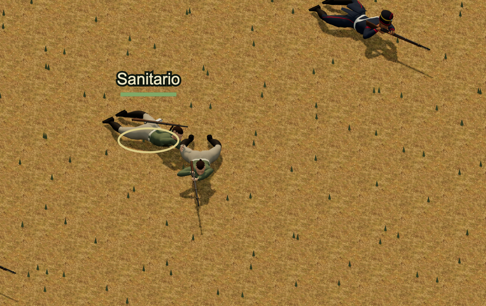

# Rooted grass blades

Native ground decoration used solid cones. The current `TacticalScene.tsx` sprite terrain uses three thin strokes with different lengths and spreading tips. The native tufts now use three tapered leaves with a bend through the middle, seeded rotation and 20–30 cm maximum height. This improves the silhouette without changing the terrain placement rules.

The old rooted centres, elevations, tuft counts, material, lighting admission, draw batches and shadow flags remain exact. Ground tiles, skirts, rocks and rubble retain their exact merged vertex attributes. Each tuft uses nine triangles instead of twenty, a 55% reduction. The existing double-sided material renders both leaf faces. Character bodies, animation banks, climb and patient-care code, saved cells, AP rules and terrain collision stay unchanged.






The root viewed both current normal-HUD images, the male predecessor and the actual [male](../prone-patient-contact/current-sprite-male.png) and [female](../prone-patient-contact/current-sprite-female.png) sprite images. The native and sprite captures retain their original renderer scales. The sprite guide is the thin, spreading leaf form; its placement, pigment and terrain texture are not exact native matches. The direct sprite images were compiled from the paid care state in the earlier patient review. They are source-art comparisons, not a second live 2D gameplay run.

This is one terrain increment. Ground dressing, denser environmental detail, the full body silhouette and complete building polish remain open. The change makes no claim of sustained frame rate or complete visual parity.

## Root validation

The code is `9d722f7c1fbeccafdb580304e02f865dc527fa5b`, based on main `1e89f1dbc7cf94b82218bc61bd3f24d9a6904e94`. The [portable preservation check](../../../../tools/verify-three-grass-preservation.mjs) compares the real current merged terrain with the two pinned predecessor sources retained here. Its [result](physical-preservation.json) covers 540 cases, 900 unchanged non-grass mesh occurrences and 810 rooted tufts across signed coordinates, three elevations, six terrain types and day/night lighting.

All 18 affected world and vegetation checks pass in 1.71 seconds. TypeScript, the native library, locomotion profile, documentation audit and all 38 baseline checks pass. Production build `213a547a6bc5` verifies 1,248 files and 1,041 static references. Its full source identity is `213a547a6bc54be3e7382895b95a84cf0af4b185778c56d628cc17d95d03d906`.

The [browser and protection receipt](root-source-and-ui.json) retains 128 source/native pins before and after each normal paid HUD run. Only the two grass source files differ between the runs. Each run has two anatomy routes, twelve timed captures and 302 verified native responses, with no browser errors. The paid patient turn and care retain their existing AP, bandage, posture and cell assertions. A separate 118-file Git comparison preserves all 105 native files, the locomotion profile, the clinical and crest code, and the tactical reducers byte for byte.

## Repeat

```sh
node tools/verify-three-grass-preservation.mjs
node --test tests/three-sector-world.test.mjs tests/three-world-vegetation.test.mjs
npm run typecheck
```
