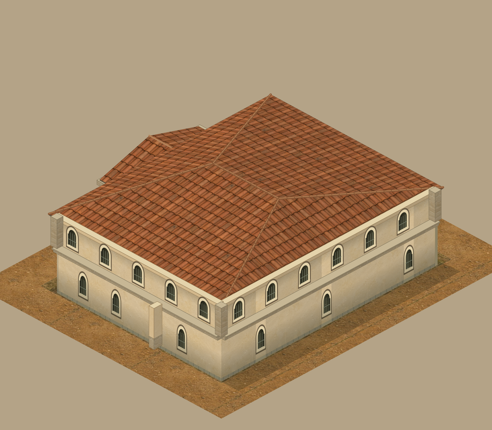
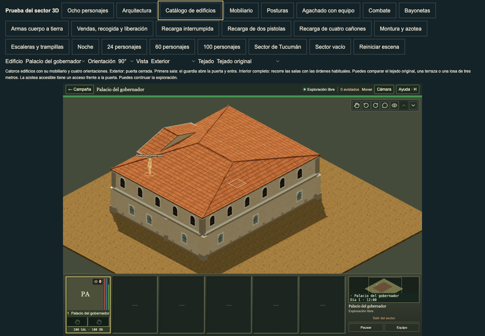
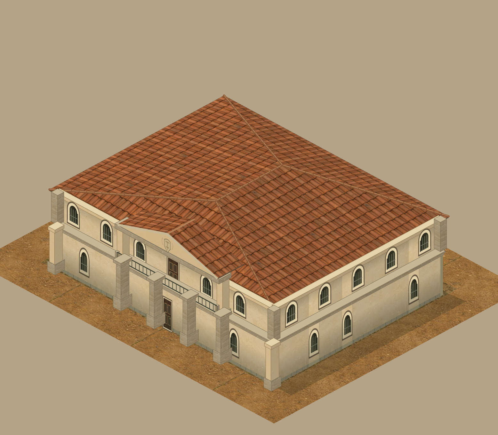
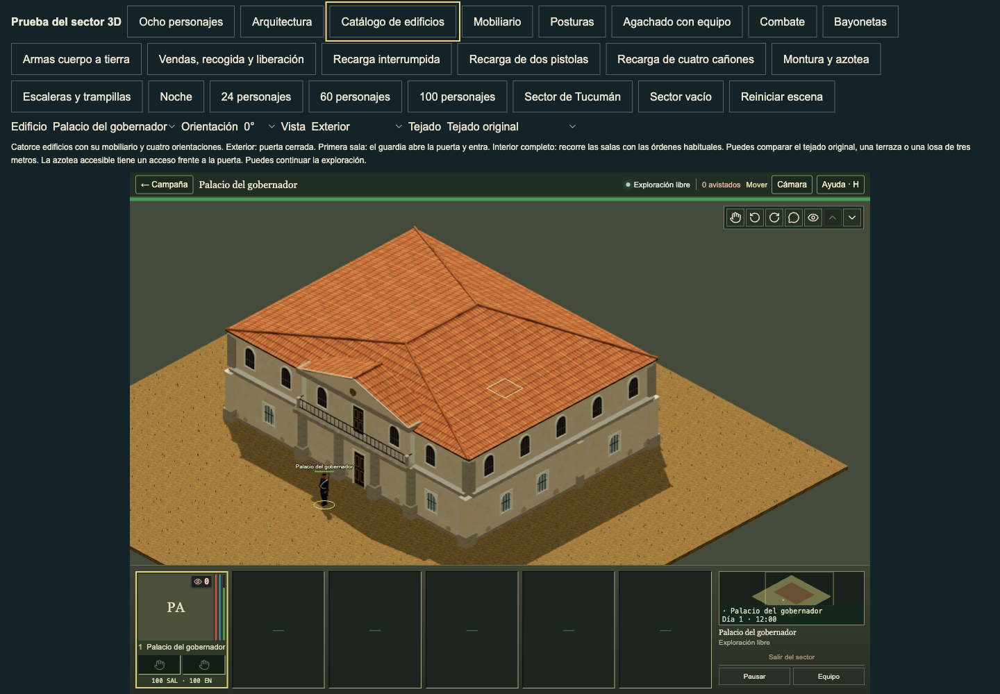

# Palace portico roof return

The ordinary 90° palace view exposed a tall beige rear triangle above the main hip roof. Its geometry was closed. The defect was a visible roof join, not a missing wall. The current 90° sprite looks joined because its main roof paints over the rear portico. The sprite explicitly authors that rear triangle and a level porch ridge; this review retains that literal-source evidence.





For a supported ordinary palace, the physical porch ridge now ends over the source entablature's rear edge at v=.3. A planar tiled rear hip enters the actual main roof before the existing rear eave at v=1.2. The two side planes retain their original pitch. All four source eave corners, the front ridge point, pediment, crest, columns, entablature, balcony, saved finishes and metre texture density stay exact. The main roof, source stone storey band and plaster cornice stay exact. This is a declared physical adaptation of the flat sprite's painter-order join; it does not claim an exact historical roof reconstruction.





The actual tiled planes intersect at v=1.01125127–1.01125142, before the old rear end. Across four rotations, three saved roof finishes and two elevations, the computed ray intersection residual is below 0.001 mm. At v=1.199 the new rear roof is 289.995–289.996 mm below the main roof; the old level ridge was 785.936 mm above it. The original side pitch is 16.197°; the bounded rear closure is 44.076°. Timber underside thickness stays 75 mm. All exterior roof normals face upwards.

Admission requires the existing supported civic cornice/hip rule and real coverage of the complete rear edge, including underside and ridge-cap clearance. Short metric slabs, explicit terraces, authored upper roofs, edited corners and legacy shells retain their released closure. Normal upper walking cells retain the existing complete canopy exclusion. Normal room disclosure removes the facade and portico together. No collision, authored cell, doorway, window aperture, room rule, actor source, material shader or public asset changes are included.

Validation on main `4ec028f541272ee5579d5c7fa1d4259042b2fec7` building inputs:

- 85 affected checks pass in 18.38 s. They use real compiled buildings at all four rotations, current source points, physical roof intersections, complete underside, metre UVs, saved finishes/elevations, edited corners, standing aperture approach/sight rays, upper-route exclusions and normal disclosure.
- The old literal roof fails the two new physical-join/support tests while the other three new invariants pass. The original rejected output is retained in the private review package.
- TypeScript passes.
- 12 before and 36 after ordinary gameplay views pass without browser errors: all four rotations and exterior/first-room/interior views for the original roof; the same states for the closed 3 m slab and usable 3 m roof after the change. Visual review includes front/rear exteriors, partial/interior cutaways and both slab states.
- A portable 408-state comparison preserves all 10,948 non-portico meshes, world matrices, material recipes, openings, cutaways, heights and authored state exactly. It includes the main roof, current bands/cornice and complete compiled slab/roof-route fallbacks. Both results have SHA-256 `e09a75df1702ea46a215a2468c1f781c1ba89c9eb1105e65cd1ab48c4bcc595b`.

Focused gate:

```sh
node --test tests/three-palace-portico.test.mjs tests/three-palace-portico-join.test.mjs tests/three-palace-facade.test.mjs tests/three-palace-source-columns.test.mjs tests/three-civic-cornice.test.mjs tests/three-civic-storey-bands.test.mjs tests/three-building-supports.test.mjs tests/three-building-surfaces.test.mjs tests/three-building-doors.test.mjs tests/three-building-windows.test.mjs tests/three-building-details.test.mjs tests/three-building-placement.test.mjs
npm run typecheck
```

Portable preservation check, run once against each source root and compare the output files:

```sh
node tools/verify-three-palace-portico-preservation.mjs <source-root> <output.json>
```

The source point records and all 24 actual roof measurements are in [source-bounds.json](source-bounds.json). The source recipe is [palacePortico in TacticalBuildingDetails](../../../../web/app/TacticalBuildingDetails.tsx). The implementation is [world-palace-portico](../../../../web/lib/three/world-palace-portico.ts) with a narrow call in [world-palace-facade](../../../../web/lib/three/world-palace-facade.ts).

Remaining limits: the source/native ground-window aperture adaptation remains disclosed elsewhere; this cut does not change it. Tall explicit terraces and edited/legacy geometry retain the literal rear gable. The supplied JA2 screenshots guide readable structure and interiors, but do not provide a period palace roof reconstruction. This bounded join does not establish complete architectural polish.
