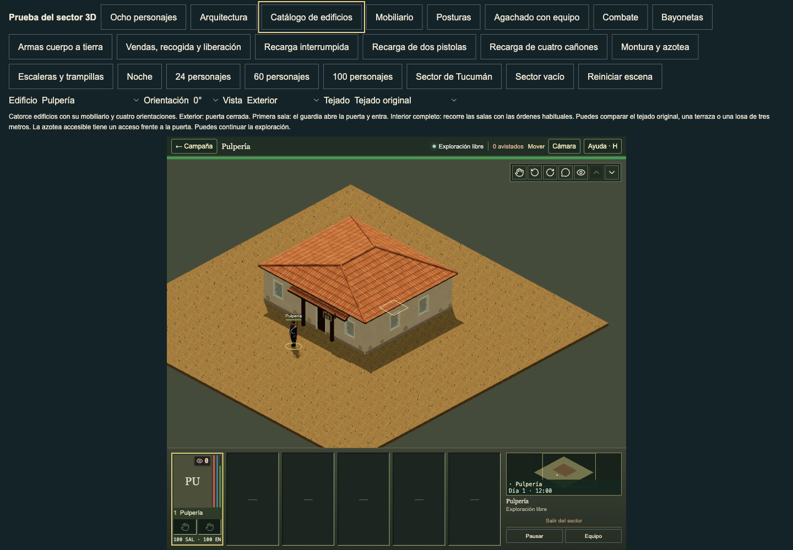
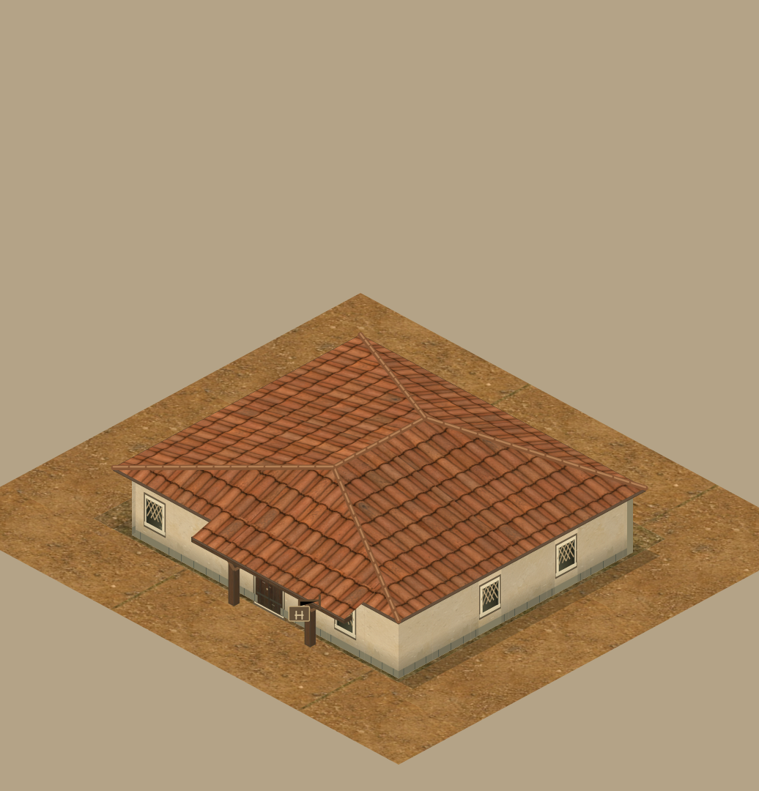

# Pulpería porch sign source review

The ordinary 3D Pulpería exterior had no readable hanging trade plaque. Its earlier barrel emblem sat near the wall at depth −0.09 tile, behind the now-exposed source porch. The current sprite has a brown 14 × 10 plaque, a timber bracket, pale edge strokes and two vertical marks joined by a crossbar. The source does not assign a meaning to these marks.

| Before, ordinary camera | After, same controls |
| --- | --- |
|  |  |



## Source and physical adaptation

The current `shop-sign` branch of `web/app/TacticalBuildingDetails.tsx` supplies the board proportions, mark paths and four local pigments: board `#645039`, edge `#c1a676`, bracket `#5f472e`, marks `#d5c096`. No world wall, roof or shared wood recipe changes. The board and its hardware follow the actual entrance frame through all four rotations.

The board converts the sprite's screen interval x=−21…−7 into its entrance-relative along interval. For the actual compiled shop, its board lies at u=1.919…2.458 tile, in solid cell 2. Its shallow front plane sits beyond the porch shafts. The complete board, edge, marks and bracket stay in that same cell's ±0.49 footprint. The bracket rail joins the existing lifted porch beam. This preserves a physical connection on taller edited slabs instead of copying a screen-facing glyph into mid-air. Both real board faces carry the retained mark.

The complete sign reaches 1.548 m at its lower edge. The old ≥1.9 m bound failed and is recorded in [source-bounds.json](source-bounds.json). A low plaque over a blocked wall does not occupy the standing doorway. Its replacement measures the actual opening widths, door heights, ordinary approach rays and oblique sight rays. A negative control moves the same complete plaque across the doorway and confirms that the test rejects the obstruction.

Edited or missing sign supports, front corner openings, omitted porches and overlapping legal upper surfaces omit the authored plaque. Short roofs omit it. Ordinary partial/interior disclosure removes it with the exterior detail group. Unpainted legacy shops retain their earlier generic sign. Gameplay footprints, collision, openings, saved finishes and room state stay exact.

## Review evidence

Before selection, all fourteen current templates were captured through normal catalogue controls: 84 views and no browser errors. Their current direct sprite overview was rendered from the same source base. The supplied playtest screenshots in `docs/references/playtest-2026-10-03` were inspected in the primary workspace. References 002/003/008 inform ordinary-scale detail, surface contrast and roof disclosure; their modern fixtures are not copied into colonial architecture.

This cut has 12 before and 12 final after views of the Pulpería's original roof, plus 12 edited slab after views. Every set includes all four rotations and exterior/partial/interior states through the real compiler, door/movement orders and ordinary room disclosure. The 0°/270° exterior images show the plaque; it is omitted in disclosed interiors. The private capture uses a visible Chrome window. No private renderer or actor-state injection is used.

Validation: 58 affected checks passed in 7.60 seconds; TypeScript passed. The affected command is:

```sh
node --test tests/three-pulperia-sign.test.mjs tests/three-building-details.test.mjs tests/three-work-porches.test.mjs tests/three-building-supports.test.mjs tests/three-building-doors.test.mjs tests/three-building-windows.test.mjs
```

The source base is `4a140a4fd8487b374da1c46174affb98721a2331`. This restores one concrete source detail. It does not establish complete building polish from bounds or test results.
