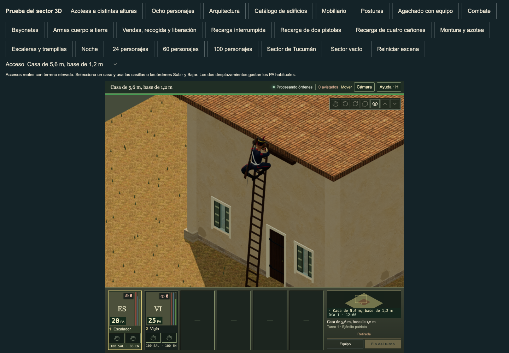

# Reachable hands on taller paid roof climbs

The 5.6 m roof above a 1.2 m foundation had a reachable right-hand target which the renderer rejected. Its fixed 0.65 m displacement gate left the planted palm up to 793.139 mm from the real rung. At the inspected fraction 0.651667, male wrist reach was 0.464029 m against a 0.520182 m native arm; female reach was 0.452101 m against 0.490102 m. No limb extension was needed.

The renderer now admits a fully weighted rung hand only if the requested wrist lies inside the measured native two-link reach annulus, with the existing 0.5 mm joint margin. This covers the travelling hand and its planted contact. Fading hands and feet keep the original 0.65 m displacement gate. Invalid geometry/fractions use a finite native phase before the mixer and skip contact fitting. Nonfinite target adjustments cannot enter the solver.

The source library, dimensions, body position/orientation, Root/pelvis and other native channels, animation clocks, AP/energy rules, saved cells, doors, roofs and collision are unchanged. The new review scene stamps and compiles an ordinary house, authors its real terrace and cardinal/same-cell access, then uses the usual paid climb controls. Cases cover 2, 4.2, 5.6 and 6 m roofs above 0.4, 1.1, 1.2 and 1.7 m foundations. The selected case survives the normal scene reset. Diagonal links remain excluded by the existing gameplay schema; they were only an offline physical stress sample.

## Current evidence

- 33 affected checks passed in 8.99 s; TypeScript passed. The original helper fails all 18 new native/fallback checks; its output is retained.
- An independent predecessor comparison covers 48 ascent/descent cases: both anatomies, all three LODs, 2/3/4.2/5.6 m and raised bases. All non-hand bones, native offsets/scales, wrapper position/orientation and clocks remain exact. All valid 2/3/4.2 m poses are exact. The 5.6 m changes occur only in the former rejected-hand interval.
- A 240 Hz physical scan covers 70,092 sampled poses. The 5.6 m planted-palm error falls from 793.139 mm to under 0.001 mm. The complete weighted boot scan stays above the roof in the sampled fully planted crest phases. The smallest roof margin in this scan is 3.316 mm.
- 96 entry/fade edge probes show weighted skin displacement decreasing with the frame interval. Maximum complete body-arm skin velocity is 6.819 m/s at these edges; wrist/palm maxima are 6.263 m/s. These speeds follow the retained rung trajectory. They are not a claim of a fully polished climb.
- At the rejection exit/native wrap fraction 0.653333, the actual wrist and palm stay joined across +/-1e-7 fraction: maximum wrist shift is 0.00408 mm and palm shift is 0.000306 mm. The broader elbow wrap still fails as described below.
- Before/current normal visible HUD runs each pass all four paid ascents and returns, with no page/HTTP errors. AP100 -> 80 -> 65 and energy100 -> 88 -> 80; final saved cells, actual rendered heights and supplies remain correct. Current selected-case resets also pass. The screenshots use normal camera zoom 3 and real commands; no pose, state or time injection. Frame phase is estimated from the ordinary projected hit target, so before/current pictures are close phases, not identical private poses. Camera/body occlusion can hide a hand; native contact measurements supply the precise bound.




## Limits retained

The remapped native phase jumps from approximately 0.760000 to 0.617778 at fraction 0.653333 on the tall ladder. The current wrist/palm remain on the actual rung, but body-arm skin shifts up to 153.934 mm as the native elbow pole changes. At 240 Hz the 5.6 m maximum is 37.350 m/s, reduced from the old rejected-hand maximum of 194.433 m/s. This remains a failed broader motion audit and is the next correction; it is not accepted as full body polish.

Male LOD2 exposed vertices with more than 70% hand weight cross the roof by 4.0475-4.0476 mm at fraction 0.84 on the 2/4.2/5.6 m cases. These crest poses are exact before/current. The original failed -4 mm clearance assertion is retained. The broad palm audit is not green. Low-ceiling/headwear clearance is a separate, already recorded limit. No roof/floor was enlarged or hidden.

## Repeat

```sh
node --test tests/characters-tall-climbing-contact.test.mjs tests/varied-roof-climb-fixture.test.mjs tests/characters-climbing-support.test.mjs tests/climb-playback-timing.test.mjs
npm run typecheck
node tools/verify-three-climb-hand-contact-preservation.mjs --before-helper=/absolute/path/to/exact/predecessor/climb-contact-fit.ts
```

The preservation tool reads the old helper, installs it on an independent actor with the same native constructor calibration, and compares actual poses. It does not write the project or saved state. Add `--require-full-palm-clearance` or `--require-continuous-native-wrap` to retain the broader failing acceptance checks.

For visible checks, start the normal app and run `tools/verify-three-varied-roof-climbs.mjs` with `PLAYWRIGHT_MODULE`, `CHROMIUM_EXECUTABLE`, `GRANADEROS_REVIEW_URL` and `GRANADEROS_REVIEW_OUTPUT` set for that checkout. The default opens visible Chrome. The review button is **Azoteas a distintas alturas**; choose **Altura del acceso**, open the selected actor's equipment and use **Subir / Bajar**.

The changed predecessors match main 3879a828. `model-pins.json` records the actual current native files. Native banks, manifest and production ActorRuntime were not changed.

## Root integration validation

The root installed the frozen 18-path cut on main `c37743fb027d93c8d54b7226faa18a2686168255` and committed the implementation as `30c8bdcb55d5c1d71e2d6104c9fa0a03be40120c`. All 33 affected checks passed in 7.01 seconds. TypeScript, native library verification, locomotion profile verification, the documentation audit and all 38 baseline checks passed. Production build `c63d631c9f6c` passed its static export check: 1,247 files and 1,040 asset references.

The root reran the independent predecessor comparison: 48 native cases and 96 admission/fade edge probes passed their bounded preservation checks. For the 5.6 m cases, maximum planted-palm error was 0.000526 mm, compared with 793.077381 mm before. The six unchanged broader palm failures and the 153.933435 mm native arm wrap remain recorded; this result does not accept them as polished motion. All 106 released character/profile files and all eight files from the previously merged material-role cut remain exact.

The root then ran all four ordinary HUD cases at the exact implementation commit. Eight paid ascent/return actions and all four selected-case resets passed, with no page or HTTP errors. All 510 source/native file pins and the Git HEAD remained exact before and after; 386 served native responses matched their disk hashes. The root viewed current ascent and return contact images and the supplied before/current pair. The full UI proof is `artifacts/three-reachable-climb-hand-current-review/current-ui/source-network-proof.json` in the root review checkout. The before bridge confirms all three modified predecessor hashes and unchanged web/game inputs since the original main basis; screenshot phases remain approximate.
