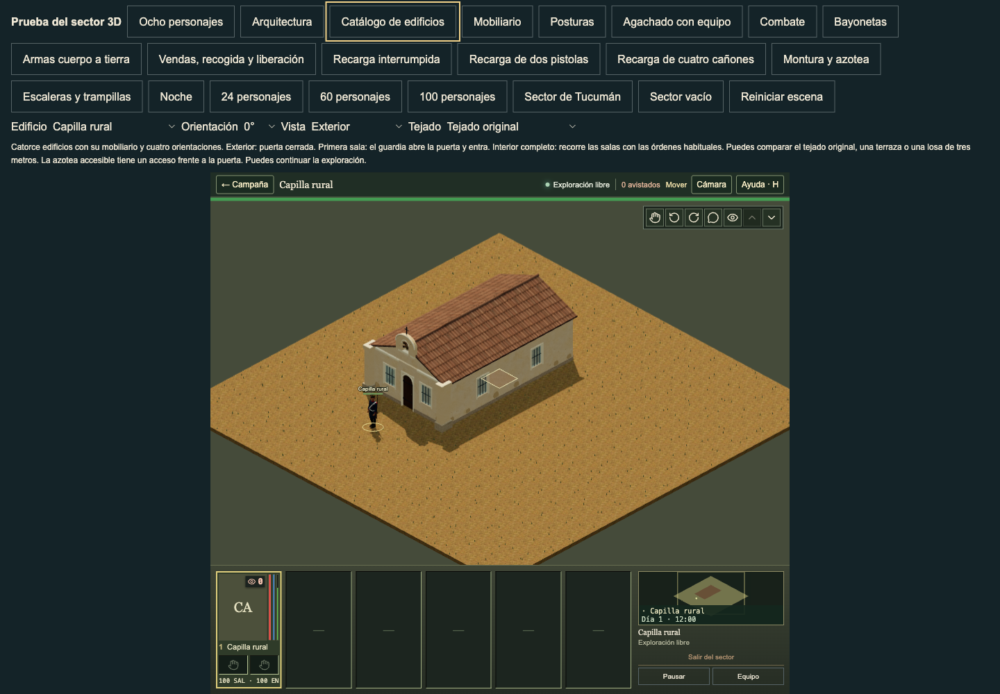
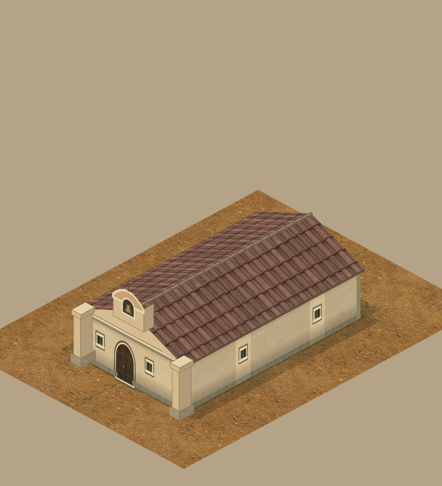

# Rectangular window bars: current source comparison

Base: main `db32676f` (PR #261). This is a local bar-detail correction for authored `barred` and `small` windows. It does not change gameplay rules or collision.

The current `Opening()` in `web/app/TacticalArchitectureMaterials.tsx` draws three pale `#767c68` bars at SVG x=16/20/24, with one-unit end insets and 0.8-unit strokes. Its ordinary rectangular span is x=11..29, y=-32..-13, and its transverse line runs x=12..28 at y=-22. The small span is x=15..25, y=-30..-20; it has no transverse line. The previous native helper drew four dark full-height bars and a transverse line for both styles.

The new local helper maps those source strokes into each existing real aperture. Both wall faces retain the same pane and framing. Explicit tile styles select the helper; unpainted legacy shells retain their previous grille. The accepted parish arches, timber lattice and green shutters keep their own helpers. Existing iron lighting is retained; no global material or texture change is used.





The paired normal-scale chapel views show the three inset bars and the removed small crossbar. These are normal catalogue controls and normal room visits, rather than a pose or renderer override. The source sprite's small aperture has different proportions from the existing native gameplay aperture; the native width, height and sill are deliberately preserved. This record does not claim complete visual parity for all window frames or glazing.

Validation: 25 affected checks pass in 7.58 s, including six new source/physical tests; 33 additional architecture, door and placement checks pass in 7.56 s. TypeScript passes. The tests compare the actual current React stroke formulas, complete grille bounds, pigment and both camera faces. They use seven real compiled templates at four rotations; all seven also retain standing door crossings and sight gaps for original roofs, closed slabs and legal roof routes. They cover corner-window fallbacks, short 1.8 m slabs, saved styles and flags, explicit painted legacy shells, breaches, ordinary disclosure and the retained helpers. Renderer input remains byte-identical. The original source helper failed five new checks before the correction; that evidence remains in the private review artifacts.

Live review: 18 before views and 42 after views passed without browser errors. The 42 after views cover all seven affected templates, all four rotations and exterior/partial/interior states through ordinary controls. Twelve closed-slab and twelve legal-roof-route views also passed without browser errors, for 84 live before/after captures in total. These extra sets use the ordinary chapel and smithy roof controls. Source renders use the real map compiler and the current direct TacticalScene renderer. Only the paired chapel images and source stroke record are retained here; the broader screenshot set remains review evidence.

Focused command:

```sh
node --test tests/three-rectangular-window-bars.test.mjs tests/three-building-windows.test.mjs tests/three-parish-window-bars.test.mjs tests/three-building-supports.test.mjs tests/three-building-surfaces.test.mjs
npm run typecheck
```
