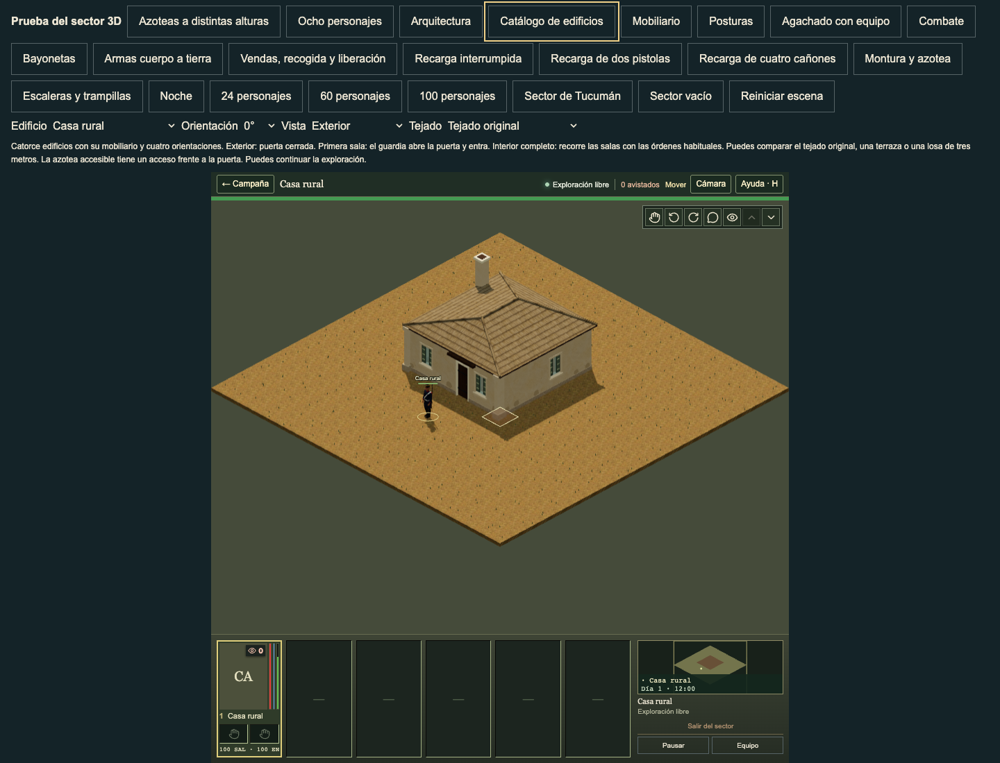
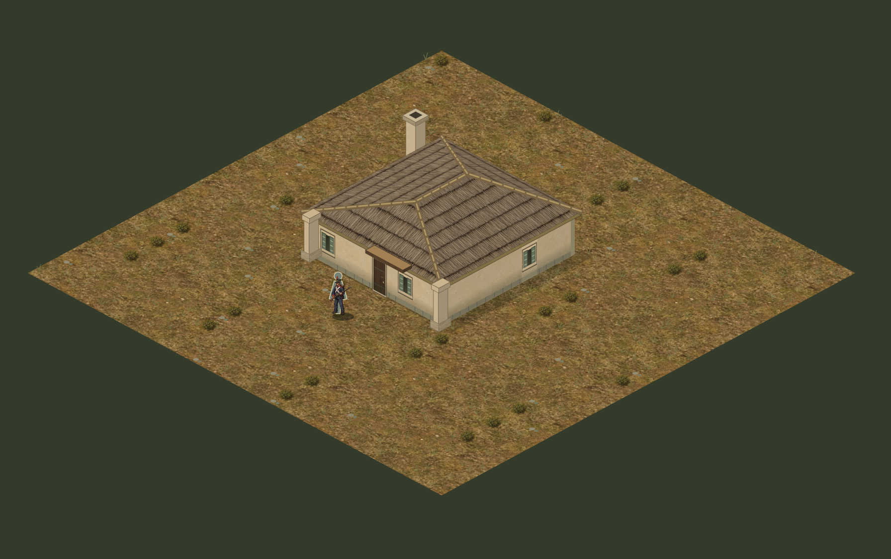

# Source window frame paint

Authored native window jambs, lintels and curved surrounds used generic beige trim. The current sprite `Opening()` uses the trim pigment for each actual wall finish. The native frames now use those five source colours, matching their projecting sills. The old geometry, frame width, arch shape, glazing and grilles stay exact.

This applies to retained full-height windows on authored or explicitly painted legacy shells. Cut windows, unpainted legacy windows and breached openings retain their old admission. Other facade paint and doors stay exact. It adds one shared frame draw per finish in a building. Frame shape, complete facade proportions, glazing differences and full building polish remain open; this increment establishes the source pigment without a claim of complete visual parity or historical reconstruction.





The native images use normal catalogue controls and the full gameplay HUD. The sprite is the retained direct current `TacticalScene` image from the sill review. Its three source renderer files are byte-identical to the predecessor. The images retain the original scale of each renderer. The supplied playtest reference remains a guide for richness and readability, rather than a source of modern appliances.

## Root checks

Implementation `99929c6a3bd2d366aa540f71975a9d4a964ae54e` is based on main `381af4c5669fc106994297966724338c275259c9`. All 32 affected checks pass in 10.19 seconds, including both real curved window faces, standing entrances, sight gaps, roof routes, cutaways and edits. TypeScript, native-library, locomotion-profile, documentation and baseline checks pass. Production build `9a580aed3786` verifies 1,247 files and 1,040 static references.

The independent predecessor comparison covers 608 cases: all fourteen templates through four rotations, three room disclosures and three roof states; five actual source paints and five window styles through four rotations; and four legacy/edit cases. All 11,376 other mesh occurrences retain complete attributes, indices, transforms, materials and shadow flags. All 685,008 reassigned frame triangles retain every exact vertex attribute, transform and shadow flag. Opening and disclosure metadata stay exact. Combined preserved mesh signature: `eed94657f5dc86c81a71a63e38c06e9c24fd760e70a346c3a8d3d1512ae4c4c3`.

Thirty before and sixty current ordinary browser views cover house, chapel, parish, shop and smithy. Both runs retain all 24 source/native pins before and after, and all served pinned native responses match disk. Only `world-buildings.ts` changes between those source receipts. The root viewed the ordinary house pair, the current parish, the current source sprite and supplied playtest reference 004. The complete 106-file published native/profile tree also matches its predecessor Git blobs. Full receipts, repeated mesh-name handling and the obsolete generic-trim test expectation remain in `artifacts/three-window-frame-paint-current-review/`; `source-paint.json` records the concise source and image pins.

## Repeat

```sh
node tools/verify-three-window-frame-paint.mjs --before-buildings=/absolute/path/to/exact/predecessor/world-buildings.ts
node --test tests/three-window-sills.test.mjs tests/three-building-windows.test.mjs tests/three-rectangular-window-bars.test.mjs tests/three-parish-window-bars.test.mjs tests/three-building-surfaces.test.mjs tests/three-building-supports.test.mjs
npm run typecheck
```
