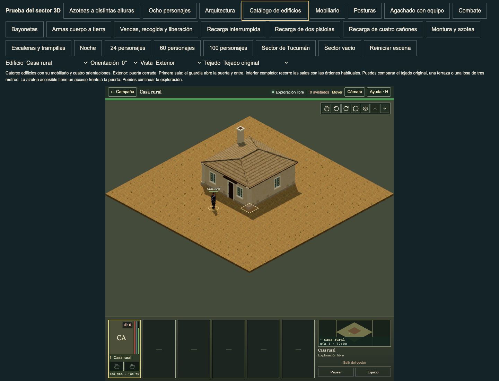

# Source window sills

The current authored `Opening()` draws a trim-coloured sill beyond both jambs. Its regular span is x=9..31 around the x=11..29 window; its small span is x=13..27 around x=15..25. Both use a 2.5-unit stroke. The previous native window had jambs and a lintel, but no projecting sill.

The new native ledge follows those width ratios and the actual source trim pigment for each authored wall finish. Its 2.5 source units become a 99.735 mm native thickness. The complete ledge sits below the retained aperture, stays inside its actual wall span and projects past the existing trim on both camera faces. A small sloping edge drains away from the wall. This is a physical interpretation of the source stroke: its below-aperture placement and depth are explicit adaptations, not an exact copy of the complete facade-scaled SVG outline or a claim of historical reconstruction.

The helper dresses only retained full-height windows on authored or explicitly painted shells. Unpainted legacy shells, cut windows and breaches keep their previous admission. Short slabs and edited corner windows use their real dimensions. Unknown finishes/styles and invalid dimensions omit the extra ledge. No opening, roof, floor, collision, saved state or gameplay rule changes.





The source image uses the current real compiled template and direct `TacticalScene` SVG. The native pair uses normal catalogue controls and the full gameplay HUD. All three preserve the original scale of their respective renderers. The supplied playtest bar/interior reference and retained building catalogue were also inspected for detail and readability; modern appliances were not taken as historical assets. Remaining window framing/glazing differences and complete building polish are outside this sill increment.

## Root evidence

The implementation is `1ccf497c2448793121c7eb2fe69c5d0de5e83527`, based on main `88ee16b9f6e546ea8274602e6549429ac53e2522`. All 32 affected checks pass in 4.78 seconds. They compare the actual current React source sill, five styles and five paint finishes, complete convex surface normals, both sight faces, 168 real compiled catalogue states, disclosure, breaches, short slabs, corner edits and painted legacy admission. TypeScript, native/profile verification, documentation and all 38 baseline checks pass. Production build `922a8e1b9b1e` verifies 1,247 files and 1,040 static asset references.

An independent predecessor renderer comparison covers all fourteen templates, four rotations, three room-disclosure states and three roof states: 504 cases. All 9,220 non-sill meshes retain complete attributes, indices, world transforms, material properties and shadow flags exactly. Opening records, height and disclosure metadata also stay exact. Combined non-sill signature: `0d790ed6f8305241f12564d3d3fd851a3b7ba2eeff7241bd7febe0ae3dbc5732`. Each added ledge has 20 triangles and shares one material draw per finish in its building. The exact predecessor has no sill group.

Thirty before views on main and sixty current views at the implementation commit pass without page, console or HTTP errors. The current set covers house, chapel, parish, shop and smithy through all four rotations and exterior/partial/interior views. All 24 current source/native pins remain exact before and after; 412 served native responses match disk hashes. The 23 before pins and 224 served responses are retained separately. The root viewed the house pair, current smithy, current source house and supplied reference. Full evidence stays in `artifacts/three-window-sills-current-review/`; `source-bounds.json` retains the concise source, metric, preservation and image pins.

## Repeat

```sh
node --test tests/three-window-sills.test.mjs tests/three-building-windows.test.mjs tests/three-rectangular-window-bars.test.mjs tests/three-parish-window-bars.test.mjs tests/three-building-surfaces.test.mjs tests/three-building-supports.test.mjs
node tools/verify-three-window-sill-preservation.mjs --before-buildings=/absolute/path/to/exact/predecessor/world-buildings.ts
npm run typecheck
```
