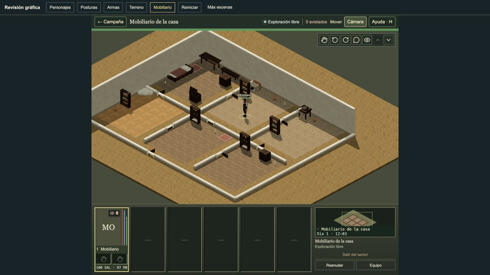
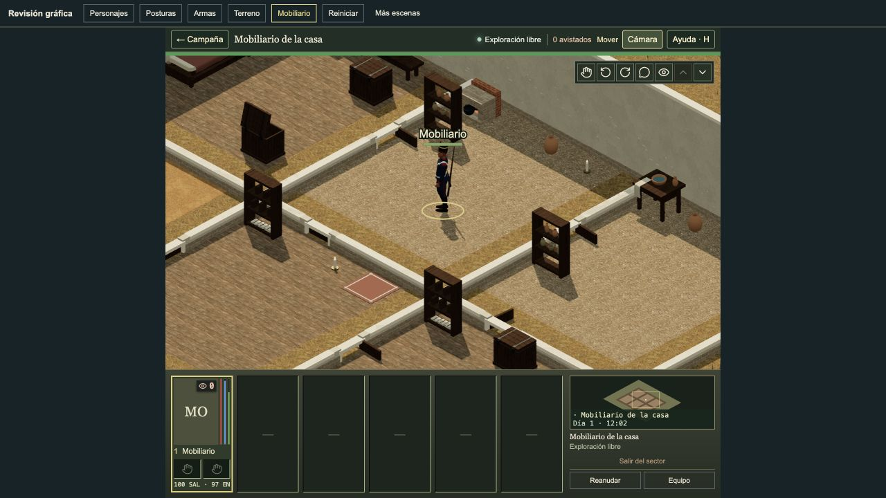
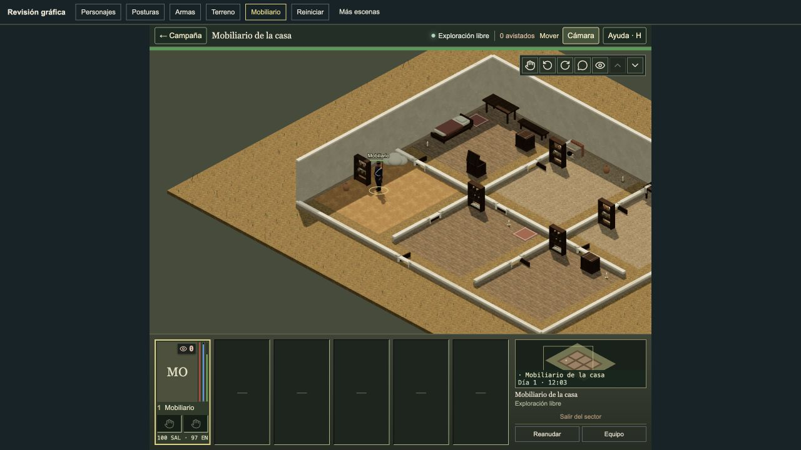
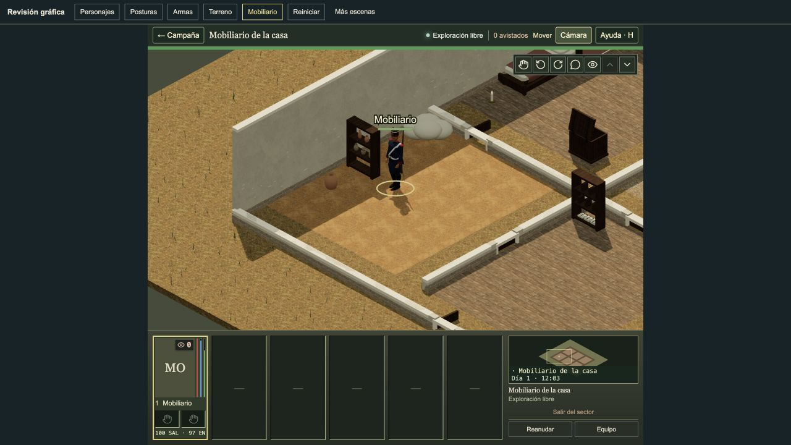

# Shelf vessel review

Root accepted the actual Battlefield through CUA at 44 and 88 pixels. The household shelves show jar, bottle and bowl profiles with open mouths and rolled lips. Their shapes are clear at 88 pixels and quiet at 44 pixels. Office and archive ledgers retain their old render attributes. This agent did not use the browser.

The ordinary store route starts at I7 `{x:6,y:8,tacticalLevel:0}`, passes the open door K7 `{x:6,y:10,tacticalLevel:0}`, and ends at N7 `{x:6,y:13,tacticalLevel:0}`. Kitchen views use I13 `{x:12,y:8,tacticalLevel:0}`. Kitchen BEFORE is paused at 12:03; AFTER is paused at 12:02. Those clocks are not matched. Both store clocks are paused at 12:03. All four metrics files report no browser errors.

Eight photographs and four metrics files are copied and pinned in [live-review.json](../../artifacts/shelf-vessels/live-review.json).

| View | Before triangles | After triangles | Added triangles | Draw calls |
| --- | --- | --- | --- | --- |
| Kitchen, 44 pixels | 68,712 | 70,920 | 2,208 | 114 on both |
| Kitchen, 88 pixels | 126,638 | 128,110 | 1,472 | 99 on both |
| Store, 44 pixels | 68,112 | 70,320 | 2,208 | 112 on both |
| Store, 88 pixels | 122,346 | 123,082 | 736 | 79 on both |

The native household shelf changes from 312 to 1,048 triangles (+736). Its merged stored/drawn vertices change from 936 to 3,144; merged attribute bytes change from 41,184 to 138,336 (+97,152). The three cached forms total 18,408 attribute/index bytes. These are source/CPU counts, not measured GPU allocation. No texture is added. It retains the existing wood/stone, food and ceramic material batches. Three vessel profiles share reusable geometry. Kitchen 44-pixel counters retain 109 geometries and 43 textures; 88-pixel counters retain 102 and 28. Store counters retain 109 and 43 after a LOD2-to-LOD1 transition. These are cache counts, not measured GPU memory. Snapshot FPS does not prove sustained performance. All snapshots have one loaded actor and no pending loads.

Preservation checks pin the complete shelf frame and office/archive ledger attributes at all four rotations. They check board contact, mouths, lips, spacing under the next board, bounds, the game footprint and height, shared materials, room light, cache identity and disposal. Only three owned source/test files differ from corrected piece 15. All other source, assets, character banks, configuration and engine pins remain exact. Room selection, admission, rotations and door clearance are unchanged.

The fixed source is `162ef299a2910112841ce95f5f02d7eb1de0f07fa9d2f43d548d0c7498d79e81`. Typecheck passed in 20.323 seconds. Production build passed in 33.987 seconds and measured 1,377 export files and 1,045 asset references with this exact source identity. The affected Node summary reports 39 passed checks. Its process exit remains unknown because the outside-repository evidence collector failed before it saved that exit. The focused files were not repeated. All six then had measured successful isolated completion records and FILE PASS lines in the standard quick report. The standalone 39/39 summary is retained separately because the standard runner does not export case counts for every file. The overall quick exit was measured as 0. This closes the focused execution gap without a numeric child-exit claim. [Execution-gap proof](../../artifacts/shelf-vessels/affected-execution-gap-closure.json) keeps the collector failure and unknown standalone exit explicit.

The one standard quick passed 6,856/6,856 checks in 901 files in 2,219.405 seconds. It selected 901 of 909 files, retaining only the eight standard exclusions. It used four workers and no extra filters, with no failures, skips or cancellations. All 11,332 inputs and the complete source/runtime/dependency proof remain exact. [delivery.json](../../artifacts/shelf-vessels/delivery.json) records the final gates and limits. The installed source, runtime and dependencies passed the [root equivalence proof](../../artifacts/shelf-vessels/root-final-equivalence.json); the [engine-state proof](../../artifacts/shelf-vessels/root-engine-state-proof.json) also passed. The private helper was executed and is not included in this compact bundle. Final PR: the [delivery plan](../plans/tactical-reference-graphics.md). Root removed the scheduling hold after the unchanged piece 15 reproduction passed 80/80. Publishing remains sequential: piece 15 must pass and seal before piece 16 is merged. A real piece 15 source change would require a new dependency review. Root owns the final PR and merge.

| View | Before | After |
| --- | --- | --- |
| Kitchen, 44 pixels |  |  |
| Kitchen, 88 pixels |  |  |
| Store, 44 pixels |  |  |
| Store, 88 pixels |  |  |
