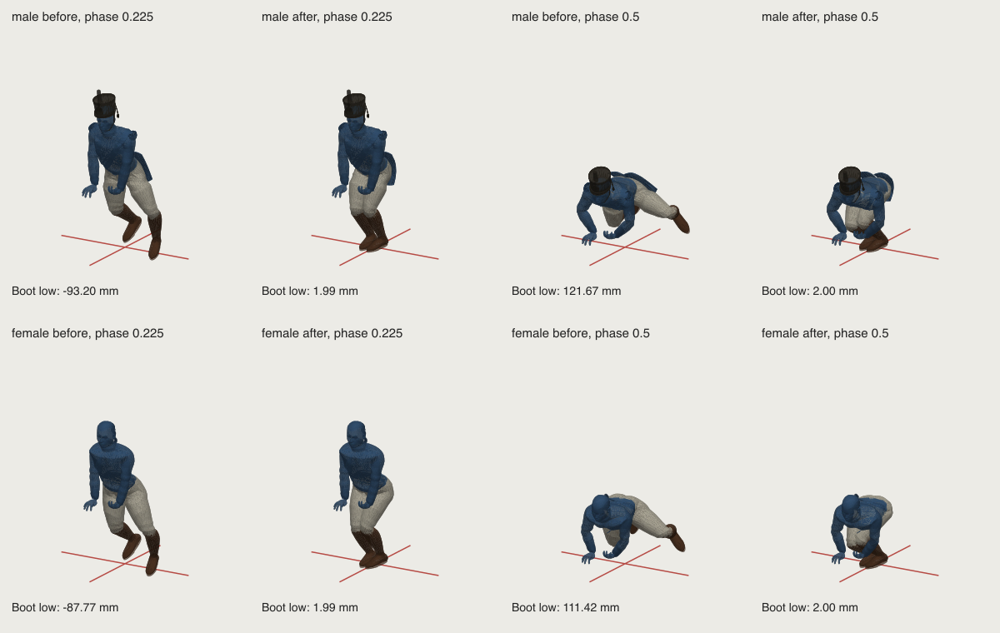

# Native standing reach-gesture boot review — 7 October 2026

This source cut repairs `stand.gesture.heal`, `stand.gesture.pickup` and
`stand.gesture.free` for both native anatomies. It changes eight leg rotation
channels per clip. It does not change the runtime blend or contact helpers.
The source clips have supported boots after this cut. Full gesture and idle
blend acceptance remains open.

## Exact source defect and repair

The original source blends its standing base toward the midpoint of the
native recovery pose. It applies the hand reach, but it does not fit the
resulting legs to the floor. A complete weighted-boot probe at 337 phases
finds the following minima. All three selected clips have identical native
Root, pelvis and leg tracks before and after the repair.

| Anatomy | Original left boot | Original right boot | Repaired worst complete boot |
| --- | ---: | ---: | ---: |
| Male | −93.270 mm | −43.884 mm | +1.953 mm |
| Female | −87.766 mm | −39.859 mm | +1.954 mm |

At the original deep reach, both boots also leave the support plane: the
nearest boot rises to 121.671 mm for male and 111.415 mm for female. The new
pose keeps both complete boot minima at the 2 mm contact plane.

The fit reads the released native poses and all actual skin weights. It
retains each starting footprint and yaw, and fits the native thigh and calf
to that footprint. A flat right sole cannot reach the retained standing
pelvis: its initial ankle target is about 2.65 mm beyond the male native
chain. A measured fixed forefoot roll solves that reach without moving the
body or stretching a bone. The fixed roll is measured over the complete
gesture before the output keys are written. It does not switch on at a
single near-straight knee sample.

The maximum source roll is 1.170 degrees male and 1.372 degrees female. The
highest heel/sole perimeter point is 8.168 mm male and 9.229 mm female. Both
native leg chains retain more than 2.004 mm of straight-leg reserve in the
stored interpolation. Native joint offsets and scales remain exact.

Every released footwear vertex is included, including the weighted boot
shaft and toe cap. The actual side counts are:

| Anatomy | LOD0, left/right | LOD1, left/right | LOD2, left/right |
| --- | ---: | ---: | ---: |
| Male | 607 / 608 | 397 / 393 | 242 / 240 |
| Female | 640 / 640 | 396 / 397 | 247 / 245 |

Each foot also has 48 actual lower sole perimeter vertices at every LOD.
The fitter checks all three complete LOD surfaces together. The independent
stored-asset tests then check each LOD separately at 240 Hz.

## World foot motion and continuity

The stored sole stays within 0.0471 mm of its fixed world footprint. Its
worst interpolation velocity residual is 11.283 mm/s. Start-to-end sole
difference is below 0.00019 mm. These measurements establish bounded contact
residuals; they do not establish zero slip.

The boot shaft can move with its weighted calf while the sole stays planted.
Its maximum measured world vertex speed falls from 2.094 m/s in the original
native clip to 1.126 m/s in the repaired clip, using the same 337-phase grid.
The native ankle path previously moved far from its starting footprint; its
maximum correction is 558.5 mm male and 532.3 mm female. Those are leg pose
changes during the deep bend, not a body translation. Root, pelvis and upper
body channels are preserved.

The following image is a CPU geometry review of the actual LOD0 skin and
weighted boots. It shows healing at phases 0.225 and 0.5 before and after the
repair. The simple colours are diagnostic; it is not a production UI or
material acceptance capture. The other two selected clips have the same
measured lower-body path.

## Raw idle blend limits

The raw blend probe uses the ordinary 120 ms duration, six native idle
equipment guards, both anatomies, all three LODs, entry and return, and idle
phases 0, 0.25, 0.5 and 0.75. Each blend has 30 samples. It performs no
runtime foot or contact correction. Entry advances both source clocks;
return holds the original gesture endpoint while the idle clock advances.

On released guard baseline `1b397d67ec17de25f622eabea4bbc9b2d5ab0b7e`, the
288 original gesture blend states reach −21.883 mm. After this source repair,
the worst residual is −5.598 mm in a male rifle return blend. The earlier
guard set at `b4c25441043b8ebdb3ea8e5e51aea9d1c0c27da1` has a repaired worst
residual of −4.855 mm. The changed rifle guard is retained exactly; it is not
altered to conceal the local blend difference.

| Idle guard | Repaired raw blend minimum, current guard baseline |
| --- | ---: |
| Unarmed | +1.229 mm |
| Rifle | −5.598 mm |
| Pistol | −4.759 mm |
| Sabre | −4.855 mm |
| Knife | −4.854 mm |
| Lance | −4.096 mm |

The current raw blend peak complete-boot speed is 1.876 m/s. The nearest
supporting boot rises at most 3.925 mm during those blends. The full native
clip and the full idle blend are separate acceptance boundaries. Runtime
start/return and interrupted equipment blends need a later consumer review.
The owned sideways consumer does not claim these gesture blends.

## Preservation and reproduction

The output is a named rotation transplant on complete source banks. A binary
payload comparison retains all 331 other clips per anatomy and all 151
non-leg channels per selected clip. It also retains the native rig nodes,
joint transforms, skin weights, inverse binds, geometry, corrective shapes,
materials and asset tables. Durations remain 1.4 seconds. Events, markers,
loop flags, simulation timing and all other manifest records remain exact.
The released rifle guard correction is included and preserved. No lance or
sideways source clip changes.

`build-gesture-support.py` reads only the three selected stored animations,
imports the three released body LODs, fits and exports only their eight lower
rotations, and proves preservation before writing either complete bank. The
normal library builder invokes it after the native climb and rifle guard
source steps. It does not retarget or rebuild the other motions. A later
integration must run this named builder on the current banks, or transplant
only these named channels and metadata, to retain concurrent source cuts.

The isolated source gate passes six complete-boot anatomy/LOD tests in
15.62 seconds, the binary preservation checks for both complete banks,
manifest preservation, and Python compilation of the four affected source
files. The tests check support, real full weighted surfaces, reach, native
offsets/scales, world footprint and endpoint continuity. No TypeScript source
changes. Clean production build, actual runtime gesture controls, garment
clearance and visual acceptance remain for integration.

The exact source, sampled before/after metrics, all 288 blend states for each
guard baseline, source roll demand and preservation hashes are recorded in
[the native metrics](reviews/standing-gestures/native-gesture-support-metrics.json).
