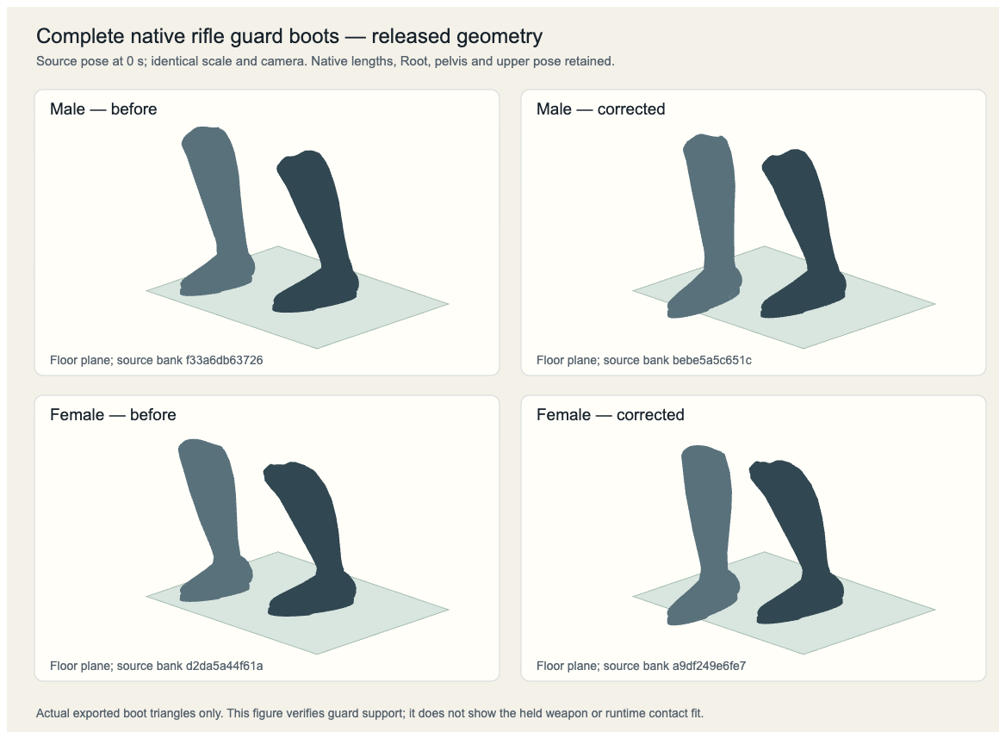

# Standing rifle guard boot support

This cut corrects the released male and female standing rifle guard. Both complete boots now meet the 2 mm floor plane at idle and at the initial/final butt-strike endpoints. The strike keeps its recorded right-foot lift while the left boot remains supported. It is a bounded source support correction; the full butt animation and target contact fit still need separate review.

## Source and preserved data

The input is the actual released bank at `b60735ba5f18dfc2e92d94d40f241c2bb427c077`, rather than a new retarget or generic gesture. `stand.idle.long-gun` remains a 2 s loop. `stand.butt.long-gun` remains 1 s with contact at 0.42 s and playback rate 1.25. The source Root advance, pelvis, upper body, both hand grips, native bone offsets/scales and all action markers stay exact. Simulation AP, cells, facing, ownership, ammunition and outcomes do not change.

Only the eight named thigh/calf/foot/ball rotation channels change in those two clips per anatomy. Each bank still has 334 clips. All 332 other clips and the other 151 channels per selected clip are byte-identical. Native node transforms, mesh attributes, triangles, skin joint order and inverse bind matrices are exact. The locomotion profile remains unchanged.

The previous source guard had a tilted left sole and raised right boot. The lower outline reached 20.194 mm on the male left boot and 27.490 mm on the female left boot. The right whole-boot minimum was 36.334 mm male and 33.978 mm female. A simple downward shift would retain the heel/toe tilt. The repair uses the actual weighted complete boot surfaces, native thigh/calf lengths, level foot and ball rotations, and a strict native leg reach solve. Neither a joint offset nor a scale is changed.

The retained female strike pelvis briefly needs a forefoot pivot. Its measured C2 roll starts at native 0.345833 s, peaks at 0.5 s, and ends at 0.65 s. Peak roll is 1.074777 degrees. This covers the complete 240 Hz reach demand with a 2 mm straight-leg reserve; it does not change the contact marker. The exported lower rotations use 120 Hz keys. Male boots need no forefoot roll.

## Complete geometry and blend acceptance

The independent source gate checks both anatomies and all three LODs at native 240 Hz. It checks every boot vertex, the complete lower sole outline, native leg reach, the final guard, and actual point speed. All twelve native clip/LOD combinations pass.

- Nearest full-boot support is 1.952317–2.000153 mm.
- Maximum supporting outline height is 7.657453 mm during the female forefoot roll. Full sole span is at most 5.664495 mm.
- The right foot retains a maximum 35.161320 mm lift. Its lift above 0.25 mm occurs in preparation at native 0.104167–0.329167 s and recovery at 0.620833–0.929167 s. The left boot remains supported throughout. Idle and both strike endpoints have both complete soles level at 2 mm.
- Minimum actual native reach reserve is 2.175874 mm male and 2.004539 mm female. Knees keep their forward anatomical bend.
- Maximum complete boot point speed is 1.390669 m/s at the approved 1.25 playback rate.

Six additional tests run the real runtime's 0.12 s idle→butt→idle crossfades at 24/60/240 Hz. They start from a legal owned-rifle paid action, keep the cardinal heading fixed to isolate source support, retain the native finite clock, and do not resolve a target model or apply a runtime rifle fit. They verify complete boot support and native lengths through both blends, one completion, and return of every boot point to the idle guard. Maximum blend point speed is 1.585415 m/s. Diagonal paid facing and fitted target contact remain separate work.

## Retained source motion limit

The original Root/pose tracks contain sharp transfer and recovery tangents. The source support correction preserves those tracks. The earlier pointwise minimum roll amplified the female recovery corner; the measured smooth roll removes that threshold and reduces its sampled acceleration, but does not erase every inherited motion corner.

The tables compare all actual boot points in the old and new banks at the same native 240 Hz interval. Speed uses the approved 1.25 playback rate; adjacent vector-velocity acceleration uses 1.25². Native times identify the same source phases. Global peak speed decreases from 1.392223 to 1.390668 m/s, while transfer and recovery acceleration increase at the retained source corners. These are sampled derivatives, rather than a proof of a smooth continuous derivative. Boot-shaft acceleration remains a motion polish limit. This cut does not claim that the complete butt animation is polished.

| Anatomy | LOD | Bank | Peak point speed (m/s) | Native time | Side / vertex | Peak point acceleration (m/s²) | Native time | Side / vertex |
|---|---:|---|---:|---:|---|---:|---:|---|
| granadero | 0 | original | 1.389973 | 0.170833 | r / 801 | 227.102977 | 0.204167 | r / 724 |
| granadero | 0 | corrected | 1.389335 | 0.137500 | r / 694 | 266.074638 | 0.204167 | r / 625 |
| granadero | 1 | original | 1.390195 | 0.170833 | r / 428 | 226.753933 | 0.204167 | r / 408 |
| granadero | 1 | corrected | 1.387871 | 0.137500 | r / 449 | 266.074638 | 0.204167 | r / 408 |
| granadero | 2 | original | 1.390566 | 0.170833 | r / 291 | 226.298371 | 0.204167 | r / 281 |
| granadero | 2 | corrected | 1.386778 | 0.170833 | r / 259 | 265.389180 | 0.204167 | r / 281 |
| woman-scout | 0 | original | 1.392223 | 0.170833 | r / 714 | 224.913490 | 0.204167 | r / 666 |
| woman-scout | 0 | corrected | 1.390668 | 0.137500 | r / 749 | 262.789353 | 0.204167 | r / 769 |
| woman-scout | 1 | original | 1.392191 | 0.170833 | r / 493 | 224.803048 | 0.204167 | r / 463 |
| woman-scout | 1 | corrected | 1.387613 | 0.170833 | r / 493 | 262.488977 | 0.204167 | r / 458 |
| woman-scout | 2 | original | 1.392039 | 0.170833 | r / 294 | 225.396517 | 0.204167 | r / 283 |
| woman-scout | 2 | corrected | 1.387564 | 0.170833 | r / 269 | 262.610786 | 0.204167 | r / 283 |

All event values below are original → corrected. Each acceleration value records its actual maximum vertex at that event.

| Anatomy | LOD | Transfer speed at .204167 (m/s) | Transfer acceleration (m/s²; vertex) | Recovery speed at .537500 (m/s) | Recovery acceleration (m/s²; vertex) |
|---|---:|---:|---|---:|---|
| granadero | 0 | 1.272024 → 1.270982 | 227.102977 (r724) → 266.074638 (r625) | 0.503003 → 0.834777 | 117.141169 (l79) → 240.031393 (l79) |
| granadero | 1 | 1.272156 → 1.270916 | 226.753933 (r408) → 266.074638 (r408) | 0.503003 → 0.833098 | 116.779732 (l42) → 239.602847 (l42) |
| granadero | 2 | 1.272156 → 1.270916 | 226.298371 (r281) → 265.389180 (r281) | 0.503301 → 0.827873 | 115.995542 (l17) → 238.294581 (l17) |
| woman-scout | 0 | 1.273504 → 1.272578 | 224.913490 (r666) → 262.789353 (r769) | 0.526002 → 0.736190 | 131.859732 (l103) → 247.613927 (l106) |
| woman-scout | 1 | 1.273516 → 1.272543 | 224.803048 (r463) → 262.488977 (r458) | 0.526002 → 0.723712 | 131.198343 (l146) → 244.923381 (l147) |
| woman-scout | 2 | 1.273516 → 1.272543 | 225.396517 (r283) → 262.610786 (r283) | 0.525526 → 0.717300 | 131.104851 (l3) → 244.427531 (l65) |

## Source view and validation

This view projects the actual released boot triangles at source time 0 with identical scale/camera. It shows the guard support change. It does not show a held weapon, runtime target contact, or an ordinary gameplay screenshot.

Focused complete-boot and crossfade tests, named-channel preservation, Python syntax checks, exact temporary project type check and unchanged locomotion calibration pass. The affected loading, riding, seat, sideways, sabre and pistol regression run passed 65 checks against the first support snapshot; the final refinement changes only the selected lower guard/strike rotations and has its own complete native/blend gates. No broad release suite is claimed.

`tools/characters-3d/build-guard-support.py` reproduces the two-clip correction from the current released poses and proves channel/rig/mesh preservation before publishing both banks. The complete animation builder invokes it after the native climbing increment. The runtime rifle-contact fit remains held until it passes the corrected guard's complete native support and both wrist paths.

## Actual gameplay acceptance

Source `16d4ccc1` passes all twelve complete-boot and actual 0.12 s crossfade checks in 5.23 seconds. Python syntax, the complete 334-clip character library, unchanged locomotion profile, TypeScript, documentation and 38 baseline checks pass. Export `bf42f3a607e8` verifies 1,244 files and 1,039 asset references. The root transplant proves all 332 other clips, all 151 non-leg channels per selected clip, native rigs/meshes/skins and all but eight permitted manifest fields exact.

All four ordinary owned Brown Bess sideways routes complete at their saved cells; 72 source-pinned images have no browser errors. Both normal cardinal paid stock-mode routes also pass: male Fusil keeps F10 and female Granada keeps N9, using their existing primary rifles and the normal B control. Each spends 4 PA, changes the observed target once from 100 to 82 health and retains one loaded cartridge plus twelve reserve cartridges. All three finite presentation phases appear; 42 captures, served native hashes and before/after source identity pass. Selected guard/movement and paid frames were inspected against the retained native-boot comparison and current movement references. Reports and receipts are under `artifacts/three-native-rifle-guard-cut-review/`, `artifacts/three-native-rifle-guard-paid-review/` and `artifacts/three-native-rifle-guard-transplant/`.

The first parallel browser startup timed out during cold page loading. Warm serial startup and the three remaining routes then pass; the failed startup is not counted as acceptance. These checks accept only source boot support. The retained sampled acceleration corners, sideways start/stop blend limits, paid diagonal rifle turn and complete natural two-hand target fit remain open. No fitted-rifle contact or general motion polish is claimed.
