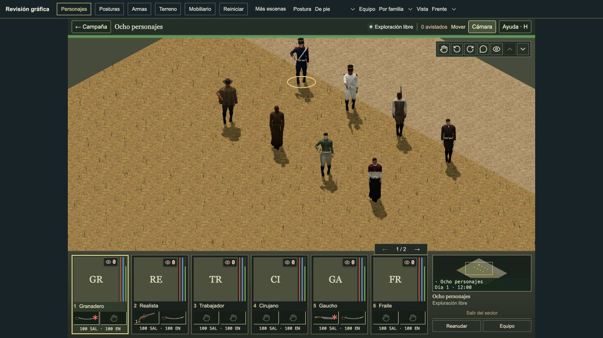
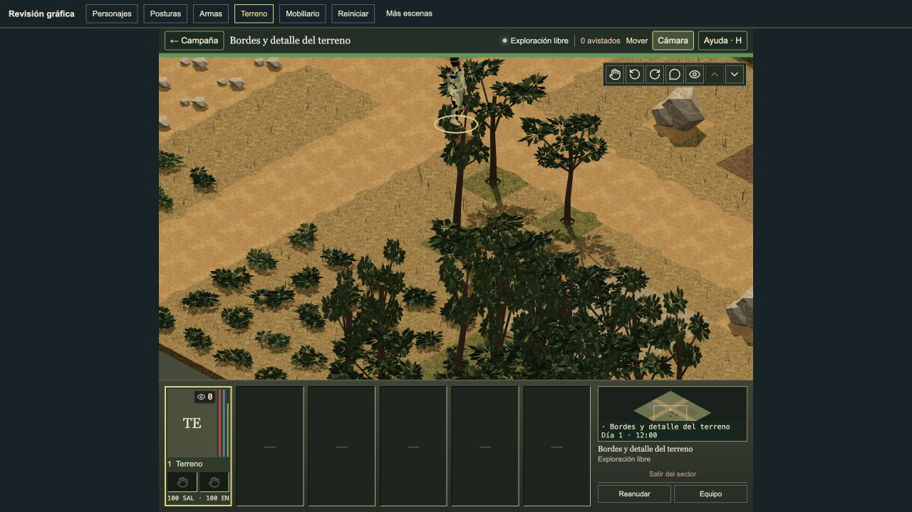
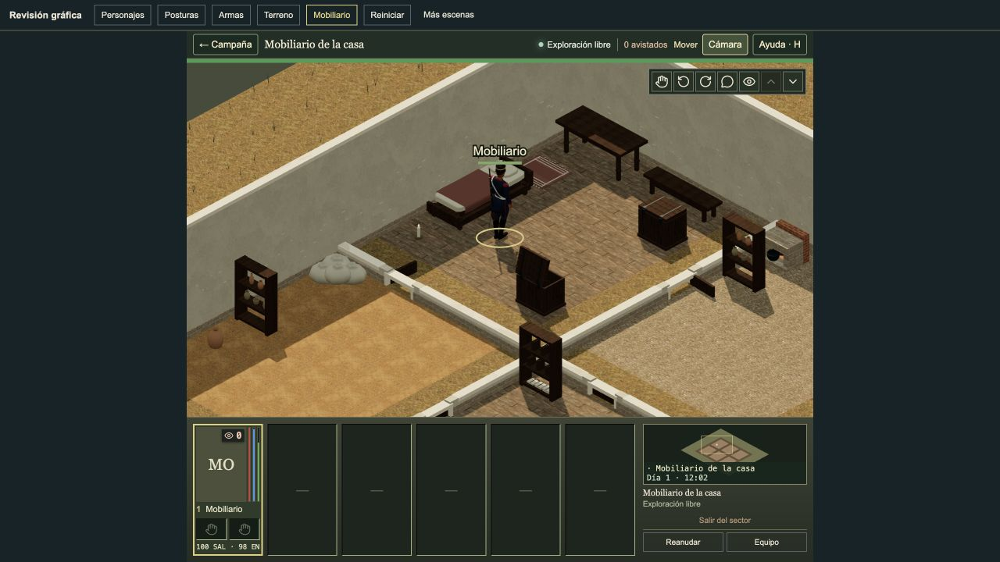
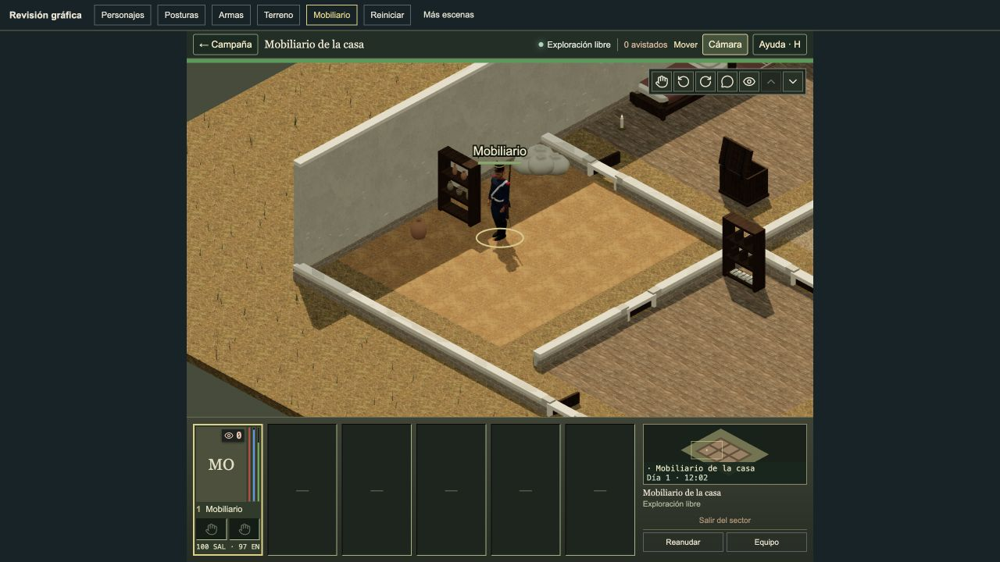
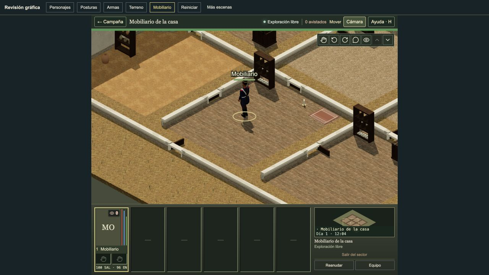

# Tactical graphics pictures

[Art records](README.md) · [18-piece delivery audit](../verification/tactical-reference-delivery-2026-10-09.md) · [Plan](../plans/tactical-reference-graphics.md)

Open a picture to inspect it on a phone. These are actual saved accepted views
at nominal 88-pixel character scale; this page can scale them. Each view records
its own stage. All 17 accepted changes are merged. Piece 5 was a rejected trial.
The supplied [house](../references/tactical-graphics-2026-10-08/house-interior.jpg)
and [clearing](../references/tactical-graphics-2026-10-08/clearing-characters.jpg)
guided these small changes. Full JA2 graphics parity is not claimed.

## Approved player view

The approved piece 6 picture shows the reviewed clothing and relaxed free left arm in blade, knife and pistol standing rest. The record links all character families and transition checks.

[Before, 88](tactical-reference-2026-10-08/relaxed-arm-before-front-88.jpg) · [After, 88](tactical-reference-2026-10-08/relaxed-arm-after-final-front-88.jpg) · [After, 44](tactical-reference-2026-10-08/relaxed-arm-after-final-front-44.jpg) · [Review](character-standing-free-arm-review-2026-10-08.md)

## Ground and plants

The piece 11 view includes irregular soil edges, sparse chips, thin weeds, uneven rocks and leaf sprays with gaps. The before link compares the leaf pass in the same expanded terrain scene.

[Before, 88](tactical-reference-2026-10-08/leaf-sprays-before-88.jpg) · [After, 88](tactical-reference-2026-10-08/leaf-sprays-after-88.jpg) · [After, 44](tactical-reference-2026-10-08/leaf-sprays-after-44.jpg) · [Review](leaf-sprays-review-2026-10-08.md)

## Interior and floor

The accepted piece 18 view shows timber construction, soft bedding and ground-floor joints and wear. The upper deck and hatch appearance stay preserved.

[Before, 88](tactical-reference-2026-10-08/room-floors-before-house-88.jpg) · [After, 88](tactical-reference-2026-10-08/room-floors-after-house-88.jpg) · [After, 44](tactical-reference-2026-10-08/room-floors-after-house-44.jpg) · [Review](room-floors-review-2026-10-08.md)

## Hearth and cookware

The inward hearth opening keeps the pot visible. Its rim and bail are clearer at 88 pixels; the bail stays quiet at 44.

[Before, 88](../../artifacts/hearth/hearth-before-88px.jpg) · [After, 88](../../artifacts/hearth/hearth-after-88px.jpg) · [After, 44](../../artifacts/hearth/hearth-after-44px.jpg) · [Review](hearth-review-2026-10-08.md)

## Shelf vessels

The store shelves show jar, bottle and bowl profiles with open mouths. Office and archive ledgers remain unchanged. Store clocks match; kitchen clocks differ.

[Before, 88](../../artifacts/shelf-vessels/before-store-88px.jpg) · [After, 88](../../artifacts/shelf-vessels/after-store-88px.jpg) · [After, 44](../../artifacts/shelf-vessels/after-store-44px.jpg) · [Review](shelf-vessels-review-2026-10-08.md)

## Gathered sacks

Gathered mouths and broad creases give the sacks a softer outline. Lower bags meet the floor; the raised bag meets its supports. Room clocks and poses are not all matched.

[Before, 88](tactical-reference-2026-10-08/storage-cloth-before-store-88.jpg) · [After, 88](tactical-reference-2026-10-08/storage-cloth-after-store-88.jpg) · [After, 44](tactical-reference-2026-10-08/storage-cloth-after-store-44.jpg) · [Review](storage-cloth-review-2026-10-08.md)

## Rug bands and fringe

Woven bands and uneven fringe are clearer close up and quiet at normal scale. The authored footprint and room admission remain exact.

[Before, 88](tactical-reference-2026-10-08/storage-cloth-before-office-88.jpg) · [After, 88](tactical-reference-2026-10-08/storage-cloth-after-office-88.jpg) · [After, 44](tactical-reference-2026-10-08/storage-cloth-after-office-44.jpg) · [Review](storage-cloth-review-2026-10-08.md)

The [rejected garment-fit record](character-outer-garment-fit-review-2026-10-08.md)
keeps the worker vest and both shawl LODs unchanged. [Upper deck preservation](tactical-reference-2026-10-08/room-floors-after-upper-88.jpg),
[open descent aperture](tactical-reference-2026-10-08/room-floors-after-descent-playback.jpg)
and [completed descent](tactical-reference-2026-10-08/room-floors-after-descent-complete.jpg)
are saved separately. Short FPS readings do not prove sustained performance.
