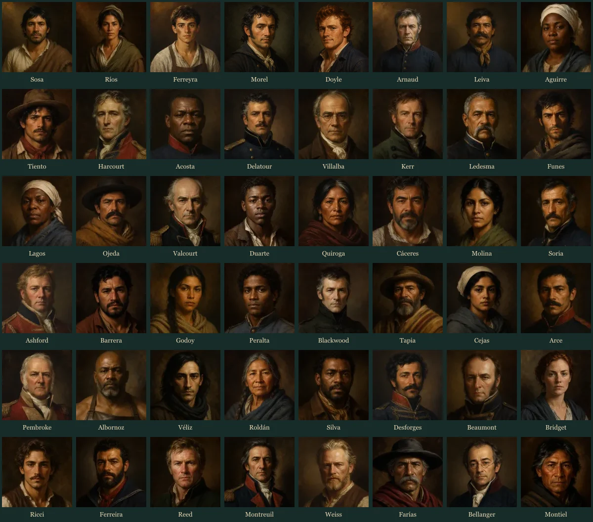

# Paid mercenary roster

The hiring desk contains 48 paid fictional volunteers, in addition to the 13 historical operatives. IDs 100–106 are retained; IDs 107–147 are new. The custom officer remains separate.

Each new volunteer has ten attributes, working tactical traits, personal equipment, a biography, a personality, seven event lines, and an individual portrait. These are fictional dramatic characters, not historical claims.

## Former officers

Ten women from the initial expansion have been replaced by five fictional former British officers and five fictional former French officers. The paid roster now has nine women and 39 men. Historical characters are unchanged.

The replacements include infantry and cavalry commanders, an engineer major, an artillery colonel, a staff colonel, and a senior military surgeon. They left their former service and seek private paid contracts; they do not represent Britain or France. Their invented backstories avoid later events such as Waterloo or the post-1815 demobilization. The National Archives documents period officer careers and half-pay status in its [British Army officer research guide](https://www.nationalarchives.gov.uk/help-with-your-research/research-guides/british-army-officers-1913/); these game characters are not entries from those records.

The existing IDs are retained. A save containing one of the replaced characters will show the new officer under that ID, retaining service status, injuries, equipment changes, experience, and the current contract. Future base skills and hiring quotes use the new officer data.

## Hiring

Search by name, nickname, or occupation. Filter by specialty or service status. Sort by name, daily pay, marksmanship, or medical skill. Stat filters require 70 points; scouting and riding filters use tactical traits. Existing prepaid contract and experience rules remain in effect. Every specialist accepts day, weekly or monthly contracts; only the treasury limits the terms. Elite specialists charge premium daily rates, so the 3200-peso starting treasury cannot retain one for more than a day or two.

| ID | Name | Role | Daily pay at level 1 | Terms |
| --- | --- | --- | ---: | --- |
| 100 | Rafael Sosa | Peón y miliciano provincial | 6 | Day / week / month |
| 101 | Tomasa Ríos | Exploradora del Litoral | 8 | Day / week / month |
| 102 | Mateo Ferreyra | Aprendiz de la maestranza | 7 | Day / week / month |
| 103 | Étienne Morel | Artillero de marina francés | 12 | Day / week / month |
| 104 | Patrick Doyle | Marinero irlandés | 10 | Day / week / month |
| 105 | Lucien Arnaud | Veterano fusilero francés | 1600 | Day / week / month |
| 106 | Manuel Leiva | Sargento de frontera | 1380 | Day / week / month |
| 107 | Inés Aguirre | Enfermera de campaña | 14 | Day / week / month |
| 108 | Julián Pereyra | Domador de la campaña | 9 | Day / week / month |
| 109 | Edward Harcourt | Ex teniente coronel británico | 1360 | Day / week / month |
| 110 | Baltasar Acosta | Fusilero de milicias | 10 | Day / week / month |
| 111 | Armand Delatour | Ex mayor de ingenieros francés | 28 | Day / week / month |
| 112 | Gaspar Villalba | Cirujano de posta | 25 | Day / week / month |
| 113 | Alistair Kerr | Ex mayor de infantería ligera británico | 27 | Day / week / month |
| 114 | Eusebio Ledesma | Sargento instructor | 22 | Day / week / month |
| 115 | Nicolás Funes | Tirador de las sierras | 19 | Day / week / month |
| 116 | Petrona Lagos | Socorrista del Litoral | 8 | Day / week / month |
| 117 | Jacinto Ojeda | Lancero de frontera | 15 | Day / week / month |
| 118 | Étienne Valcourt | Ex coronel de artillería francés | 1430 | Day / week / month |
| 119 | Benjamín Duarte | Recluta de saladero | 5 | Day / week / month |
| 120 | Mercedes Quiroga | Guía de quebradas | 16 | Day / week / month |
| 121 | Ramón Cáceres | Carpintero de campaña | 10 | Day / week / month |
| 122 | Isabel Molina | Botánica y practicante | 17 | Day / week / month |
| 123 | Santiago Soria | Fusilero veterano | 24 | Day / week / month |
| 124 | Thomas Ashford | Ex mayor de dragones británico | 26 | Day / week / month |
| 125 | Diego Barrera | Zapador de milicias | 18 | Day / week / month |
| 126 | Teresa Godoy | Exploradora serrana | 7 | Day / week / month |
| 127 | Esteban Peralta | Tambor e instructor | 12 | Day / week / month |
| 128 | William Blackwood | Ex teniente coronel de fusileros británico | 1490 | Day / week / month |
| 129 | Francisco Tapia | Arriero del oeste | 9 | Day / week / month |
| 130 | Ángela Cejas | Auxiliar de hospital | 6 | Day / week / month |
| 131 | Vicente Arce | Carabinero de frontera | 21 | Day / week / month |
| 132 | Charles Pembroke | Ex coronel de infantería británico | 1290 | Day / week / month |
| 133 | Pedro Albornoz | Herrero de herraduras | 11 | Day / week / month |
| 134 | Mariano Véliz | Vigía nocturno | 13 | Day / week / month |
| 135 | Josefa Roldán | Practicante veterana | 1170 | Day / week / month |
| 136 | Lorenzo Silva | Guardia de convoy | 14 | Day / week / month |
| 137 | Louis Desforges | Ex teniente coronel de caballería francés | 32 | Day / week / month |
| 138 | Henri Beaumont | Artillero francés | 1100 | Day / week / month |
| 139 | Bridget O’Connell | Enfermera irlandesa | 19 | Day / week / month |
| 140 | Matteo Ricci | Armero genovés | 16 | Day / week / month |
| 141 | Joaquim Ferreira | Marinero portugués | 12 | Day / week / month |
| 142 | Samuel Reed | Fusilero británico | 1290 | Day / week / month |
| 143 | Philippe Montreuil | Ex coronel de estado mayor francés | 1380 | Day / week / month |
| 144 | Karl Weiss | Mecánico de piezas | 21 | Day / week / month |
| 145 | Domingo Farías | Jinete veterano | 1230 | Day / week / month |
| 146 | Auguste Bellanger | Ex cirujano mayor del ejército francés | 23 | Day / week / month |
| 147 | Andrés Montiel | Explorador veterano | 1140 | Day / week / month |

## Artwork

The 41 new portraits were generated individually with the built-in image_gen tool. Exact prompts are in `assets/prompts/mercenary-portraits.json`. Sources are listed individually in the prompt manifest. The ten replacement officer portraits use `-v2.png` sources; previous sources are retained. Production files are 384 × 384 WebP images, mirrored in `assets/web/` and `web/public/art/`. Rebuild them with `node tools/build-mercenary-portraits.mjs`. The portrait manifest records dimensions and SHA-256 checksums.

## Compatibility

The existing saved-game migration supplies records for newly added civic volunteers. Historical IDs, existing paid IDs, current recruits, and contracts are preserved. New games continue to start without automatically hired mercenaries.
