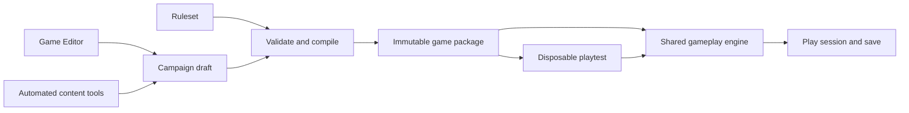

# Game content system and editor

> **Development-workspace record.** This note describes a separate development
> checkout. Its implementation and test results are not published-main acceptance.
> See [published progress](../verification/published-progress.md) for the main branch baseline.

Status: proposed design for review. No editor or runtime conversion is implemented by this document.
Date: 2026-09-27.

## 1. Goal and design decision

Develop the JA2-style gameplay systems and the authored campaign as separate work streams. The designer must be able to replace hireable characters, edit and create weapons, set where and when people appear, tune supported game rules, write dialogue, select portraits, and build a campaign without editing JavaScript for each change. Character locations can be a specific sector, a defined range or group of sectors, or a random eligible sector.

Use the JA2 behavior model: resolve permanent randomized locations at **new campaign creation**, then make fresh location decisions for roaming NPCs during scheduled daily updates. A person may stay at a fixed location, stay at a randomly chosen initial location, or relocate within an allowed area as days pass. Daily relocation changes the existing person's location; it does not create a fresh version of that person.

Activation is independent of location behavior. Some people are present from the start; others remain inactive until a death, quest, or story condition occurs. Conditional successors, such as Sal replacing Pablo, have authored definitions but become active only if their trigger occurs during play. Any randomized event delay is chosen once when that event is scheduled, then saved.

Interactions can also direct an existing character to act inside the current sector: walk to a place, approach another person, wait, face someone, or continue a conversation after arrival. These sequences run through normal gameplay movement and remain responsive to interruptions.

Build a **Game Editor** in the existing web project. It edits versioned content files through a shared validation and command layer. The game loads a validated campaign package and a ruleset. The editor and automated tools use the same commands and checks.

The first complete workflow is: duplicate a campaign draft, replace a hireable character, change their portrait and placement policy, create a weapon from a supported weapon type, assign it to the character, test recruitment and weapon use in the real game, export the package, and load it again.

This is a larger scope than a dialogue editor. Separate three kinds of decisions:

| Layer | Responsibility | Examples |
| --- | --- | --- |
| Engine | Implements supported behavior and enforces game state | Movement, line of sight, action points, shooting, wounds, inventory ownership, contracts, save validation |
| Ruleset | Selects and configures supported behavior | Action costs, progression rates, contract periods, item statistics, enemy force limits |
| Campaign content | Describes this particular world and story | Starting resources/roster/ownership, characters, factions, appearances, recruitment offers, dialogue, missions, rewards, chapter links, endings, portraits |

A campaign selects an exact ruleset revision. Different stories can use the same ruleset. A balance experiment can use a different ruleset with the same story. New mechanics still require an engine implementation and verification before the editor exposes them.



## 2. Current code and what must change

These findings describe the working files inspected on the design date, including pending work. They do not establish that the full game passes its completion audit.

| Current location | Current dependency | Required design change |
| --- | --- | --- |
| [data.js](../../game/data.js), [recruitment.js](../../game/recruitment.js), [mercenaries.js](../../game/mercenaries.js) | Character definitions are spread across modules; growth depends on roster membership | One character catalogue with explicit service and progression profiles |
| [contracts.js](../../game/contracts.js) | Character numbers below 100, number 1000, and zero pay affect permanent service | Explicit contract policy; identity does not select service rules |
| [tactical.js](../../game/tactical.js) | Certain character numbers select combat bonuses and bodyguard behavior | Named abilities and explicit relationships, with the same existing outcomes during migration |
| [data.js](../../game/data.js), [tactical.js](../../game/tactical.js), `game/weapon-readiness.js` | Weapon definitions and ready costs are split across tables | One resolved weapon catalogue; record and resolve differences against observed behavior during migration |
| `game/ammunition-types.js`, `game/weapon-fittings.js`, [equipment.js](../../game/equipment.js) | Ammunition, fittings, and inventory admission contain weapon-ID mappings or restrictions | Explicit compatibility and handling profiles that also work for newly authored weapon IDs |
| [encounters.js](../../game/encounters.js) | Contact locations, coordinates, greetings, and requirements are authored together | Separate character identity, appearance rules, and recruitment offers |
| [characters.js](../../game/characters.js) | Personality and event lines are joined by numeric character ID | Character references to named speech profiles; engine emits stable event names |
| [portraits.ts](../../web/lib/portraits.ts) | Portrait paths depend on numeric ranges and filename conventions | An asset catalogue and explicit portrait reference |
| [missions.js](../../game/missions.js), [campaign.js](../../game/campaign.js) | Historical people, chapter transitions, mission branches, and endings are embedded in rules | Campaign roles, conditions, choices, and effects supplied by content |
| [quests.js](../../game/quests.js) | Definitions already contain useful data, but replies and some checks assume particular objects and destinations | Reusable quest types with consistent quantities, delivery rules, and references |
| [world.js](../../game/world.js), `game/campaign-civilian-harm.js` | NPC snapshots and civilian history include location and contact identity | Explicit identity and save compatibility rules before changing appearances |
| [npc-ai.js](../../game/npc-ai.js), [world.js](../../game/world.js), [validate-battle.js](../../game/validate-battle.js) | Ambient AI can replace destinations, mission speakers are held in place, and re-entry/validation assumes existing activity states | Persisted scripted commands with explicit controller priority, arrival receipts, and save/re-entry support |

The [proposed dialogue runner](../web-port/09-dialogue-quests.md#11-proposed-web-dialogue-runner-json-schema) provides a useful starting point. Its proposed conditions/actions structure is not an implemented general content system.

The [sector builder plan](sector-builder.md) covers map geometry and object placement. Share its map references, validation, and scene renderer. Character placement must not create a second map format.

## 3. Designer experience

Use Spanish labels in the editor, consistent with the game. Keep file formats and programming terms out of routine authoring screens.

| Editor section | Main controls | Preview |
| --- | --- | --- |
| **Campaña** | Name, starting situation, ruleset, starting location, initial roster, chapter order and branches | Campaign overview and dependency map |
| **Personajes** | Name, biography, personality, attributes, abilities, equipment, contract policy, progression, relationships | Recruitment card, dossier, conversation portrait, event lines |
| **Armas y municiones** | Create, duplicate, and edit weapons; attributes, action costs, ammunition, handling, fittings, price, and art | Item card, equipment fit, compatible ammunition, and firing/reload test |
| **Apariciones y rutinas** | Character, activation trigger/delay, fixed/random initial location, allowed sector range, daily update time, move chance, optional weights, scene/marker, stop/override policies, succession role | Starting locations, current location, inactive/active state, daily update history, and simulated future movement |
| **Reclutamiento** | Where the offer is listed, arrival point, price policy, requirements, availability, dialogue entry | The offer and the reason it is available or blocked |
| **Diálogos y encargos** | Speaker, text, choices, requirements, delivery type, rewards, failure branches, next step | The real conversation and quest interfaces |
| **Escenas y acciones** | Interaction trigger, actor, walk/approach/wait/face/talk steps, arrival conditions, interruptions, failure branches | The sequence running in the real tactical scene, with current step and blockage |
| **Reglas** | Supported settings grouped by combat, survival, progression, economy, and campaign | Changes from the selected baseline and affected systems |
| **Recursos** | Import portrait, crop, replace an asset, select appearance and existing sprite family | Face at recruitment, dialogue, and small HUD sizes |
| **Pruebas** | Start a scenario, select a checkpoint, run a saved action sequence | Real gameplay, condition explanations, and event trace |

Start with forms and searchable lists. Add a branch diagram for conversations and chapter links when those records are supported. Every diagram operation must also be available through forms and keyboard controls.

Each draft supports undo/redo, duplication, local recovery, export/import, and a readable change list. A dependency view answers “Where is this character used?” before replacement or deletion.

### Example: replace a hireable character

1. Open **Personajes** and select the existing character.
2. Choose **Editar personaje** to revise the same person, or **Reemplazar personaje** to create a new identity.
3. Set the name, biography, portrait, attributes, abilities, equipment, and contract policy.
4. Choose whether the person is hired through a bulletin, an in-person conversation, a story event, or a supported combination.
5. Set a fixed or randomly selected initial sector, then choose stationary behavior or a daily routine within an allowed sector range. Set the arrival location separately. A bulletin's location and a character's physical location are separate fields.
6. Inspect affected dialogue, quests, relationships, and campaign roles. Select which references move to the replacement.
7. Choose **Probar aquí**. Hire the character, enter a battle, save, and reload.
8. Export a new campaign revision when its checks pass.

The replacement operation must not copy the previous character's hidden special powers. Abilities are visible fields with descriptions. The designer can copy them explicitly.

### Example: create a weapon

1. Open **Armas y municiones**, duplicate a weapon or select a supported weapon type, and give it a new identity.
2. Set its name, description, item art, damage, range, weight, action costs, capacity, and compatible ammunition. Show only fields supported by its type.
3. Set handling requirements, supported fittings, price, and presentation profile. The editor explains incompatible choices.
4. Assign it to a character, an enemy loadout, a shop, or a loot record. Those availability decisions belong to the campaign.
5. Test equip, attack, reload, transfer, and saved continuation. For a melee or thrown weapon, test its supported attack and recovery path instead of firearm reload.
6. Export the campaign with the exact ruleset revision containing the weapon.

## 4. Content model

Use structured JSON documents as the authoring source. The editor provides the normal interface; scripts can edit the same documents through shared commands. Avoid duplicate editable copies in JavaScript constants, manifests, and UI labels.

Proposed source layout, not files introduced by this design:

```text
content/
  rulesets/granaderos-classic/
    manifest.json
    combat.json
    progression.json
    economy.json
    items.json
    weapons/<weapon-id>.json
    ammunition/<ammunition-id>.json
    fittings/<fitting-id>.json
    assets.json
    assets/
  campaigns/granaderos/
    manifest.json
    start.json
    roles.json
    sector-groups/<group-id>.json
    characters/<character-id>.json
    placements/<placement-id>.json
    routines/<routine-id>.json
    recruitment/<offer-id>.json
    dialogue/<conversation-id>.json
    sequences/<sequence-id>.json
    quests/<quest-id>.json
    chapters/<chapter-id>.json
    assets.json
```

Package manifests carry a stable ID, format version, revision, required engine capabilities, and exact dependency revisions. Compiled packages have a deterministic content hash. Resolve one ruleset and one campaign initially; multiple layers of arbitrary mod overrides are a later feature.

Weapon records are the weapon part of the item catalogue. `items.json` contains other item definitions; it must not duplicate weapon statistics. Editing a weapon creates a ruleset draft/revision. A campaign references the revision and specifies where that weapon is available.

Each package owns its asset registry and files. Reusable weapon art belongs to the ruleset; campaign portraits belong to the campaign. An unqualified asset reference resolves only within its owning package. Cross-package references name the package and asset ID explicitly and use the manifest's exact dependency revision. Export includes those dependencies, so a second campaign can use a ruleset without depending on the first campaign's assets.

| Record | Authored fields | State stored in a play session |
| --- | --- | --- |
| Character | Identity, biography, base attributes, abilities, equipment template, contract/progression profiles, portrait, speech | Health, wounds, experience, owned equipment, death, capture, active contract |
| Weapon | Stable ID, supported type, combat values, handling/reload profile, ammunition/fitting compatibility, weight, price, art | Each physical copy's instance ID, owner, condition, loads, fittings, jam state, unfinished reload |
| Placement | Character/template reference, candidate sector scope, start selection policy, scene/marker, activation trigger/delay, routine reference, uniqueness policy | Initial sector and generation receipt, inactive/pending/active/terminal state, triggering event, due time, current location, relocation, departure |
| Routine | Allowed sector group, update time, selection policy, move chance, pause/stop/override policies, linked entities | Current location, random-generator state, last processed update, selected/skipped outcome, override state |
| Succession | Predecessor condition, successor, service/story role, explicit transfer effects and fallback policy | Consumed death/trigger event, role reservation/current binding, completed or failed handover |
| Sector group | Named set of strategic sector IDs selected on the map | No character copies or implicit movement |
| Recruitment offer | Character, channel, listing location, arrival policy, conditions, price policy | Contract, service entry, expiry, dismissal |
| Quest | Objectives, prerequisites, costs, delivery mode, effects, failure policy | Accepted/completed/failed status, actual deliveries, effect receipts |
| Dialogue | Nodes, speaker, text, choices, requirements, effects | Visited nodes, selected choices, last response |
| Scene sequence | Trigger, actor references, ordered/parallel actions, arrival/failure conditions, control policy | Resolved actors, triggering event, active command IDs, current steps, actual movement, paused/completed/failed state |
| Chapter | Stable ID, entry/completion/failure conditions, transitions | Current and completed chapters |
| Asset | Asset ID, package-relative path, media type, dimensions, crop, provenance when available | No health, quest, or character identity data |

### Character identity and campaign roles

- Authored IDs are permanent strings. Display names and portrait filenames never serve as identity.
- A unique named person has one campaign identity across civilian, recruit, soldier, captive, dismissed, and dead states. Reopening a map does not create a healthy duplicate.
- Reusable soldier templates are separate from unique people. Each generated soldier receives its own instance ID.
- A placement ID identifies an appearance rule, not a second copy of the person. Incompatible simultaneous appearances are rejected.
- Campaign roles refer to people by content reference: for example, strategic mentor, foundry expert, or protected commander. A different campaign can bind different people or omit roles it does not use.
- Role definitions can permit an explicit successor. Runtime role bindings record the handover without changing either person's identity or rewriting the predecessor's personal history.
- Combat relationships, such as protecting a designated commander, are explicit relationships. The generic ability acts on that relationship.
- A compatibility adapter may retain current numeric runtime IDs during conversion. The mapping is explicit, stable, and never derived from array order. Numbers must no longer select abilities or employment rules.
- Editing the same person retains their authored ID. Replacing the person creates a new ID. Old saves retain the old revision and identity.

### Illustrative character and appearance

This is a proposed field example, not a schema accepted by the current game. Referenced profiles and map markers must exist in the selected package.

```json
{
  "id": "mercenary-rio-scout",
  "name": "Lucía Vera",
  "portrait": "portrait-rio-scout",
  "serviceProfile": "paid-volunteer",
  "progressionProfile": "standard-volunteer",
  "abilities": ["guerrilla_tactician"],
  "equipmentProfile": "scout-basic",
  "speechProfile": "rio-scout-lines"
}
```

```json
{
  "id": "rio-scout-port-contact",
  "character": "mercenary-rio-scout",
  "location": {
    "scope": {"type": "sectors", "ids": ["ensenada"]},
    "selection": {"type": "fixed"},
    "resolveOn": "campaignStart"
  },
  "behavior": "stationary",
  "scene": null,
  "marker": "port-contact",
  "when": {
    "all": [
      {"type": "sectorOwned", "sector": "ensenada", "faction": "patriot"},
      {"type": "characterAvailable", "character": "mercenary-rio-scout"}
    ]
  },
  "occurrence": "unique-person"
}
```

`characterAvailable` must have a documented meaning: alive, not in service, not captured, and eligible for this appearance. An explicit relocation or return policy controls later appearances after dismissal. Its rules cannot reset wounds, inventory, or ownership.

## 5. General rules and abilities

Expose a setting only when the engine supports it and all affected systems consume the same resolved value. Each setting needs a type, unit, supported range, default, description, dependencies, and a restart/compatibility classification.

| Category | Intended editable settings | Engine responsibility |
| --- | --- | --- |
| Combat | Supported AP costs, aim limits, stance modifiers, weapon statistics, trait modifiers | Action validity, geometry, hit resolution, interrupts, AI use of the same costs |
| Survival and care | Supported bleeding, rest, treatment, recovery, morale, and fatigue rates | Health transitions, unconsciousness, medical inventory use, persistent wounds |
| Recruitment and growth | Contract terms, salary profiles, growth profiles, starting skills, supported abilities | Payment, expiry, death, experience application, consistent UI quotes |
| Economy and logistics | Price and income factors, recipes, production times, supported shipment settings | Actual ownership, transfers, consumption, scheduling, route validity |
| Strategic opposition | Supported force curves, reserve limits, scheduling policies | Movement, encounters, persistent casualties, observed intelligence |

Starting stock, roster, ownership, initial forces, faction relations, sector income bases, chapter requirements, recruitment gates, and endings belong to campaign content. Rulesets may supply explicit defaults, but the compiled package resolves the starting values once. Story records use the shared condition/effect registry; they are not global engine settings.

These are target categories, not a promise that every parameter is already configurable. Convert small groups with tests before exposing them. The first editor milestone includes character values, employment, weapon editing, and placement policies. Broader combat and strategic balance controls follow in separate stages.

Named abilities select engine implementations and validated parameters. A designer can assign, remove, or tune a supported ability. A new ability algorithm requires code. Do not accept arbitrary JavaScript expressions in a campaign file.

The initial ruleset reproduces the current Granaderos behavior. Label it as the current game baseline, not as certified JA2 parity. Keep separate mechanics scenarios so improvements can be measured independently of the story.

### Weapon catalogue and editor contract

Weapons are first-class editable records. Support the existing firearm, melee, thrown-weapon, and artillery behavior families in verified groups. The first complete path is a new firearm; an editor must not claim support for a family until its inventory, combat, AI, visual, and save consumers accept the authored definition.

| Field group | Editable content |
| --- | --- |
| Identity and presentation | Stable ID, name, description, item image, supported held-weapon/sprite profile, sound/effect references where supported |
| Combat | Supported damage, range/reach, accuracy/spread parameters, ready/attack/aim/reload costs, capacity, crew and area-effect parameters for relevant types |
| Handling | Weight, size/pocket rules, hand requirements, supported paired/mounted use, melee/throw modes |
| Ammunition and loading | Compatible ammunition definitions, loading profile, load capacity, per-charge or full-load cost with explicit units, required consumables |
| Fittings and wear | Supported attachment slots and compatibility, condition/wear and repair profiles, supported misfire behavior |
| Economy | Base value and supported production requirements; campaign records choose shop stock, loot, starting equipment, and rewards |

The form derives available fields from engine capabilities. Assigning a higher capacity does not invent a magazine or automatic-fire mechanic. Unsupported combinations fail validation with a field-specific reason.

Resolve weapon classification from explicit properties, not numeric ranges or a list of known IDs. A new pistol must be recognized as a pistol by inventory, paired-fire checks, AI, and presentation. Ammunition and fitting compatibility have one authoritative definition; reverse indexes are derived. Equal caliber alone does not establish compatibility.

Editing a weapon definition affects newly compiled sessions using that revision. It does not reset or replace physical copies already owned in a pinned save. Loaded ammunition, fittings, condition, and partial reload progress remain runtime state. A definition change must not create ammunition or detach ownership records.

During conversion, compare the authored tables with the values actually used by simulation. Record discrepancies and preserve the chosen baseline explicitly. Combat, equipment admission, item descriptions, targeting previews, AI, and worker simulation must all use the same compiled definition.

## 6. Conditions, dialogue, and effects

Use one shared registry for conditions and effects across recruitment, placement, conversations, quests, chapters, and endings. Each entry defines its data shape, explanation text, and implementation. The editor uses this registry to build controls.

Initial condition types should cover ownership, supplied route, character alive/dead/in service, actor attributes, quest state, story facts, reputation, item possession/delivery, time, and scene completion. Death by any cause and death caused by the player are separate conditions; the latter uses recorded attribution. Support explicit `all`, `any`, and `not` groups. Do not infer a rule from prose.

Effects should initially cover dialogue, journal entry, starting/completing/failing a quest, recording a story fact, reputation changes, verified item/resource transfer, recruitment availability, mission entry, activation of a prepared character, and validated role handover. Add relocation only with identity and persistence support.

Conditions read current state through engine queries. They must not change the campaign. Return both the result and an explanation, such as “Requires control of Salta” or “This contact has died.” The designer's inspector can show full state; player-facing explanations must preserve fog of war and undiscovered information.

Effects execute through the game's command boundary. Check all preconditions before applying a multi-part outcome; reject it without partial payments or rewards if a part fails. Record persistent event/effect receipts so repeat dialogue, re-entering a sector, or loading a save cannot repeat a one-time reward.

Immediate transactions and actions that take time have different completion rules. A resource transfer can commit atomically; walking creates a persistent command that may later arrive, pause, or fail. A scene waits for the relevant completion event before applying dependent dialogue or effects. Do not treat “movement queued” as “destination reached,” or attempt to roll back already elapsed movement as if it were an instantaneous transaction.

The story runner reacts to named gameplay events after authoritative state changes. Define event ordering and bound automatic follow-up processing to prevent infinite chains. Random choices occur at their declared lifecycle point: initial placement at new game, roaming at a daily update, or a delay/location choice when a conditional event is scheduled. Persist each accepted choice with its event receipt so re-entry, repeated triggers, and save loading cannot repeat it. Previews use copied state and do not consume the live game's random state.

Separate presentation lines from gameplay effects. A wounded soldier's bark can change freely without changing damage or morale. Richer conditional dialogue can select from multiple authored lines and choices.

Use placeholders backed by data for quantities and names. Changing a delivery from two ponchos to four must update objectives, progress, and completion wording consistently. Physical inventory deliveries and campaign-stock payments remain distinct supported operations.

Represent chapters by stable IDs and explicit transitions. Display order does not determine progress. Support optional tasks, branches, alternate resolutions, and multiple endings as records. Essential-character death and failed prerequisites must have an authored consequence, alternative, or clearly reported terminal state.

## 7. Portraits, appearances, and locations

Portraits refer to asset IDs. The asset catalogue resolves the actual file and crop. Show one imported portrait in all relevant UI sizes. Replacing a portrait creates a new asset revision and does not change the character's abilities, faction, or identity.

Tactical sprite appearance is a separate field. Initially select from existing supported sprite families and equipment combinations. A portrait import does not imply that new tactical animation frames exist.

Store package assets with the package; do not depend on temporary browser URLs or files outside the export. Preserve original images and provenance when available, plus derived display assets. Validate missing files, unsupported media, dimensions, and archive paths during import.

Placements refer to existing sectors, scenes, and named map markers. During transition, a validated coordinate plus surface/level may stand in for a marker. Reuse actual map walkability and occupancy checks. A designer must see blocked tiles, wrong levels, conflicts, and missing exits before launching the scene.

Keep three concepts separate: listing location, physical appearance, and destination after hiring. Moving a bulletin offer must not teleport a living person. Define what occurs when the sector changes hands, the person joins service, or the person dies.

### Initial location and ongoing routine are separate

Provide three behavior presets. A sector range defines the allowed locations; it does not imply that the person moves.

| Preset | At new campaign creation | During the campaign |
| --- | --- | --- |
| **Fijo** | Assign the authored sector | Remain there unless gameplay or an explicit story event moves the person |
| **Aleatorio y fijo** | Choose one allowed sector and save it | Remain in that selected sector; this is the Skyrider-style pattern |
| **Itinerante** | Assign an initial sector and register the daily movement rule | At each eligible daily update, make a new stay/move/location decision within the allowed area; use NPC-specific conditions as in Walker, Hamous, and Carmen |

The fixed preset covers people with an established home or meeting location, such as the rebel contacts in the user's examples. Story actions such as escorting Fatima are separate from ordinary roaming. Finding a person does not itself freeze their routine unless that stop condition is authored.

### Conditional appearances and successors

“When does this person become active?” is a separate field from “Where do they stay or move?” An inactive character can later use any of the three location presets. Their definition and identity exist independently of activation. Permanent randomized placement still resolves at campaign creation; an explicitly event-selected arrival location or randomized delay resolves once when that trigger is handled. Activation time depends on actual gameplay.

For the Sal/Pablo pattern, the editor would show:

| Field | Example configuration |
| --- | --- |
| Initial state | Inactive; absent from tactical scenes and recruitment listings |
| Trigger | Pablo dies, by any cause |
| Delay | At a configured time on the following day, or a fixed elapsed duration |
| Arrival | Authored airport location and marker |
| Role | Become the airport attendant |
| Occurrence | Once per campaign |

Keep these rules explicit:

- Trigger on confirmed death state or its authoritative event, not unconsciousness, disappearance, capture, or departure. If the design requires a player killing, use the separate attribution condition.
- Persist the triggering event ID, activation status, and due time. Replaying a death report, advancing time, or reloading cannot schedule a second successor.
- Compute a delayed arrival time from the real trigger timestamp and the authored delay policy. Draw a randomized offset once when the event is scheduled and save the resulting due time. For the JA2-style example, choose a time in the configured next-morning window after the death event; do not recalculate it on load or retry.
- Before arrival, check that the successor is still eligible, that the role can be assigned, and that the arrival scene is safe. A blocked arrival stays pending under a declared policy. Do not place the successor into a currently viewed scene or select another random location.
- The successor is a different person. Do not copy the predecessor's wounds, corpse inventory, identity, dialogue history, or completed quest receipts. Transfer a service role, stock, or quest responsibility only through explicitly authored effects with normal ownership checks.
- A service role can have one current holder and a reserved successor. If several rules can fill it, require an explicit priority or exclusive conditions. Missing successors and impossible succession cycles are validation errors.
- Repeated deaths or successor death do not recreate a person. A further successor requires its own authored rule. If a trigger is already true in the campaign start state, resolve its activation once with a declared start-time policy.
- For a successor who roams, activate their daily movement rule after arrival. The default is the next campaign-wide morning update. Store activation time and prevent an already processed daily event from running again for a newly activated person.

The same activation system covers a replacement merchant, a reinforcement contact after a quest, or a person who appears only after another leaves. Those triggers must be selected explicitly; “dead” must never be inferred from “not currently on the map.”

A range is a set of actual strategic sector IDs. Select sectors individually, draw a map selection, or use a named region/route group. Multiple visual districts of one sector count once. A random choice can use the whole campaign map or a restricted set. Named groups need not be adjacent unless the designer chooses that constraint.

### Initialize placement, then process scheduled events

1. Validate the package, sector scopes, scenes, markers, and generation constraints.
2. Resolve fixed and randomized permanent initial locations using the campaign seed. Random location does not imply random existence; existence defaults to certain.
3. Initialize persistent NPC state and random-generator state. Register recurring daily movement events and conditional activation rules. Do not generate future daily destinations or event-delay draws in advance.
4. Save the initial placements, generation version, initial seed, content hash, event queue, and receipts before normal play begins.

Use a saved random generator for NPC/world events, separate from combat randomness. Process events and actors in a stable order. Initial placement, accepted daily decisions, and randomized event scheduling advance their relevant saved random state at the actual decision time. Uniform choice is the default; optional positive weights specify relative likelihood. Preserve authored ordering for priority policies and stable candidate ordering for random selection. This targets JA2's observable behavior, not identical random-number sequences between implementations.

Separate **initial placement constraints** from **daily/event conditions**. Initial placement uses the authored set and starting state. Later ownership, quest progress, captivity, conversation history, or loaded sectors may permit, block, or override a roaming update according to its policy. Evaluate these conditions at the scheduled event, not whenever the player opens the sector map. A randomized-stationary person keeps the original location despite later changes unless explicitly relocated by gameplay.

An empty initial candidate set is a validation error, or an explicit omission for an optional person. An empty daily candidate set holds the current location and records a skipped update. A delayed arrival keeps its recorded destination/time and remains pending under its declared policy if blocked. Never silently expand the allowed area or reroll repeatedly until an acceptable result appears.

### Daily routines without daily respawning

The routine editor sets the allowed sector group, daily update time, move probability, destination policy, and pause/stop/override conditions. Use **04:00 campaign time** as the JA2-style default. A simple rule may toggle between two places; another may choose randomly from several locations, including its current sector. Linked companions or a vehicle can move together.

Make a fresh random decision at each eligible daily event. Do not precompute a repeating itinerary. A possible outcome is to stay in the same sector: choosing a destination from a set is different from requiring a move to a different sector.

Examples of reusable behavior profiles, based on the checked JA2 source:

| Profile | Daily rule |
| --- | --- |
| Walker-style | Chance to toggle between two sectors; block relocation while either relevant sector is loaded |
| Hamous-style | Choose from an allowed set, possibly the same sector; move the linked vehicle too; stop while the person/vehicle is in player service |
| Carmen-style | A quest-return state overrides ordinary roaming; otherwise choose from the allowed set when the current sector is not loaded |
| Until-met | Permit roaming only while the relevant conversation/meeting condition remains false |

The same person changes location. Health, wounds, items, received gifts, dialogue history, quest state, and identity persist. Routine processing must not recreate or heal them. On recruitment or escort, player control overrides roaming; death terminates it. Capture suspends it. Release, dismissal, meeting the player, and story milestones have explicit resume/stop/relocation policies. Linked people or vehicles move as one validated group when required. These lifecycle checks are explicit data, not inferred from a numeric character ID.

The first movement mode is **scheduled off-screen relocation**, as used by the JA2 examples. A daily update changes the existing person's strategic location without simulating a walk across every intervening sector. The profile declares its loaded-sector guards: current sector for ordinary roamers, both relevant sectors for a two-location toggle. Do not remove someone from an active conversation, battle, escort, or protected loaded scene. Reconcile destination scene insertion through the engine's supported loading boundary; do not force a new visible spawn into an active scene. Physical travel along strategic routes is a separate movement capability.

At each daily event: apply lifecycle and quest overrides, check that the actor may roam, and apply the profile's guards. If blocked, hold the current location and record the update as skipped. Otherwise evaluate move chance and select a destination under the profile. Commit the outcome and updated random state once. A blocked post-selection destination does not cause another draw. The next scheduled day is a new decision; missed or skipped days are not replayed on sector entry. Returning from a story override resumes the daily rule at the next eligible update.

Strategic time advancement processes due events in order even when their sectors are not loaded. Save/reload and large time jumps must produce the same results as ordinary advancement from the same complete state and external actions. Persist actual location, random state, outcome receipt, and last processed event atomically. Remove old-sector occupancy when relocating, and let tactical scenes read the authoritative campaign identity/location so stale snapshots cannot duplicate the person. The initial seed alone does not fix the whole future: player actions and event-time guards can change which decisions occur.

Sector selection and the tactical spawn point remain separate. Each candidate destination needs a compatible scene and placement marker/rule. Reuse actual walkability and surface checks. A blocked marker uses a declared deterministic legal fallback within the selected sector or blocks placement; it does not reroll the strategic location on map entry.

The designer preview shows the generated starting map, daily outcomes, and reasons for moves or skipped updates. A day/time control simulates future events on a copy of the session, with clear assumed player actions; it is a forecast, not a guaranteed itinerary. It can compare seeds and explain weights or blocked movement. Player UI shows only discovered or reported locations, with the time of the report.

### Interaction-driven movement inside a sector

A story interaction can issue real local actions to existing characters. The Kingpin example is an authored sequence: a boxing interaction triggers his departure from the house, he walks to a marker at the bar, and arrival enables the next relevant scene step. It is separate from both daily inter-sector routines and activation of an absent character.

| Sequence field | Example |
| --- | --- |
| Trigger | The boxing event starts or its invitation is accepted |
| Actor | The character bound to the local patron role |
| Requirements | Actor alive, available, and in this sector; event not already handled |
| Action | Walk to the bar's spectator marker |
| During movement | Suspend ambient wandering and background relocation for this actor |
| On arrival | Face the ring; enable the appropriate dialogue or scene step |
| On interruption/failure | Follow the authored wait, retry, cancel, or alternate branch |

Expose a small supported action vocabulary: **walk to marker**, **approach person/object**, **face target**, **wait for time/condition**, and **speak/start conversation**. Link actions through completion events. Parallel actions require explicit join behavior, such as waiting for all participants to arrive. Authors select existing map markers and actors; no pathfinding code is embedded in the content.

An actor can be a named NPC, a campaign role, or an explicitly selected allied/player-controlled unit. Resolve role bindings and participant selectors when the sequence starts and retain those identities. Do not silently redirect a command to a newly assigned successor. For player-controlled units, the authored scene must define whether the action is a cancellable order or a bounded scripted scene with temporary control; restore normal control on completion, cancellation, or failure.

Use the existing movement rules for legal paths, occupied tiles, doors, surfaces, time, action costs, and combat turns. [NPC movement](../../game/npc-ai.js) and `game/quest-escort.js` offer existing mechanisms to extend; neither is a complete general scene runner. A character walks through the scene and retains physical state. A blocked path never becomes an implicit teleport or respawn.

Store scripted orders separately from ambient `ai.destination`. The ambient controller currently replaces that destination, pins mission speakers, and resumes wandering on arrival; sector re-entry also resets activity. Convert these consumers and save validators together. Hiring the actor during a sequence cancels or suspends NPC control; it cannot silently take control of the newly recruited soldier.

The loaded-sector hold rule for daily off-screen relocation does not prohibit these visible local actions. A scene command operates on the actor already present. Local scripted orders suspend ambient behavior and daily relocation, while death/capture/player control and combat safety rules retain priority. Gunfire can pause or cancel the scene according to an explicit policy; a walking character does not become invulnerable or ignore normal incapacitation.

Arrival requires the actual actor to reach the target marker or the declared interaction distance on the correct surface. Emit an arrival event tied to the command ID once. Only then advance dependent steps. Recompute a blocked path deterministically when relevant map state changes; use an authored timeout or failure branch if it cannot complete. Target alternatives have authored priority or an explicit one-time selection when the sequence starts; persist that target rather than drawing again during path retries.

Persist the trigger receipt, sequence instance, resolved actors/targets, command IDs, active step, progress, and terminal outcome. Save/reload in mid-walk continues the same sequence. Retriggering a one-time interaction does not create competing orders or repeat completion rewards. If the player leaves the sector, default to suspending a local sequence at its real position; advance it off-screen only through an explicitly supported simulation policy. Returning to the sector must not fabricate arrival.

The player decides whether to start a tournament, accept a quest, kill an NPC, or interrupt a scene. Those events select authored actions in response to actual state. Permanent initial placement, daily roaming, conditional activation, and local directed movement remain separate mechanisms with explicit event timing.

### JA2 source reference and selected behavior

In the bundled v1.13 source, `engine/gamedir/Data-1.13/Scripts/GameInit.lua` chooses his initial hiding sector during a new game. The `engine/gamedir/Data-1.13/Scripts/StrategicEventHandler.lua` updates roaming NPC locations. These are distinct mechanisms, and individual NPCs have different conditions.

The [JA2 Stracciatella daily handler](https://github.com/ja2-stracciatella/ja2-stracciatella/blob/master/src/game/Strategic/Strategic_Event_Handler.cc) provides the selected reference for daily behavior: Walker can toggle sectors, Hamous and his truck can move while unowned, and Carmen has a quest-return override. Random choices happen during daily updates. Granaderos follows this pattern rather than generating future itineraries at campaign start. Source variants differ, so explicit policy fields capture the intended behavior; the bundled v1.13 Lua path must not be assumed identical to every C++ guard.

The bundled `engine/Tactical/Overhead.cpp` schedules the second airport attendant after Pablo dies; it does not require player kill attribution for that case. This supports treating Sal's appearance as conditional activation, independently of whether his eventual location is fixed or roaming.

The bundled `engine/TacticalAI/NPC.cpp` selects a script after accepted boxing payment and checks whether Kingpin is still in his house, with the stated purpose of bringing him to the bar. This is a dialogue-triggered movement pattern; the separate action that starts the match is not itself his movement command. The generic NPC script system also supports continuation after reaching a destination. Kingpin's exact binary dialogue destination record has not been inspected for this design.

## 8. Drafts, playtests, releases, and saves

Use three explicit states:

1. **Draft:** editable authoring documents, undo history, and asset imports.
2. **Playtest:** a disposable session using a compiled snapshot of the draft. The draft and normal campaign save remain separate.
3. **Release:** an immutable package with exact content, ruleset, schema, and asset revisions.

Changing text or a portrait can refresh the editor preview immediately. Changing live rules or story structure requires a fresh test session or a compatible test checkpoint. Never silently overwrite an active campaign's definitions.

A save records the campaign package ID/hash, ruleset ID/hash, save format, compatible engine version, initial seed, resolved initial placements, current random-generator states, and runtime state. Actual locations, daily/event queue progress, accepted outcome receipts, activation triggers/due times, role handovers, scene sequences/commands, and lifecycle overrides are part of that state. It loads only with those packages or an explicit validated migration. For the first release, incompatible structural edits require a new campaign; there is no obligation to migrate every draft save.

Initial design choice: a portable export can bundle its required content and assets; a compact save may refer to an installed immutable package. A missing package produces a clear recovery action instead of substituting the latest draft. Local draft recovery is useful, but a file export provides a durable copy.

Legacy numeric IDs and location-based NPC history need a planned adapter. Do not make current saves silently load against a changed roster. Old map snapshots must not overwrite newly authored presentation or create a second identity during an explicit migration. Health, capture, death, inventory, and contract state require separate verified handling.

“Play from here” uses validated scenario fixtures: location, participants, supplies, story state, and seed. A saved test run records the package hash and actions. Designer fixture setup is separate from the actions used to establish that the scenario works through normal gameplay.

## 9. Technical structure and integration

Use the current React web application and plain JavaScript game modules. Keep the present build and hosting configuration during this work. The initial editor is local-first with import/export and local draft recovery; a shared hosted authoring service would be a later, separate scope.

Proposed responsibilities:

| Module area | Responsibility |
| --- | --- |
| `game/content/` | Schemas, reference lookup, validation, deterministic compilation, package manifests, compatibility adapters |
| `game/rules/` | Setting definitions, supported abilities, condition/effect registry, default ruleset resolution |
| `game/story/` | Initial placement, persistent NPC location and daily updates, event and sequence processing, dialogue/quest/chapter state, effect receipts, condition explanations |
| `web/app/editor/` | Authoring forms, placement view, asset controls, dependency review, test launcher |
| `tools/content/` | Validate, import/export, apply commands, create packages, and run scenarios |
| `tests/content/` | Schema, behavior, integration, save, and editor workflow coverage |

The exact test layout must stay compatible with the repository's test discovery, which currently runs top-level `tests/*.test.mjs`. Add discovery deliberately if subdirectories are used.

Pass a resolved, immutable game context containing the campaign definitions and rules into sessions. Avoid a mutable global “active campaign”: an editor preview and a normal game must be able to run with different content in the same process. Existing APIs can use compatibility wrappers while consumers are converted.

The UI, save loader, AI, battle workers, and command handlers must use the same resolved context. Workers receive a validated serializable context or exact package identity during initialization and confirm the hash. Changing a draft invalidates affected previews and caches. A worker must never silently use default rules for a custom campaign.

Build-time checks compile and validate the shipped campaign. Runtime import uses the same checks before a session starts. Saved progress is not an authoring document, and the compiled package is a derived artifact.

## 10. Verification and useful errors

| Check | Expected result |
| --- | --- |
| Invalid/missing ID, portrait, item, sector, map marker, ability, or role | Point to the record and field; prevent release |
| New weapon ID | Accepted by equipment, correct ammunition/fittings, UI, player actions, AI, workers, and saves without an ID-specific code change |
| Weapon definition conflict or unsupported combination | Report the conflicting fields; do not fall back to an old/default weapon |
| Loaded or partly reloaded edited weapon | Pinned save keeps its original definition and physical state |
| Required person has conflicting placements | Explain the conflict; prevent release |
| Fixed or randomized-stationary placement | Initial sector is saved at campaign creation and remains fixed unless explicitly moved |
| Roaming across day boundaries | Make fresh daily decisions only when permitted, preserving the same person, health, inventory, and history |
| Repeated placement preview, map entry, or save/reload | Preserve current locations, random state, and processed outcomes; no extra draw or combat-randomness change |
| Empty initial set or blocked daily update | Reject invalid initial placement; hold/skip a blocked daily update without retry draws |
| Large time jump versus ordinary time advancement | Same ordered routine/lifecycle outcomes and no replay of completed slots |
| Loaded source/destination, hiring, escort, capture, death, or story override | No disappearance from a loaded scene, duplicate person, resurrection, or loss of player control |
| Conditional successor after a death | Remain inactive while the predecessor lives; schedule once on the selected death condition and activate after the authored delay |
| Reload before/after successor arrival or repeated death reports | Preserve trigger time, pending state, role binding, and exactly one successor |
| Inactive/blocked/dead successor or contested service role | Apply the declared wait/failure policy without resurrection, duplicate stock, or silent reassignment |
| Interaction directs an actor across the loaded sector | Walk through legal paths under normal time/action rules; suspend competing ambient orders |
| Queued movement versus actual arrival | Dependent dialogue/effects run once after verified arrival, never at command creation |
| Blocked route, combat, death, player cancellation, or sector exit | Pause/fail through the authored branch without teleporting, freezing the game, or inventing arrival |
| Save/reload or retrigger during a scene | One sequence and command set, continued progress, no duplicate effects, restored player control when it ends |
| Required conversation node has no path from an entry | Report an unreachable node |
| A dependency cycle prevents a required quest or chapter from starting | Report the cycle; permit deliberate dialogue loops with bounded processing |
| A condition needs dynamic information | Inspect it in a scenario and show what is still unverified |
| Repeated conversation, map entry, or save/reload | No duplicate rewards, inventory, or people |
| Hiring through two channels | One service record, one person, one contract |
| Contact is wounded, killed, captured, hired, or dismissed | Preserve identity and authored consequences across visits and reloads |
| Portrait/name edit | Recruitment, dialogue, dossier, and HUD agree |
| Ruleset change | Player actions, AI, previews, costs, worker execution, and saved continuation agree |
| Baseline campaign conversion | Existing behavior remains equivalent in controlled scenarios |
| Package import/export | References and assets survive on a fresh local session |

Static validation can find structural defects; it cannot prove that an arbitrary campaign is winnable or fun. Use scenario tests and actual playthroughs for those questions.

Maintain two test collections. Mechanics scenarios use small controlled fixtures and stable seeds. Content scenarios test recruitment, branches, losses, and completion using normal actions. Keep a small number of full campaign routes for integration; the story author should not have to finish the entire campaign after each text edit.

## 11. Delivery stages and acceptance criteria

### Stage A: character, weapon, and placement editor

- Catalogue current character/weapon definitions, special numeric-ID behaviors, portraits, ammunition/fittings, and encounters.
- Establish a validated default package and a session context behind compatibility adapters.
- Establish the shared condition registry with the small set needed for recruitment and placement. Later stages extend the same format.
- Include confirmed-death activation, delayed arrival, and service-role succession in that first set; broader quest/story triggers follow in Stage B.
- Replace identity-based service, progression, and combat rules for the character path with explicit profiles, abilities, and relationships. Preserve baseline behavior with focused regression tests.
- Build character, portrait, recruitment, and placement forms, including greeting and event-line editing, dependency checks, import/export, and a disposable test launch.
- Implement fixed and randomized-stationary starting locations plus daily random movement over sector groups/ranges. Validate JA2-style update timing and profile guards, lifetime identity, saved randomness, linked movement, and lifecycle/quest overrides.
- Consolidate weapon definitions and compatibility profiles. Deliver a complete new-firearm workflow first, then expose the other existing weapon families as their consumer paths pass verification.
- Support both revising a person and creating a replacement identity.

Acceptance: replace one paid hireable character with a new identity, choose a portrait, change attributes/pay/equipment/abilities, move their offer and physical appearance, set an availability condition, and edit their greeting. Export/import the package, hire them through normal controls, enter a battle, and save/reload. All views show the new identity. No code edit is required for the second replacement. Existing characters keep their intended abilities, and the new person has only their declared abilities.

Weapon acceptance: create a firearm with a new ID and changed statistics, select compatible ammunition and supported fittings, assign it to a recruit and an enemy, and verify equip, fire, partial/full reload, unload, drop, pickup, transfer, targeting preview, AI use, and save/reload. Check ammunition and item conservation. Changes to the draft do not mutate an existing pinned save. Cover each additional weapon family with its applicable actions before marking it editable.

Placement acceptance: generate a campaign with one fixed person, one person randomized once within a range, and daily roaming profiles for toggle, random-with-stay, and quest-override behavior. Verify 04:00 updates, unchanged permanent locations, fresh eligible daily draws, skipped guard outcomes, optional weights, invalid/empty scopes, blocked markers, loaded-sector policies, sector ownership changes, meeting, hiring, escort, capture/release, linked vehicles, death, and explicit story relocation. Save/reload before and after an update preserves identity, health, inventory, history, random state, and exactly-once event progress. Multi-day waits equal ordinary advancement with the same complete inputs. Sector entry and preview never reroll a completed choice. Future roaming is not precomputed.

Succession acceptance: keep a successor inactive while their predecessor lives. Record the predecessor's death, choose and persist any random arrival offset once at event scheduling, and activate the successor once at the recorded destination with the declared role. Test both player-caused and other deaths, unconsciousness without death, an already-true starting condition, reload during the delay and after arrival, duplicate event delivery, blocked arrival, a dead/ineligible successor, role conflicts, and joining the next daily update after activation. Personal state and inventory must not be copied from the predecessor unless an explicit valid transfer requires it.

### Stage B: dialogue, quests, campaign roles, and directed scenes

- Extend the shared condition registry, add transactional story effects, and support editable dialogue choices.
- Convert one small delivery quest and then Yatasto.
- Allow multiple quests per contact and explicit branch/failure outcomes.
- Replace historical-person checks in converted story paths with role bindings and authored conditions.
- Add interaction-driven local action sequences using normal NPC/unit movement, arrival events, persistent commands, and explicit interruption handling.

Acceptance: change a quest's requested item/count, speaker, prerequisite, reward, and follow-up. Test success, refusal, contact death, repeated conversation, and saved continuation. Rebind a converted campaign role to another character and verify that the branch still works.

Scene acceptance: trigger an NPC's walk from a house to a bar marker through a dialogue/event. Verify the visible route, door/occupancy rules, arrival-dependent follow-up, repeated trigger rejection, save/reload during movement, ambient/daily-order priority, a blocked route, combat interruption, actor death, hiring the actor mid-sequence, sector exit/return, and explicit player-order cancellation when the actor is player-controlled. No step may teleport the actor or report arrival before it occurs.

### Stage C: rulesets and balance tools

- Move supported combat, contract, progression, care, economy, and opposition values into bounded settings in small verified groups.
- Show differences from the baseline, units, dependencies, and restart requirements.
- Verify AI, previews, worker execution, and save checks with non-default values.

Acceptance: run the same controlled scenario and seed under two rulesets. Differences match the changed settings. Restore the baseline and recover the baseline result within the same engine version.

### Stage D: campaign composition

- Convert start state, chapter transitions, recruitment gates, mission entry, victory, defeat, and endings to content.
- Add the chapter/branch overview and campaign test scenarios.
- Check for remaining historical identity and fixed-sector assumptions in shared runtime paths.

Acceptance: create a short second campaign using different characters, opening location, progression, and ending, while sharing the gameplay engine and ruleset. The second campaign runs without story-specific engine edits.

## 12. Parallel work and release discipline

Gameplay work owns engine behavior and its tests. Content work owns campaign records and assets. The content contract is the shared interface between them.

An engine change declares whether it is a behavior fix, a new capability, or a format change. Content validation runs against the affected campaign packages. A new capability remains unavailable in the editor until its consumer paths and save behavior work.

For migration, establish a reviewed baseline of the current working game and preserve unrelated pending work. Convert one path at a time. Keep one authoritative definition source once a path is converted; temporary compatibility adapters may read it, but must not become a second editable source.

No deployment, full mechanics rewrite, cloud collaboration service, arbitrary scripting language, or complete save migration is required to begin. The first success measure is a designer replacing a character, creating a working weapon, and selecting fixed/ranged/random placement without editing code. The final separation test is the second campaign in Stage D.
