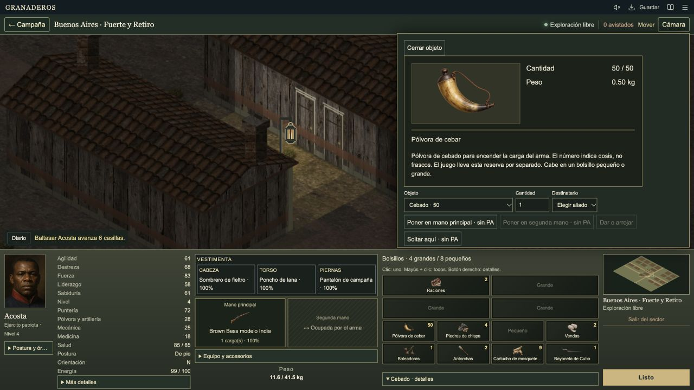

# Supply artwork in the advanced local game

This is **local-only evidence** for the advanced game on port 3000. It does not
establish full convergence with published main, campaign acceptance, or frame rate.

The seven published supply images are used by the existing tactical and campaign
pocket component and by the selected-item card. Typed cartridge stacks retain
their type-specific names and use the cartridge image. Counts, weights, stack
limits, cursor transfers and saves keep their existing contracts. The local ration
description reflects its actual rule: it restores energy, while wounds need dressings.

Only five existing source files were changed, plus a new presentation catalog and
the eight published artwork files (seven images and their prompt manifest). The
original source hashes were checked before applying each edit. Unrelated work
was preserved. Exact source and log hashes are in the [evidence](../evidence/local-supply-art-2026-09-29.json).

Verification in the original checkout: **41/41 equipment checks**, no failures or
skips, type check passed, production export passed (1107 files, 993 references).
The guarded restart replaced only the original port 3000 server after the build
passed. The ordinary QA campaign inventory loads all seven supply images, and
right-clicking priming powder shows the image and Spanish description. No browser
console errors were recorded. The user's normal save was not opened or changed.

Still open: the advanced and published inventory reducers remain separate; full
campaign acceptance and smoother walking artwork have not been established here.
