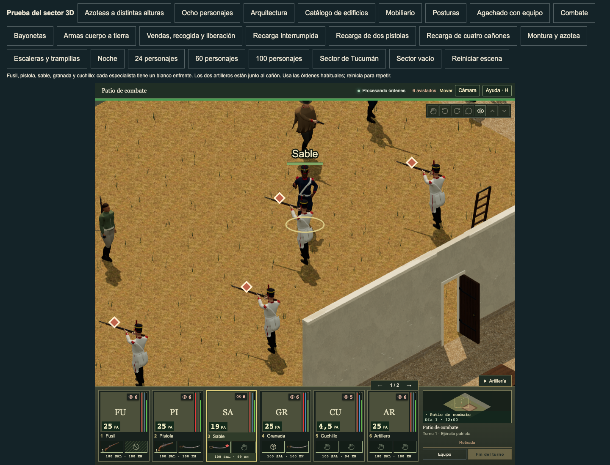
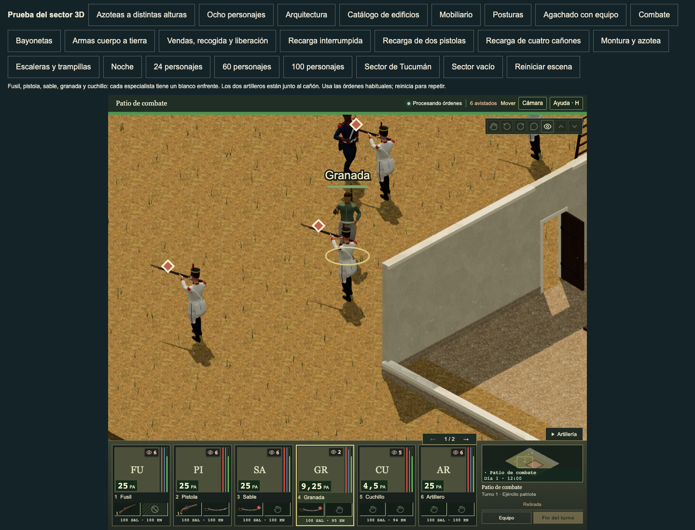

# Standing sabre thrust wrist and contact handoff

Baseline: `7cd854a7039c9368cf0150a1c9623fb961ecfc6a`, including accepted faces
from PR #284 and normal gameplay face verification from PR #285.

The standing sabre thrust now uses six reviewed native right-arm/wrist/thumb
rotation outputs per anatomy. The other 333 clips, input clocks, markers,
native offsets/scales, body meshes, accepted faces and owned equipment remain
exact. The compact source donor records its original PR #239 commit and bank
hashes; it does not replace either complete bank with that older revision.

The current-target contact refit also keeps the previous preparation hand
correction at the phase edge, then blends to the newly sampled target surface
at the existing contact marker. This prevents breathing from causing an
instant hand displacement. The full path and target contact gates still apply.

| Check | Result |
| --- | --- |
| Affected native/runtime tests | 16 pass, including all 40 sabre contact pairings |
| Actual paid cycles | 24 cases / 11,496 samples at 240 Hz plus exact phase edges |
| Anatomy / direction / target / geometry | Both anatomies; cardinal/diagonal; standing/crouched target; LOD 0/1/2 |
| Maximum physical wrist bend | Baseline 143.81°, final 42.30° |
| Maximum paid wrist speed | Baseline 2.946 m/s, final 1.991 m/s |
| Maximum exact phase-edge hand displacement | Baseline 1.964 mm, final 0.000578 mm |
| Native paid result | Unchanged 1,970 ms; one finite AP/damage/item/cell result |
| Source replay | Exact released-bank replay; malformed female clock and duplicate application rejected before any install |
| Fresh Blender native export | Both anatomies: all 53 native rest transforms, six input clocks, duration and markers exact |
| Local checks | Typecheck, production build, locomotion metadata check, Python compile, diff check |

The visible combat route uses normal controls, existing owned sabres, paid
movement and paid empty-cell orders on the knife soldier. The presented cue IDs
`1:8:1:unit:sabre` and `1:8:1:unit:grenade` select the thrust naturally. Each
thrust spends 3.5 displayed PA and changes its target from 100 to 58 health once.
Both routes finish with no page, console or asset errors, and served model bytes
match the frozen source hashes. No save or renderer state is injected.

The preceding baseline screenshots use the same ordinary order count and
source-mounted sequence generation. The baseline does not expose the new
sequence attributes, so its variant identity is an inference from that source
and count. PNG capture time is a wall-clock sample, not proof of the exact
contact marker. At this game scale, the comparison shows the changed forearm
and held blade orientation; it cannot prove every palm, finger or cloth contact.

| Anatomy | Before | After |
| --- | --- | --- |
| Male |  |  |
| Female |  |  |

The [machine-readable receipt](../art/reviews/standing-sabre-thrust-wrist/receipt.json)
contains exact source/bank hashes, source guards, each paid-cycle row and the
normal HUD before/after state. Repeat the visible route with
`tools/verify-three-sabre-thrust.mjs`; it accepts `PLAYWRIGHT_MODULE`,
`CHROMIUM_EXECUTABLE`, `GRANADEROS_REVIEW_URL` and `GRANADEROS_REVIEW_OUTPUT`.

Knife changes remain held. Main has a 206.69 mm diagonal prepare/contact wrist
jump; the rejected knife donor increases it to 212.26 mm. The selected sabre-only
bank keeps the released knife channels exact. Backhand and hilt wrist fit,
complete clothing/palm clearance, sustained frame rate and full game polish
remain separate open work. The existing loose finger/handle proximity test
does not establish a complete paid palm-contact result.
