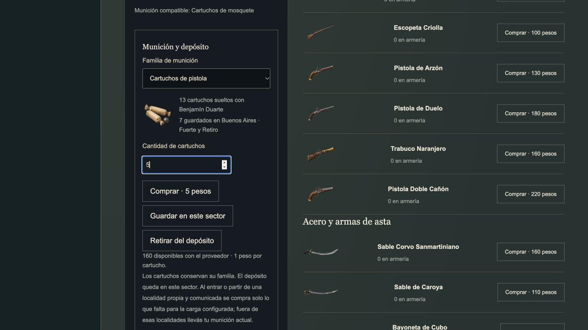

# Persistent campaign ammunition

This feature is verified locally on `codex/strategic-ammunition-custody`, based
on published commit `b6b081c9e206d8dda5cec00a10b24c1ebe02c67c` (PR #134).
It adds strategic ownership to the published four-family runtime. The larger
advanced physical-inventory implementation remains separate.

Runtime/test source: `e90895c5bb0eadeb168533be118097300fba034e`.
[PR #135](https://github.com/fsodano/granaderos/pull/135) merged this delivery as `6772c1cb719d729ae2b6da27728ef88cfc60f5cc`.
All five final-head checks passed in [run 36641090948](https://github.com/fsodano/granaderos/actions/runs/36641090948); this record does not claim completion of the wider game.

## Rules and controls

The armory has a **Munición y depósito** panel for the selected soldier. Choose
musket, rifle, pistol or shot ammunition. The panel shows its image, loose carried
quantity, local stored quantity, loaded charges, merchant stock and purchase price.
Buy, store and take actions move an exact quantity, with a limit of 60 per order.

The soldier must be alive, in service and present in the controlled sector.
Orders are unavailable during an active tactical scene. Buying also requires a
controlled, supplied town with a land arrival site. Mountain passes and wilderness
do not sell ammunition. Stores belong to their exact sector or map cell; remote
stores do not supply a soldier. Buying or withdrawing must fit the shared pockets.

At town entry or departure, the game buys only the shortfall to the authored
marching allowance. This includes departures for an attack. Owned compatible
rounds count toward that allowance. Extra or incompatible rounds stay owned.
Outside a supplied controlled town, the force uses its existing ammunition.
The quote and charge use the pinned cartridge price, including a zero price.

Merchants have finite stock. Initial capacities are 180 musket, 60 rifle,
180 pistol and 120 shot rounds. Each 24 hours of controlled, supplied time adds
18, 6, 18 and 12 rounds respectively, up to those caps. Stock and replenishment
time survive saves. Each town has its own stock. Market tuning was fixed in this delivery. The following
[authored supplier delivery](authored-ammunition-markets.md) adds its editor controls.

Sector return keeps actual ammunition. It does not refund unspent rounds.
Loaded charges and partial reload work stay with the primary firearm. Changing
the campaign primary unloads its actual family into pockets; it cannot convert
cartridges or exceed pocket capacity. An unfinished reload must be completed
before storing that primary in the abstract campaign armory. Tactical physical
weapon transfers still retain their partial work.

## Conservation and old saves

`ammunitionCustodyVersion: 1` governs campaign stores and shops. Old settled saves
start with empty strategic reserves: their former ammunition was already refunded.
A pending paid deployment retains its physical issue when it settles, once.
Restoring again cannot add stock. Invalid versions, locations, family counts,
loaded capacities and merchant records are rejected.

Witnessed returns compare each family against the deployed force, enemy and
militia issue, retained bodies, ground bundles and loaded loose weapons. A return
cannot create rounds or substitute another family. Every deployed soldier must
remain in the scene report; every living soldier needs a return report. Dead
soldiers' strategic reserves clear while their field belongings stay in the scene.
Legacy reports without a scene cannot increase an individual's issued ammunition.
The standalone legacy credit helper retains its historical unit checks, but the
campaign runtime no longer calls it.

## Verification

The focused checks cover purchase, exact sector storage, withdrawal, finite stock,
depletion, malformed orders, restoration, deployment shortfall, unchanged return
funds, family preservation on weapon replacement, forged returns and old-save
migration. An actual shot and a 250-AP reload prove that incomplete loading
survives retreat, storage, save and reentry. A mounted production page buys,
stores, takes and saves through the armory controls.

The desktop browser check used a separate fresh preview campaign. Buying 20
pistol rounds cost 20 pesos and reduced merchant stock from 180 to 160. Storing
12 and taking five left 13 carried and seven stored. Reloading and continuing
retained both quantities and the 3,175-peso treasury. Images loaded and the
browser reported no errors. The user's existing campaign was not used for orders.

The campaign fixtures retain real combat, casualties, finite supplies, paid care,
contracts, recruitment gates and saved replay. Retaining loaded weapons changes
later deterministic battles and costs. The Cuyo route now renews expiring
contracts before its return march, so its surviving qualified speaker can recruit
San Martín. It does not lower the leadership requirement or replace casualties.

The fresh stock route wins all 13 localities at hour 582, with 5,126 pesos,
San Martín at 61 health and 13 permanent deaths. It uses 26 hours of paid coastal
care and four hours of immediate stabilization after Santa Fe. Two hours of ordinary post-victory care use two carried dressings to stabilize
the last bleeding survivor before the long wait. At hour 632, the
saved continuation retains 7,547 pesos and three active soldiers after contract
expiry and a nine-peso ammunition top-up. No casualty is revived.

The 12 focused core and mounted checks pass. Types, the 735-file production export
with 637 asset references, and all 36 reference comparisons pass. The complete suite passes **1,306/1,306**, with no failures or skips.
The documentation audit retains 271 requirements and 111 evidence records; all
379 local links in the changed documents resolve. Final-head remote checks gate
publication. After the complete run, the story editor help text was corrected
to describe shortfall purchases, retained rounds and a zero target. All three
related mounted checks, types and export pass after this text-only correction.
Machine-readable results are in the
[evidence record](../evidence/strategic-ammunition-custody.json).

## Limits

This does not close ITEM-01, JA2-I08, STORY-06 or INTEGRATION-01. Alternative loads
for the same gun, dealer authoring, civilian equipment custody and the advanced
physical inventory adapter remain open. A scripted complete stock campaign does
not establish full JA2 parity, all authored campaigns or loaded-browser speed.
