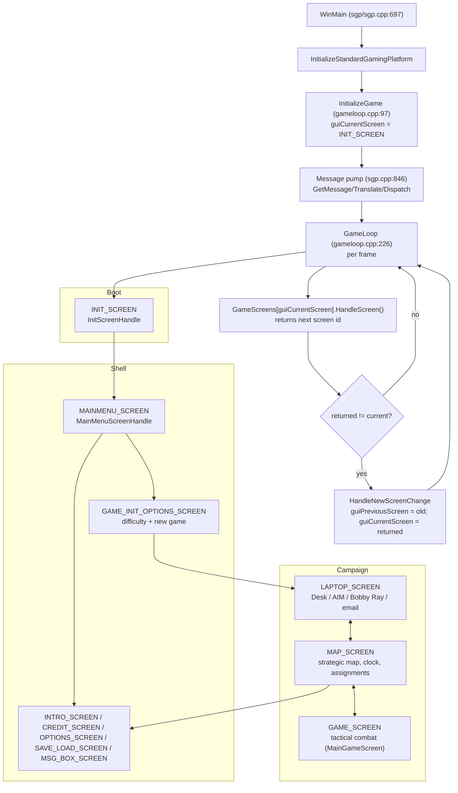

# Web Port Series 00 — Engine Overview

> Economy update: the browser game now uses pesos only. The material, convoy, and horse-management mappings below describe the earlier implementation. See [the current economy rules](../INDUSTRY-AND-IMPORTS.md).

> **Audience:** an agent with zero prior JA2 knowledge who must port engine behavior into the
> browser clone (`game/` + `web/`). This is the index document for the `docs/web-port/` series.
> It describes *what the engine is*, *how it is built*, *how it boots and flows between screens*,
> *where the Granaderos-specific rules live*, and *how the 13 planned docs map onto the engine
> directories*. Nothing here modifies engine code — it is read-only analysis with `file:line`
> citations so every claim can be verified.

---

## 1. Repo identity

| Fact | Value | Evidence |
|---|---|---|
| Product | **Granaderos** — browser strategy + turn-based tactical game, Argentine War of Independence (1810–1820) | `README.md` |
| Inspiration | **Jagged Alliance 2 v1.13** | `README.md` |
| Engine | `engine/` is a **git submodule** pinned to `https://github.com/1dot13/source.git` at commit `ddb691318eb3dd0cdc6eab42139739b6d498c645` | `.gitmodules`, `git submodule status` |
| Engine nature | 32-bit Windows C++17 (CMake, Win32, DirectDraw/FMOD/Bink legacy) | `engine/CMakeLists.txt:26`, `engine/CMakePresets.json:16` |
| Web clone | Next.js app in `web/` + pure-JS rules in `game/` + `tests/` | `README.md`, `docs/WEB-SYSTEMS.md:3` |
| Version | `0.4.0-dev.1` | `VERSION` |
| Language split | Player-facing content **Spanish**; code and docs **English** | `README.md` |

The web clone **does not execute the Windows JA2 binary**; it reuses the historical structure and
JA2-inspired data/mechanics as authored JavaScript (`docs/WEB-SYSTEMS.md:3`). The engine is
retained as the authoritative reference for rules, data shapes, and screen flow.

---

## 2. CMake build graph

### 2.1 Top-level `engine/CMakeLists.txt`

The build is a single `project(ja2)` (line 9) that produces **four Win32 executables** plus
utilities, from a shared set of static libraries compiled once per application.

| Concern | Location | Notes |
|---|---|---|
| `GRANADEROS` option | `CMakeLists.txt:11-14` | `option(GRANADEROS ... OFF)`; when ON adds `add_compile_definitions(GRANADEROS)`. This is the **only** Granaderos-specific build switch. |
| `USE_SCCACHE` | `CMakeLists.txt:16-24` | Wraps cl.exe/clang-cl with sccache if installed. |
| C++ standard | `CMakeLists.txt:26-28` | C++17, extensions OFF. |
| `LTO_OPTION` | `CMakeLists.txt:30-39` | Optional IPO via `CheckIPOSupported`. |
| ASan | `CMakeLists.txt:42` | `include(cmake/AddressSanitizer.cmake)`; `ja2_asan_instrument_first_party()` at line 92. |
| Global compile defs | `CMakeLists.txt:62` | `CINTERFACE XML_STATIC VFS_STATIC VFS_WITH_SLF VFS_WITH_7ZIP`. |
| Include dirs | `CMakeLists.txt:63-81` | Ja2, ext/VFS, ext/libsmacker, ext/lua-5.1.5, Utils, TileEngine, TacticalAI, ModularizedTacticalAI, Tactical, Strategic, sgp, Ja2/Res, lua, Laptop, Multiplayer, Editor, i18n. |
| Vendored libs | `CMakeLists.txt:84-89` | `ext/libpng`, `ext/libsmacker`, `ext/lua-5.1.5`, `ext/zlib`, `ext/VFS`; `bfVFS` links `7z`. |
| Bink import lib | `CMakeLists.txt:144-169` | Rebuilds `binkw32.lib` from `binkw32.def` (lld-link/MSVC name-shape differences); skipped under ASan (no-op stubs instead). |

### 2.2 Compile-time switches (the "belongs in the build, not a header" block)

`CMakeLists.txt:101-123` — these are the canonical feature switches. **Do not reintroduce any of
these as bare `#define`s in source.**

| Define | Meaning (from comments) |
|---|---|
| `ENABLE_BRIEFINGROOM` | Laptop briefing room (Jazz). Also needs `BRIEFING_ROOM` in `ja2_options.ini` + a briefing-room mod. |
| `ROBOT_ALWAYS_READY` | Robots always ready. |
| `FORCE_ASSERTS_ON` | Keep `Assert()` live in configs that would compile it out. |
| `BMP_RANDOM` | `sgp/random.h` 32-bit PRNG. Off ⇒ old generator yields only 2^15 distinct values — breaks big maps, invalidates saves. |
| `CALLBACKTIMER` | `Utils/Timer Control.h` callback timer. |
| `DISABLE_MP_INTERRUPTS_IN_COOP` | MP: AI interrupts stay off in COOP (pure-client interrupts are wrong); drops server ALT+E override-turn dialog. |
| `INTERRUPT_MP_DEADLOCK_FIX` | r5623 workaround for enemy AI deadlock on pure-client interrupt. |
| `ENABLE_MP_FRIENDLY_PLAYERS_SHARE_SAME_FOV` | MP friendly players share FOV. |

### 2.3 Library lists

**`Ja2_Libraries`** (link-time, `CMakeLists.txt:171-185`): `libexpatMT.lib`, `winmm.lib`,
`ws2_32.lib`, `winhttp.lib`, `bfVFS`, `Lua`, `Multiplayer`, `smacker`, `wine`, plus `binkw32.lib`
when not ASan.

**`Ja2_Libs`** (static libs compiled per application, `CMakeLists.txt:188-199`):

| Library | Engine dir | Role |
|---|---|---|
| `Editor` | `Editor/` | Map editor screens/tools |
| `Ja2` | `Ja2/` | App shell: screens, init, main menu, game loop |
| `Laptop` | `Laptop/` | Laptop UI: AIM, Bobby Ray, email, mercs |
| `ModularizedTacticalAI` | `ModularizedTacticalAI/` | Modular AI framework |
| `sgp` | `sgp/` | Standard Gaming Platform (WinMain, video, input, sound, timer, memory, random, VFS) |
| `Strategic` | `Strategic/` | Strategic layer: game clock, events, map screen, assignments |
| `Tactical` | `Tactical/` | Tactical layer: soldiers, combat, weapons, LOS, interface |
| `TacticalAI` | `TacticalAI/` | Tactical AI |
| `TileEngine` | `TileEngine/` | World/tile rendering, structures, lighting, pathing |
| `Utils` | `Utils/` | Fonts, text, timer control, shared helpers |

### 2.4 Per-application build (the "one lib per app" trick)

`CMakeLists.txt:220-272` — for each app in `ApplicationTargets` (validated against
`JA2 JA2MAPEDITOR JA2UB JA2UBMAPEDITOR`, line 211):

1. Each `Ja2_Libs` entry becomes `${app}_${lib}` (e.g. `JA2_sgp`, `JA2UB_Tactical`) — same sources,
   different compile defs (lines 230-236).
2. The executable `${app}` is `WIN32` and compiles exactly `sgp/sgp.cpp` + `Ja2/Res/ja2.rc`
   (lines 240-243).
3. Per-app compile defs (lines 224-228): editor ⇒ `JA2EDITOR;JA2BETAVERSION`; UB ⇒
   `JA2UB;JA2UBMAPS`; UB editor ⇒ `JA2UB;JA2UBMAPS;JA2EDITOR;JA2BETAVERSION`.
4. Debug-only defs (line 218): `JA2BETAVERSION;JA2TESTVERSION;DEBUG_ATTACKBUSY;WINDOWED_MODE`.
5. Per-app `i18n` lib with all 8 languages compiled in, selected at runtime by
   `BindLanguageStrings` (lines 253-258).
6. Special links: `${app}_Utils` → `smacker` (line 266); `${app}_sgp` → `ddraw.lib`,
   `fmodvc.lib`, `libpng`, `NO_ZLIB_COMPRESSION` (lines 269-271).

### 2.5 Presets (`engine/CMakePresets.json`)

| Preset | Generator / toolchain | Notes |
|---|---|---|
| `base` (hidden) | Ninja, **x86** (`architecture.value=x86`, `strategy=external`) | `binaryDir=build/${presetName}`, `CMAKE_RUNTIME_OUTPUT_DIRECTORY=gamedir` |
| `msvc` (hidden) | MSVC x86 | inherits base |
| `msvc-relwithdebinfo` / `msvc-debug` / `msvc-release` | MSVC | build types |
| `clang-cl-asan` | clang-cl, `ADDRESS_SANITIZER=ON` | RelWithDebInfo; see `SANITIZERS.md` |

**Gotcha:** the engine is **32-bit x86 Windows only**. `docs/build.md` documents the supported
build path (VS2022 x86 Native Tools, Ninja, PowerShell `tools/build-windows.ps1`). macOS/ARM
hosts cannot build it natively; Windows CI is the supported path.

---

## 3. Directory-to-system map with file counts

Counts = `.cpp/.c/.h/.hpp` files per top-level engine dir (measured 2026-09-06).

| Engine dir | Files | System | Web-port relevance |
|---|---|---|---|
| `sgp/` | 82 | Platform: `WinMain`, video, input (MSYS), fonts, sound, timer, memory, random, VFS | Boot/message-pump model; PRNG (`BMP_RANDOM`); file I/O |
| `Ja2/` | 72 | App shell: screens, `Init.cpp`, `gameloop.cpp`, main menu, options, save/load, MP screens | Screen-flow state machine (see §5) |
| `Tactical/` | 259 | Soldiers, AP/points, weapons, LOS, firing, interface, explosives, vehicles | `game/tactical.js` combat rules; **GRANADEROS hits live here** |
| `Strategic/` | 118 | Game clock, events, map screen, assignments, strategic AI, movement | `game/campaign.js` strategic reducer |
| `TileEngine/` | 78 | World/tile rendering, structures, lighting, pathing, exit grids | `game/maps.js`, `game/world.js` sector maps |
| `Laptop/` | 189 | AIM, Bobby Ray, email, merc contracts, IMP, shopkeeper | `web/app/Desk.tsx`, `Recruitment.tsx`, `Armory.tsx` |
| `TacticalAI/` | 20 | Tactical AI | enemy turn in `game/tactical.js` |
| `ModularizedTacticalAI/` | 24 | Modular AI framework | (AI design reference) |
| `Multiplayer/` | 131 | Networking (RakNet), MP screens, teams | Not ported (single-player web) |
| `Utils/` | 73 | Fonts, text, timer control, shared helpers | `game/time.js`, `game/hotkeys.js` |
| `Editor/` | 52 | Map editor | `web/app/CharacterCreator.tsx` (creator), map authoring |
| `i18n/` | 35 | 8-language runtime selection | Spanish strings in `game/data.js` |
| `lua/` | 15 | Lua bindings (strategic mines, underground, music) | Not ported |
| `ext/` | 252 | Vendored: libpng, libsmacker, lua-5.1.5, zlib, VFS | Not ported (reference only) |
| `export/` | 28 | `ja2export` utility | Not ported |
| `tools/` | 1 | `symbolize_crash.cpp` | Not ported |
| `wine/` | 2 | Wine DLL-override shim | Not ported |

**Total ≈ 1,431 C/C++ files.** The web clone does not need most of this — the port surface is
the *rules* (Tactical/Points.cpp, Tactical/Weapons.cpp, Strategic/Game Clock.cpp, save format)
and the *screen flow* (Ja2/), not the renderer.

---

## 4. Game applications

| Executable | Purpose | Compile defs |
|---|---|---|
| `JA2.exe` | Main game | (none extra) |
| `JA2MAPEDITOR.exe` | Map editor | `JA2EDITOR;JA2BETAVERSION` |
| `JA2UB.exe` | Unfinished Business campaign | `JA2UB;JA2UBMAPS` |
| `JA2UBMAPEDITOR.exe` | UB map editor | `JA2UB;JA2UBMAPS;JA2EDITOR;JA2BETAVERSION` |
| `ja2export` | Data export utility (`export/src`) | — |
| `symbolize_crash` | Crash-symbolization tool (`tools/`) | — |

All four games share the same `Ja2_Libs` sources; the per-app compile defs select behavior
(`#ifdef JA2UB`, `#ifdef JA2EDITOR`, `#ifdef JA2BETAVERSION`). The Granaderos web clone targets
the **JA2** configuration only.

---

## 5. Screen-flow state machine

### 5.1 The screen table

- `Ja2/screenids.h:4-48` — `enum ScreenTypes`: `EDIT_SCREEN, SAVING_SCREEN, LOADING_SCREEN,
  ERROR_SCREEN, INIT_SCREEN, GAME_SCREEN, ANIEDIT_SCREEN, PALEDIT_SCREEN, DEBUG_SCREEN,
  MAP_SCREEN, LAPTOP_SCREEN, LOADSAVE_SCREEN, MAPUTILITY_SCREEN, FADE_SCREEN, MSG_BOX_SCREEN,
  MAINMENU_SCREEN, AUTORESOLVE_SCREEN, SAVE_LOAD_SCREEN, OPTIONS_SCREEN, SHOPKEEPER_SCREEN,
  SEX_SCREEN, GAME_INIT_OPTIONS_SCREEN, DEMO_EXIT_SCREEN, INTRO_SCREEN, CREDIT_SCREEN,
  MP_JOIN_SCREEN, MP_HOST_SCREEN, MP_SCORE_SCREEN, MP_CHAT_SCREEN, MP_CONNECT_SCREEN,
  MINIGAME_SCREEN, FEATURES_SCREEN`, plus `AIVIEWER_SCREEN` (JA2BETAVERSION) and
  `QUEST_DEBUG_SCREEN`, ending at `MAX_SCREENS`.
- `Ja2/Screens.h:11-17` — each screen is a `Screens` struct of three function pointers:
  `InitializeScreen`, `HandleScreen`, `ShutdownScreen`.
- `Ja2/Screens.h:23-26` — legal state flags: `SCR_INACTIVE(0x00)`, `SCR_INITIALIZING(0x01)`,
  `SCR_ACTIVE(0x02)`, `SCR_SHUTTING_DOWN(0x04)`. Legal transition is strictly
  `INACTIVE→INITIALIZING→ACTIVE→SHUTTING_DOWN→INACTIVE`.
- `Ja2/Screens.cpp:36-77` — `Screens GameScreens[MAX_SCREENS]` table mapping each enum value to
  its three functions (e.g. `MAINMENU_SCREEN → MainMenuScreenInit/Handle/Shutdown`).
- `Ja2/jascreens.h` — prototypes for every screen's Init/Handle/Shutdown.

### 5.2 Boot sequence

1. **`sgp/sgp.cpp:697` `WinMain`** — installs vectored crash handler, sets crash build ID,
   handles Wine DLL overrides, single-instance check, `InitializeRandom()`, copies command line,
   `ProcessJa2CommandLineBeforeInitialization`, `HandleJA2CDCheck`, then
   `InitializeStandardGamingPlatform(hInstance, sCommandShow)` (line 809).
2. **`sgp/sgp.cpp:846-856`** — the message pump: `while (gfProgramIsRunning) { GetMessage;
   TranslateMessage; DispatchMessage; }`. `GameLoop()` is invoked from the window-proc path via
   `CallGameLoop`/`SGPGameLoop` (lines 1346-1402), guarded by a critical section.
3. **`Ja2/gameloop.cpp:97` `InitializeGame()`** — loads INI settings (`LoadGameAPBPConstants`,
   `LoadGameExternalOptions`, `LoadSkillTraitsExternalSettings`, `LoadCTHConstants`,
   `LoadModSettings`, etc.), `MSYS_Init`, `InitButtonSystem`, `InitCursors`, `InitializeFonts`,
   `InitTacticalSave(TRUE)`, then **initializes every screen** in `GameScreens[]` (lines 170-176),
   `InitHelpScreenSystem`, `LoadSaveGameOldOrNew`, `LoadGameSettings`, `LoadFeatureFlags`, and
   finally sets `guiCurrentScreen = INIT_SCREEN` (line 188).
4. **`Ja2/Init.cpp:1409` `InitializeJA2()`** — the heavyweight init: `HandleJA2CDCheck`,
   `LoadExternalGameplayData(TABLEDATA_DIRECTORY, false)` (line 1420, wrapped in
   `SGP_TRYCATCH_RETHROW`), `LoadAllExternalText`, `InitJA2Sound`,
   `InitializeSystemVideoObjects`, `InitAnimationSystem`, `InitLightingSystem`,
   `InitalizeDialogueControl`, `InitStrategicEngine`, `InitStrategicMovementCosts`,
   `InitMapScreenInterfaceBottomCoords`, `InitTacticalEngine`, `BuildShadeTable`,
   `BuildIntensityTable`, `InitializeWorld`, `InitTileCache`, `InitMercPopupBox`, `InitMyBoxes`,
   `MusicSetVolume`, `DetermineRGBDistributionSettings`, `InitSaveDir`, `IniLuaGlobal`
   (line 1611). Returns `INIT_SCREEN` (line 1612).
5. **`Ja2/Init.cpp:1616` `ShutdownJA2()`** — reverse-order teardown; also calls every screen's
   `ShutdownScreen` (lines 1637-1640).

### 5.3 The per-frame loop

**`Ja2/gameloop.cpp:226` `GameLoop()`** — the heart of the state machine:

- Reads mouse position, pumps mouse events through `MouseSystemHook` (lines 239-284).
- Forces `guiPendingScreen = MSG_BOX_SCREEN` when `gfInMsgBox` (line 340-344), or
  `MP_CHAT_SCREEN` when `gfInChatBox` (line 347-350).
- If a screen change is pending (lines 351-381): deinits the current screen if needed
  (`EndMapScreen(FALSE)` for `MAP_SCREEN`, `ExitLaptop()` for `LAPTOP_SCREEN`), calls
  `HandleNewScreenChange(guiPendingScreen, guiCurrentScreen)`, then commits
  `guiCurrentScreen = guiPendingScreen`.
- Calls the current screen's handler: `(*(GameScreens[guiCurrentScreen].HandleScreen))()`
  (line 385). **The handler returns the next screen id**; if it differs from current,
  `HandleNewScreenChange` runs and `guiPreviousScreen`/`guiCurrentScreen` are updated
  (lines 388-393).
- `RefreshScreen(NULL)` (line 454), `UpdateClock()` (line 459), network packet pump if
  `is_networked` (lines 487-491).

Key globals (`gameloop.cpp:48-50`): `guiCurrentScreen`, `guiPendingScreen` (init
`NO_PENDING_SCREEN`), `guiPreviousScreen`.

Screen-change helpers: `SetCurrentScreen` (line 495), `SetPendingNewScreen` (line 502),
`HandleNewScreenChange` (line 515), `HandleShortCutExitState` (line 557, exit confirmation),
`EndGameMessageBoxCallBack` (line 618).

### 5.4 Main menu and new-game flow

- **`Ja2/MainMenuScreen.cpp`** — `MainMenuScreenInit/Handle/Shutdown` (889 lines). Handles
  Continue / New Game / Options / Credits / Exit. New Game routes to
  `GAME_INIT_OPTIONS_SCREEN`.
- **`Ja2/GameInitOptionsScreen.cpp`** (4,789 lines) — `GameInitOptionsScreenInit/Handle/Shutdown`
  and `SpIniExists()` (`GameInitOptionsScreen.h:9`). Holds the difficulty model:
  `DIFFICULTY_SETTINGS_VALUES` struct (`GameInitOptionsScreen.h:22-106`) with starting cash,
  enemy AP bonus, garrison percentages, Queen's troop pool, CTH difficulty modifiers, etc.
  Difficulty enum `DIF_LEVEL_EASY=1 … MAX_DIF_LEVEL` (`GameInitOptionsScreen.h:13-20`).
- **`Ja2/Intro.cpp`** — `IntroScreenInit/Handle/Shutdown`; splash/intro (Bink video).
- **`Ja2/gamescreen.cpp`** — `MainGameScreenInit/Handle/Shutdown` = the **tactical** screen
  (`GAME_SCREEN`).
- **`Ja2/Options Screen.cpp`**, **`Ja2/SaveLoadScreen.cpp`**, **`Ja2/MessageBoxScreen.cpp`**,
  **`Ja2/Credits.cpp`**, **`Ja2/HelpScreen.cpp`**, **`Ja2/FeaturesScreen.cpp`** — the rest of the
  shell screens.

### 5.5 Boot → menu → strategic ↔ tactical loop

The strategic↔tactical handoff is the core loop the web clone must reproduce: `MAP_SCREEN`
(strategic) and `GAME_SCREEN` (tactical) swap via `SetPendingNewScreen`/handler return values,
with `MSG_BOX_SCREEN` able to interrupt either (`gameloop.cpp:340-344`).

---

## 6. GRANADEROS compile-flag hits

The `GRANADEROS` define (enabled by `-DGRANADEROS=ON`, `CMakeLists.txt:11-14`) gates the
historical black-powder conversion rules. All hits are in **`Tactical/`** and reference the
standalone rules header **`Tactical/GranaderosBlackPowder.h`** (44 lines, `namespace granaderos`).

### 6.1 `Tactical/GranaderosBlackPowder.h` — the rules API

| Constant / function | Value / behavior |
|---|---|
| `firstFirearm = 1800`, `lastFirearm = 1808` | Item-id range of the 9 firearms |
| `smokeItem = 1840` | Smoke item id used for engine smoke |
| `reprimeAP = 15` | AP cost to re-prime the pan |
| `isFirearm(item)` | `item >= 1800 && item <= 1808` |
| `fireAP(item)` | Per-weapon fire AP: `{12,11,16,9,10,7,6,12,8}` |
| `aimAP(item)` | Per-weapon aim AP: `{6,5,10,4,4,3,2,5,3}` |
| `reloadAP(item, missing, available, prone)` | Per-weapon reload AP `{45,42,70,38,35,32,28,40,55}`; capacity 1 (2 for 1808); prone ×1.5 |
| `misfirePercent(condition, precipitation, humidity, base=2)` | Black-powder misfire chance, clamped 0–95 |
| `rangeCeiling(item, tiles)` | Ballistic range ceiling on CTH; rifled Baker (1802) keeps range |

### 6.2 `Tactical/Points.cpp` (AP economy)

| Line | Function | GRANADEROS behavior |
|---|---|---|
| 39 | (include) | `#include "GranaderosBlackPowder.h"` |
| 1667 | `CalcAPsToAttack` (aimed shot path) | Firearms: `sAPCost + max(0, bAimTime) * granaderos::aimAP(usUBItemNum)` |
| 1882 | `BaseAPsToShootOrStab` | Firearms: return `granaderos::fireAP(pObj->usItem)` directly |
| 1969 | `BaseAPsToShootOrStabNoModifier` | Firearms: return `granaderos::fireAP(usItem)` directly |
| 2861 | `GetAPsToReloadGunWithAmmo` | Firearms: `granaderos::reloadAP(pGun->usItem, magSize - shotsLeft, ammoShotsLeft, prone)` |

### 6.3 `Tactical/Weapons.cpp` (firing)

| Line | Function | GRANADEROS behavior |
|---|---|---|
| 55 | (include) | `#include "GranaderosBlackPowder.h"` |
| 1355 | `CheckForGunJam` | Black-powder ignition applies to both armies: negative `bGunAmmoStatus` ⇒ re-prime action (15 AP, returns 255); rain/humidity misfire modifiers; smoke on fire |
| 2745 | `FireWeapon` (OCTH path) | After `DeductAmmo`: `NewSmokeEffect(sGridNo, granaderos::smokeItem, level, ubID)` |
| 3573 | `FireWeapon` (NCTH path) | Same smoke effect on the alternate firing path |
| 7692 | `CalcChanceToHitGun` | `iChance = min(iChance, granaderos::rangeCeiling(historicalItem, PythSpacesAway(...)))` |

**Port note:** the web clone already mirrors these numbers in `game/tactical.js` — `WEAPONS`
table (ids 1800–1808, `fireAP/aimAP/reloadAP/range/capacity`), `misfireChance` (line 23),
`ignitionRisk` (line 29), `shotChance` range cap (line 65), `reprime` action (line 82). The
engine header is the authoritative source if the JS drifts.

---

## 7. Parallelization map — the 13 planned docs

`docs/web-port/` will contain 13 documents. Each covers a slice of the engine and names the web
target it feeds. Docs are independent enough to be written in parallel; `00` (this file) is the
index.

| # | Doc | Engine dirs covered | Web target |
|---|---|---|---|
| 00 | **overview** (this file) | all (top-level map) | `game/` + `web/` layering, reproduction checklist |
| 01 | `01-sgp-platform.md` | `sgp/` | boot/message-pump model, PRNG, file I/O, timer |
| 02 | `02-boot-init.md` | `Ja2/` (Init.cpp, gameloop.cpp, sgp.cpp WinMain, Screens.cpp) | `web/app/page.tsx` screen router |
| 03 | `03-screens-ui.md` | `Ja2/` (MainMenu, GameInitOptions, Options, SaveLoad, MessageBox, Intro, Credits, Help, Features, MP screens) | `web/app/` dialogs + title screen |
| 04 | `04-tactical-core.md` | `Tactical/` (Soldier Control, Overhead, Interface, points/AP) | `game/tactical.js` unit model + AP |
| 05 | `05-tactical-combat.md` | `Tactical/` (Weapons.cpp, Points.cpp, LOS, Bullets, Explosives, Firing) | `game/tactical.js` fire/melee/charge/reload |
| 06 | `06-strategic-layer.md` | `Strategic/` (Game Clock, Game Events, Map Screen, Assignments, Strategic AI, Movement) | `game/campaign.js` reducer + clock |
| 07 | `07-laptop.md` | `Laptop/` (AIM, Bobby Ray, email, merc contracts, IMP, shopkeeper) | `web/app/Desk.tsx`, `Recruitment.tsx`, `Armory.tsx` |
| 08 | `08-tileengine-world.md` | `TileEngine/` (world, tiles, structures, lighting, pathing, exit grids) | `game/maps.js`, `game/world.js`, `TacticalScene.tsx` |
| 09 | `09-ai.md` | `TacticalAI/`, `ModularizedTacticalAI/` | enemy turn in `game/tactical.js` |
| 10 | `10-multiplayer.md` | `Multiplayer/`, `wine/` | (reference only — not ported) |
| 11 | `11-editor-tools.md` | `Editor/`, `export/`, `tools/` | `web/app/CharacterCreator.tsx`, map authoring |
| 12 | `12-data-xml-i18n.md` | `i18n/`, `lua/`, `ext/`, `Ja2/` XML loaders (`Init.cpp:136` `LoadExternalGameplayData`) | `game/data.js`, `game/equipment.js`, Spanish strings |

---

## 8. Web-port layering proposal

The web clone is a **rules-first** port: `game/` holds pure, deterministic, serializable JS
modules (no DOM); `web/` holds the Next.js/React UI that calls them. This mirrors the engine's
own split between `Ja2/`+`sgp/` (shell/platform) and `Tactical/`+`Strategic/` (rules).

### 8.1 `game/` modules ↔ engine systems

| `game/` module | Engine source of truth | Role |
|---|---|---|
| `tactical.js` (140 ln) | `Tactical/Points.cpp`, `Tactical/Weapons.cpp`, `Tactical/GranaderosBlackPowder.h` | Deterministic turn-based combat: `createBattle`, `actBattle`, `endTurn`, `shotChance`, `actionCosts` |
| `campaign.js` (401 ln) | `Strategic/` (Game Clock, Game Events, Map Screen) | Strategic reducer: `initialCampaign`, `dispatchCampaign`, `campaignObjectives`, `rosterFor` |
| `data.js` (568 ln) | `TableData` XMLs (Items/Weapons/MercProfiles) + `i18n/` | Authored Spanish content: `OPERATIVES`, `WEAPONS`, `FACTIONS`, `THEATERS`, `CAMPAIGN_SECTORS`, `PHASES`, `RECIPES` |
| `maps.js` (117 ln) | `TileEngine/` | `MAP_IDS`, `buildSectorMap` |
| `world.js` (38 ln) | `TileEngine/` + `Strategic/` | `enterSector` — sector snapshot handoff |
| `save.js` (16 ln) | `Ja2/SaveLoadGame.cpp` | `encodeSave`/`decodeSave`, `SAVE_KEY` |
| `time.js` (15 ln) | `Strategic/Game Clock.cpp` | `advanceBattleClock`, `COMBAT_ROUND_SECONDS`, `REST_SECONDS`, `syncBattleTime` |
| `validate-battle.js` (37 ln) | `Ja2/SaveLoadGame.cpp` validation | Tactical snapshot validation |
| `recruitment.js`, `characters.js`, `character-profile.js`, `character-events.js` | `Laptop/` (AIM/IMP) | Roster, custom officer, speech events |
| `logistics.js`, `industry.js`, `equipment.js`, `ammunition.js` | `Strategic/` assignments + `Laptop/` arms dealers | Supply, production, armory |
| `horses.js`, `squads.js`, `militia.js`, `garrison.js` | `Strategic/` (vehicles, squads, militia) | Mounts, persistent squads, garrisons |
| `encounters.js`, `missions.js`, `narrative.js`, `politics.js`, `quests.js`, `cities.js` | `Strategic/` events + `Laptop/` email | NPCs, authored missions, factions |
| `hotkeys.js` | `Utils/` input handling | Keyboard shortcuts |

### 8.2 `web/` app ↔ engine screens

| `web/app/` file | Engine screen | Role |
|---|---|---|
| `page.tsx` | `sgp.cpp` WinMain + `gameloop.cpp` GameLoop | Top-level screen router (`title`/`desk`/`campaign`/`battle`), save/load, model-context tools |
| `Campaign.tsx` | `MAP_SCREEN` | Strategic map + campaign desk |
| `Desk.tsx` | `LAPTOP_SCREEN` | Campaign office / roster |
| `Battlefield.tsx` + `TacticalScene.tsx` | `GAME_SCREEN` (`gamescreen.cpp`) | Tactical combat rendering + input |
| `Recruitment.tsx` | `Laptop/` AIM + IMP | Hire volunteers, custom officer |
| `Armory.tsx` | `Laptop/` Bobby Ray / arms dealers | Buy/equip/repair |
| `Logistics.tsx` | `Strategic/` assignments | Transport, depots, convoys |
| `Squads.tsx` | `Strategic/` squad management | Persistent squads |
| `MissionBriefing.tsx` | `PreBattle Interface` | Battle briefing |
| `CharacterCreator.tsx` | `SEX_SCREEN`/IMP | Custom officer creation |
| `Horses.tsx` | `Strategic/` vehicles | Individual mounts |
| `TrainingProgress.tsx` | `Strategic/` training assignments | Skill training |
| `TacticalMinimap.tsx`, `TacticalBuildings.tsx`, `TacticalProps.tsx`, `SpriteFigure.tsx`, `useUnitMotion.ts` | `TileEngine/` render helpers | Tactical scene rendering |

### 8.3 Layering rules

1. **`game/` never imports from `web/`** — it is pure logic, testable with `node --test`.
2. **`web/` imports `game/`** via relative paths (e.g. `page.tsx:11-15` imports
   `initialCampaign`, `createBattle`, `actBattle`, `endTurn`, `encodeSave`).
3. **State is serializable** — `encodeSave(campaign, battle)` round-trips through
   `decodeSave`; the engine's `czVersionString` save-compat key has no web equivalent, but
   `save.js` schema-checks instead (`docs/WEB-SYSTEMS.md:43`).
4. **Determinism** — `game/tactical.js` uses a seeded PRNG (`random(s)` at line 19, LCG
   `Math.imul(seed,1664525)+1013904223`), mirroring the engine's `BMP_RANDOM` 32-bit PRNG
   requirement (`CMakeLists.txt:108-111`).

---

## 9. Reproduction checklist for the web clone

Use this to verify a ported system against the engine. Each item cites the engine source.

### 9.1 Boot / shell

- [ ] Screen router reproduces `INIT_SCREEN → MAINMENU_SCREEN → GAME_INIT_OPTIONS_SCREEN →
      LAPTOP/MAP_SCREEN` ordering (`gameloop.cpp:188`, `Init.cpp:1612`).
- [ ] A pending-screen mechanism exists (web equivalent of `guiPendingScreen`,
      `gameloop.cpp:49`), and message boxes can interrupt any screen (`gameloop.cpp:340-344`).
- [ ] Every screen has init/handle/shutdown lifecycle (web: mount/update/unmount),
      `Screens.h:11-17`.
- [ ] New-game flow passes through a difficulty/options screen before the campaign
      (`GameInitOptionsScreen.h:22-106`).

### 9.2 Strategic layer

- [ ] Campaign clock matches `Strategic/Game Clock.cpp` semantics (web: `game/time.js`,
      360-day year, 30-day months, 720-hour payroll — `docs/WEB-SYSTEMS.md:15`).
- [ ] Strategic events are ordered and gated like `Strategic/Game Events.cpp` (web:
      `campaign.js` reducer actions).
- [ ] Save/load round-trips without data loss (`Ja2/SaveLoadGame.cpp`; web: `game/save.js`).

### 9.3 Tactical layer

- [ ] AP economy matches `Tactical/Points.cpp` — including the GRANADEROS overrides at
      `Points.cpp:1667,1882,1969,2861` (web: `tactical.js` `actionCosts`, `reloadCost`).
- [ ] Firing matches `Tactical/Weapons.cpp` — misfire/ignition (`Weapons.cpp:1355`), smoke
      (`Weapons.cpp:2745,3573`), CTH range ceiling (`Weapons.cpp:7692`).
- [ ] Weapon table matches `GranaderosBlackPowder.h` ids 1800–1808 and the JS `WEAPONS` table
      (`tactical.js:4-10`).
- [ ] Turn structure: player phase → enemy phase → end-of-turn effects (bleeding, smoke decay,
      energy recovery) — web `endTurn` (`tactical.js:139`).

### 9.4 Data

- [ ] All authored content is Spanish and lives in `game/data.js` (engine `i18n/` has no
      Spanish; `docs/WEB-SYSTEMS.md:9`).
- [ ] Item/weapon field separation follows `TableData/Items/Weapons.xml` semantics
      (`docs/WEB-SYSTEMS.md:8`).

### 9.5 Verification

- [ ] `npm test` passes (rules, campaign, maps, integration — `README.md`).
- [ ] `npm run typecheck` passes.
- [ ] `npm run build` produces `dist/`.
- [ ] A human has completed the campaign end-to-end (automated checks do not prove this —
      `README.md`).

---

## 10. Gotchas

1. **32-bit x86 Windows only.** The engine cannot build on macOS/ARM natively
   (`docs/build.md`). All engine analysis is read-only reference.
2. **`BMP_RANDOM` is load-bearing.** Turning it off breaks big maps and invalidates saves
   (`CMakeLists.txt:108-111`). The web clone must keep a 32-bit PRNG for determinism.
3. **Compile defs belong to CMake, not headers** (`CMakeLists.txt:97-100`). When porting a
   `#ifdef`-gated behavior, check whether it is a build switch (`ENABLE_BRIEFINGROOM`,
   `GRANADEROS`, …) or a source-level flag.
4. **`GRANADEROS` is the only Granaderos-specific switch** and it only touches `Tactical/`.
   Everything else in the engine is stock JA2 v1.13.
5. **Screen handlers return the next screen id** — the state machine is a return-value FSM, not
   a central switch (`gameloop.cpp:385-393`). Port this as a router that reads the handler's
   result.
6. **`MSG_BOX_SCREEN` can preempt any screen** (`gameloop.cpp:340-344`) — modal dialogs must be
   modeled as a screen, not a component overlay, to match engine behavior.
7. **`czVersionString` is 15 chars + NUL** and is the savegame compatibility key
   (`Ja2/CMakeLists.txt:10-26`). The web clone has no binary save header, but `save.js` must
   schema-validate instead (`docs/WEB-SYSTEMS.md:43`).
8. **Bink/DirectDraw/FMOD are legacy and not portable** — the web clone replaces them with
   `<audio>`/canvas/WebGL. Do not port `sgp/` video or `ext/` code.
9. **`LoadExternalGameplayData` (`Init.cpp:136`) loads ~100 XML files** with language-prefixed
   fallbacks (`AddLanguagePrefix`, `Init.cpp:92-114`). The web clone folds this into
   `game/data.js`; there is no runtime XML loading.
10. **The engine's `i18n/` has no Spanish** (`docs/WEB-SYSTEMS.md:9`) — Spanish strings are
    authored directly in `game/data.js`.
11. **File names contain spaces** (e.g. `"Fade Screen.cpp"`, `"Options Screen.cpp"`,
    `"Sys Globals.cpp"` — `Ja2/CMakeLists.txt:48,70,75`). Grep/glob patterns must quote them.
12. **`GameScreens[]` order must match `screenids.h`** — the table is positional
    (`Screens.cpp:36-77`); adding a screen means touching both files.

---

## 11. Next steps

1. Read `01-sgp-platform.md` for the boot/message-pump model and PRNG.
2. Read `02-boot-init.md` for the exact `InitializeJA2`/`InitializeGame` ordering.
3. Read `04-tactical-core.md` + `05-tactical-combat.md` before touching `game/tactical.js`.
4. Read `06-strategic-layer.md` before touching `game/campaign.js`.
5. Use §9 as the acceptance checklist for each ported system.