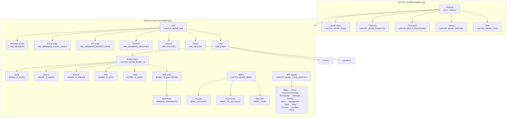
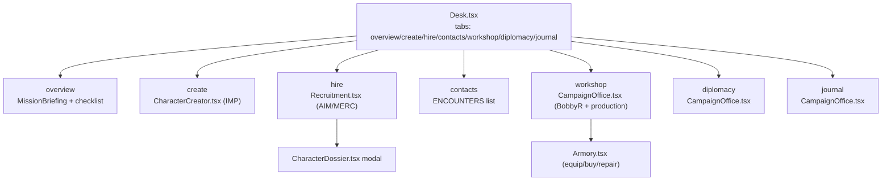

# 08 — Laptop: The Campaign Desk, Recruiting, and the Arms Trade

**Audience:** a web engineer with **no Jagged Alliance 2 experience** who must reproduce the
laptop (the in-game computer) in the browser clone. This document is a translation guide from
the C++ engine (`engine/Laptop/`, 190 files) to the existing React surface
(`web/app/Desk.tsx`, `Recruitment.tsx`, `Armory.tsx`, `CharacterCreator.tsx`) and the pure-JS
rules modules (`game/recruitment.js`, `game/contracts.js`, `game/campaign.js`,
`game/equipment.js`). It covers **page navigation, data sources, and money/transaction logic
only** — the strategic map screen (`MAP_SCREEN`) and tactical combat are owned by other docs.

**Source of truth:** `engine/Laptop/`. The web game already has a working desk
(`web/app/Desk.tsx`), a contract catalogue (`web/app/Recruitment.tsx`), an armory
(`web/app/Armory.tsx`), and a custom-officer wizard (`web/app/CharacterCreator.tsx`); this
document maps the C++ engine onto that existing surface so the web clone can be pushed toward
parity.

---

## 1. Big picture: the laptop is a browser-within-a-browser

The engine's laptop is a **single screen** (`LAPTOP_SCREEN`) that hosts a simulated desktop and
a simulated web browser. Every "website" (AIM, Bobby Ray's, MERC, IMP, florist, insurance,
funeral, WHO, PMC, …) is just another value of one global enum, `LaptopMode`
(`Laptop/laptop.h:96-192`), and the laptop main loop dispatches each value to a per-page
`Enter/Handle/Render/Exit` function set.

The web clone already collapses this into a **tabbed desk** (`web/app/Desk.tsx:14`): `overview`,
`create`, `hire`, `contacts`, `workshop`, `diplomacy`, `journal`. The engine's "program
windows" (email, files, personnel, finances, history) map to desk tabs; the engine's "WWW
bookmarks" (AIM, Bobby Ray, MERC, IMP, florist, funeral, insurance) map to the desk's
recruitment/armory surfaces.

### 1.1 The `LaptopMode` enum — every page in one table

`Laptop/laptop.h:96-192` defines the full page table. The values relevant to the web port:

| Value | Page | Web target |
|---|---|---|
| `LAPTOP_MODE_NONE` (0) | Desktop | `Desk.tsx` shell |
| `LAPTOP_MODE_FINANCES` (1) | Finance ledger | `Desk.tsx` treasury + `campaign.js` `resources` |
| `LAPTOP_MODE_PERSONNEL` (2) | Merc roster/stats | `CharacterDossier.tsx` |
| `LAPTOP_MODE_HISTORY` (3) | Campaign history log | `Desk.tsx` journal tab |
| `LAPTOP_MODE_FILES` (4) | Document viewer | (not ported) |
| `LAPTOP_MODE_EMAIL` (7) | Email inbox | `Desk.tsx` contacts tab |
| `LAPTOP_MODE_WWW` (10) | Browser chrome | `Desk.tsx` nav |
| `LAPTOP_MODE_AIM` (11) | AIM home | `Recruitment.tsx` (historical officers) |
| `LAPTOP_MODE_AIM_MEMBERS` (12) | AIM merc profile | `CharacterDossier.tsx` |
| `LAPTOP_MODE_AIM_MEMBERS_FACIAL_INDEX` (13) | AIM mugshot grid | `Recruitment.tsx` catalogue |
| `LAPTOP_MODE_AIM_MEMBERS_SORTED_FILES` (14) | AIM sort page | `Recruitment.tsx` sort |
| `LAPTOP_MODE_AIM_MEMBERS_ARCHIVES` (16) | AIM alumni gallery | (not ported) |
| `LAPTOP_MODE_AIM_POLICIES` (17) | AIM policies | (not ported) |
| `LAPTOP_MODE_AIM_HISTORY` (18) | AIM history | (not ported) |
| `LAPTOP_MODE_AIM_LINKS` (19) | AIM partner links | (not ported) |
| `LAPTOP_MODE_MERC` (18→20) | MERC home | (not ported — civic volunteers replace it) |
| `LAPTOP_MODE_MERC_ACCOUNT` (19) | MERC account | (not ported) |
| `LAPTOP_MODE_MERC_NO_ACCOUNT` (20) | MERC open-account | (not ported) |
| `LAPTOP_MODE_MERC_FILES` (21) | MERC merc files | (not ported) |
| `LAPTOP_MODE_BOBBY_R` (22) | Bobby Ray home | `Armory.tsx` |
| `LAPTOP_MODE_BOBBY_R_GUNS` (23) | Guns | `Armory.tsx` catalog |
| `LAPTOP_MODE_BOBBY_R_AMMO` (24) | Ammo | `Armory.tsx` catalog |
| `LAPTOP_MODE_BOBBY_R_ARMOR` (25) | Armour | `Armory.tsx` catalog |
| `LAPTOP_MODE_BOBBY_R_MISC` (26) | Misc | `Armory.tsx` catalog |
| `LAPTOP_MODE_BOBBY_R_USED` (27) | Used goods | (not ported) |
| `LAPTOP_MODE_BOBBY_R_MAILORDER` (28) | Mail order form | `Armory.tsx` purchase + `equipmentShipments` |
| `LAPTOP_MODE_CHAR_PROFILE` (29) | IMP wizard | `CharacterCreator.tsx` |
| `LAPTOP_MODE_FLORIST` (31) | Florist | (not ported) |
| `LAPTOP_MODE_INSURANCE` (35) | Insurance | (not ported) |
| `LAPTOP_MODE_FUNERAL` (139) | Funeral home | (not ported) |
| `LAPTOP_MODE_SIRTECH` (140) | SirTech (stub) | (not ported) |
| `LAPTOP_MODE_BROKEN_LINK` (141) | "Page not found" | (not ported) |
| `LAPTOP_MODE_CAMPAIGNHISTORY_*` (143-146) | Campaign history | `Desk.tsx` journal |
| `LAPTOP_MODE_MERCCOMPARE_*` (150-153) | Merc compare | (not ported) |
| `LAPTOP_MODE_WHO_*` (156-158) | WHO disease data | (not ported) |
| `LAPTOP_MODE_PMC_*` (161-163) | PMC militia hire | (not ported) |
| `LAPTOP_MODE_MILITIAROSTER_MAIN` (166) | Militia roster | `CampaignOffice.tsx` militia |
| `LAPTOP_MODE_INTELMARKET_*` (169-171) | Intel market | (not ported) |
| `LAPTOP_MODE_FACILITY_PRODUCTION` (174) | Facility production | `CampaignOffice.tsx` workshop |
| `LAPTOP_MODE_BOBBYR_SHIPMENTS` (176) | Bobby Ray shipments | `Armory.tsx` production queue |
| `LAPTOP_MODE_ENCYCLOPEDIA*` (179-180) | Encyclopedia | (not ported) |
| `LAPTOP_MODE_BRIEFING_ROOM*` (183-185) | Briefing room | `MissionBriefing.tsx` |

### 1.2 The laptop state machine

The laptop is entered from the strategic screen and runs as a normal `LAPTOP_SCREEN` in the
`GameScreens[]` table (`Ja2/Screens.cpp:36-77`). Inside, the mode switch is a **return-value /
global-assignment FSM**:

1. `EnterLaptop()` initializes the desktop, title bar, and bookmark list.
2. `EnterNewLaptopMode()` (`Laptop/laptop.cpp:1550`) is the central dispatcher: it handles
   program minimize/maximize states (`gLaptopProgramStates[]`, lines 1563-1669), then calls the
   per-mode `Enter*` function.
3. Every page's `Handle*` function can set `guiCurrentLaptopMode` (e.g.
   `SelectBobbiesSignMenuRegionCallBack`, `BobbyR.cpp:514-530`, sets it at line 523). The laptop
   loop detects the change and calls `EnterNewLaptopMode()` again.
4. `ExitLaptop()` (`laptop.cpp:1102`) calls `ExitLaptopMode(guiCurrentLaptopMode)` (line 1149)
   and tears down the desktop.

Key globals (`Laptop/laptop.h:70-90`): `guiCurrentLaptopMode`, `guiPreviousLaptopMode`,
`giCurrentSubPage` (sub-page persistence across mode switches, `laptop.cpp:319`),
`fLoadPendingFlag` / `fFastLoadFlag` / `fConnectingToSubPage` (the fake "World Wide Wait"
network delay), `fCurrentlyInLaptop`.

**Web equivalent:** `web/app/page.tsx` already models the outer screen router
(`title`/`desk`/`campaign`/`battle`, `page.tsx:20`). The desk's inner tabs (`Desk.tsx:14`) are
the web's `LaptopMode`. The engine's fake network delay has no web equivalent — React state
transitions are instant; do not reintroduce artificial loading screens.

### 1.3 Bookmarks and `GoToWebPage`

`GoToWebPage(iPageId)` (`laptop.cpp:4259`) is the engine's "open a website" primitive: it sets
`guiCurrentWWWMode` and `guiCurrentLaptopMode` to the target page and triggers the load-pending
flag. The bookmark enum (`laptop.h:242-262`) lists the sites: `AIM_BOOKMARK=0`, `BOBBYR_BOOKMARK`,
`IMP_BOOKMARK`, `MERC_BOOKMARK`, `FUNERAL_BOOKMARK`, `FLORIST_BOOKMARK`, `INSURANCE_BOOKMARK`,
`ENCYCLOPEDIA_BOOKMARK`, `BRIEFING_ROOM_BOOKMARK`, `CAMPAIGNHISTORY_BOOKMARK`, `MERCCOMPARE_BOOKMARK`,
`WHO_BOOKMARK`, `PMC_BOOKMARK`, `MILITIAROSTER_BOOKMARK`, `INTELMARKET_BOOKMARK`,
`PRODUCTION_BOOKMARK`, `REBELCOMMAND_BOOKMARK`. `SetBookMark()` (`laptop.cpp:3884`) adds a site
to the browser's favorites; `RemoveBookmark()` (`laptop.cpp:4080`) removes it.

**Web equivalent:** the desk tabs are the bookmarks. `Desk.tsx:14` hard-codes the tab list;
there is no dynamic bookmark add/remove.

---

## 2. Site map



**Web equivalent (existing):**



---

## 3. AIM — the mercenary-recruitment website

### 3.1 Navigation state machine

- Entry: `GoToWebPage(AIM_BOOKMARK)` (`laptop.cpp:4268-4285`) sets both `guiCurrentWWWMode` and
  `guiCurrentLaptopMode` to `LAPTOP_MODE_AIM`.
- Bottom nav: `NUM_AIM_SCREENS = 6` (`aim.h:42`); the button→page map is `gCurrentAimPage[6]`
  (`aim.cpp:27-35`): Home, Members (→ `AIM_MEMBERS_SORTED_FILES`), Archives, Policies, History,
  Links. Buttons are created in `InitAimMenuBar()` (`aim.cpp:625-650`); the click handler
  `BtnAimBottomButtonsCallback()` (`aim.cpp:665-695`) sets `guiCurrentLaptopMode` (line 684).
- Home page regions (`EnterAIM()`, `aim.cpp:220-318`): MemberCard → `AIM_MEMBERS_SORTED_FILES`
  (`aim.cpp:416`), Policies → `AIM_POLICIES` (432), History → `AIM_HISTORY` (448), Links →
  `AIM_LINKS` (464), logo → home (562), banner ads → `GoToWebPage()` to Florist/Insurance/
  Funeral/BobbyR (`aim.cpp:942-963`).
- Keyboard (`HandleAimKeyBoardInput()`, `aim.cpp:1309-1340`): `h`→History, `l`→Links,
  `e`/`m`/`ENTER`→Members, `p`→Policies.
- Sub-page persistence: each multi-page module saves/restores `giCurrentSubPage`
  (`laptop.cpp:319`) — History (`AimHistory.cpp:155/138`), Policies (`AimPolicies.cpp:261/212`),
  Archives (`AimArchives.cpp:298/198`), Members (`AimMembers.cpp:948/913`). Page changes fake a
  network delay via `ChangingAimHistorySubPage` (`AimHistory.cpp:649-665`) etc.

### 3.2 Members page — the merc list and profile

- Data model: `AimMercArray[NUM_PROFILES]` (`aim.cpp:22`) holds the ordered list of AIM merc
  profile IDs, populated in `Tactical/Soldier Profile.cpp:986-1006` from `gAimAvailability[]`
  (only entries with `ProfilId != 255`).
- Profile render (`RenderAIMMembers()`, `AimMembers.cpp:1096-1243`): stats box, price box,
  weapon box; `UpdateMercInfo()` (`AimMembers.cpp:1311-1434`) shows the three pay rates
  (`sSalary`, `uiWeeklySalary`, `uiBiWeeklySalary`), discounted daily costs
  (`DrawDiscountedDailyCosts()`, lines 1298-1309), medical-deposit notice, and bio text
  (`LoadMercBioInfo()`, lines 1438-1497, reads `MERCBIOSFILENAME` .edt or XML
  `Loc::AIM_BIOGRAPHY`).
- `DisplayMercsInventory()` (`AimMembers.cpp:1501-1682`) draws the merc's starting gear;
  `DisplayMercStats()` (`AimMembers.cpp:1989-2171`) draws the 11 attributes from
  `gMercProfiles[gbCurrentSoldier]`.
- Navigation: prev/next merc (`PreviousAimMember()`/`NextAimMember()`,
  `AimMembers.cpp:1719-1768`), keyboard arrows/`a`/`d` (`HandleAimMemberKeyBoardInput`,
  `AimMembers.cpp:4964+`), `q`/`BACKSPACE` returns to the Facial Index.

### 3.3 Hiring — the video-conference state machine

Hiring is a **simulated video call**, not a button. The state machine is driven by
`gubVideoConferencingMode` (enum at `AimMembers.cpp:448-458`):

```
AIM_VIDEO_NOT_DISPLAYED → POPUP → INIT → WillMercAcceptCall()
    → FIRST_CONTACT | MERC_ANSWERING_MACHINE | MERC_UNAVAILABLE
    → HIRE_MERC → (authorize) → POPDOWN → NOT_DISPLAYED
```

- Start: clicking the merc's face (`SelectFaceRegionCallBack`, `AimMembers.cpp:1259-1277`) or
  the Contact button (`BtnContactButtonCallback`, `AimMembers.cpp:1796-1829`) sets
  `gubVideoConferencingMode = AIM_VIDEO_POPUP_MODE`.
- Driver: `HandleCurrentVideoConfMode()` (`AimMembers.cpp:4347-4466`); `WillMercAcceptCall()`
  (`AimMembers.cpp:3139-3160`) decides the outcome from `gMercProfiles[].bMercStatus` (annoyed →
  UNAVAILABLE; on contract/not arrived → ANSWERING_MACHINE; hireable → FIRST_CONTACT).
- First contact: `BtnFirstContactButtonCallback` (`AimMembers.cpp:2860-2900`) checks
  `CanMercBeHired()` (line 2880, morale hangover + hated-mercs lists).
- Hire screen: contract-length buttons (`BtnContractLengthButtonCallback`,
  `AimMembers.cpp:2201-2236`, sets `gubContractLength`), buy-equipment toggle
  (`BtnBuyEquipmentButtonCallback`, `AimMembers.cpp:2239-2270`, sets `gfBuyEquipment`), and the
  **Authorize/Transfer Funds** button (`BtnAuthorizeButtonCallback`, `AimMembers.cpp:2273-2354`)
  which calls `AimMemberHireMerc()`.
- The actual hire — `AimMemberHireMerc()` (`AimMembers.cpp:2358-2459`):
  1. Balance check: `if (LaptopSaveInfo.iCurrentBalance < giContractAmount)` → failure popup
     (lines 2368-2382).
  2. Builds a `MERC_HIRE_STRUCT` (line 2384): `ubProfileID`, arrival sector, `fCopyProfileItemsOver
     = gfBuyEquipment` (lines 2386-2394).
  3. Contract length 1/7/14 days → `CONTRACT_EXTEND_1_DAY` / `_1_WEEK` / `_2_WEEK`
     (lines 2403-2417).
  4. Calls `HireMerc(&HireMercStruct)` (line 2427); handles `MERC_HIRE_OVER_PLAYER_LIMIT` (2428)
     and `MERC_HIRE_FAILED` (2434).
  5. Money: `AddTransactionToPlayersBook(HIRED_MERC, ...)` for contract minus medical deposit
     (line 2448); `AddTransactionToPlayersBook(MEDICAL_DEPOSIT, ...)` if required (2450-2454).
  6. History: `AddHistoryToPlayersLog(HISTORY_HIRED_MERC_FROM_AIM, ...)` (line 2457).
- Cost computation: `DisplayMercChargeAmount()` (`AimMembers.cpp:2620-2682`) — `giContractAmount`
  = `sSalary`/`uiWeeklySalary`/`uiBiWeeklySalary` (2644-2651) + `sMedicalDepositAmount` if
  `bMedicalDeposit` (2654-2657) + `usOptionalGearCost` if `gfBuyEquipment` (2660-2663).
- Contract-length constants: `AIM_CONTRACT_LENGTH_ONE_DAY=0`, `ONE_WEEK=1`, `TWO_WEEKS=2`
  (`AimMembers.cpp:382-384`).

### 3.4 Sort, Facial Index, Archives, Policies, History, Links

- **Sort** (`AimSort.cpp`): 13 criteria (0=Price, 1=Experience, 2=Marksmanship, 3=Mechanical,
  4=Explosives, 5=Medical, 6=Health, 7=Agility, 8=Dexterity, 9=Strength, 10=Leadership,
  11=Wisdom, 12=Name) with direction `AIM_ASCEND=13`/`AIM_DESCEND=14` (`AimSort.h:9-10`).
  `ExitAimSort()` calls `SortMercArray()` (`AimSort.cpp:422-426`) which `qsort`s `AimMercArray`
  via `QsortCompare` (`AimSort.cpp:965-1040`). Default: Name, descending (`GameInitAimSort`,
  lines 211-218). Three sub-nav icons: Mugshots → Facial Index (553-566), Mercenary Files →
  Members (569-582), Alumni Gallery → Archives (586-599).
- **Facial Index** (`AimFacialIndex.cpp`): 8×5 mugshot grid (lines 28-29), 40 per page, page
  offsets `START_MERC`/`END_MERC` (31-32). Faces from `FACES\%02d.sti` (lines 217, 223). Status
  overlays: dead (red-shaded, 458), POW (471), already hired (478), away (486). Left-click →
  Members profile (367-371); right-click → Sort page (374).
- **Archives** (`AimArchives.cpp`): 4×5 grid of retired mercs (`AIM_ALUMNI_NUM_FACE_ROWS=4`,
  `_COLS=5`, lines 36-37), 20 per page, up to 4 pages. Data from `gAimOldArchives[NUM_PROFILES]`
  (`AimArchives.cpp:147`), struct `OLD_MERC_ARCHIVES_VALUES` (`AimArchives.h:13-22`):
  `uiIndex`, `szNickName[160]`, `szName[160]`, `szBio[1120]`, `FaceID`, `visibleOldMerc`. Loaded
  from XML by `ReadInAimOldArchive()` (`XML_OldAIMArchive.cpp:152-212`), called from
  `Ja2/Init.cpp:1332/1339`. A merc shows only if `FaceID != -1` (`AimArchives.cpp:178`).
- **Policies** (`AimPolicies.cpp`): 11 sub-pages (line 13); page 0 is the Statement of Policy
  with Agree/Disagree (`InitAgreementRegion`, 623-656; `BtnPoliciesAgreeButtonCallback`,
  750-795). Disagree → back to `LAPTOP_MODE_AIM` (781).
- **History** (`AimHistory.cpp`): 5 sub-pages (line 14); page 0 is a Table of Contents
  (`InitTocMenu`, 447-497). Data from encrypted `AimHist.edt` or XML `Loc::AIM_HISTORY`.
- **Links** (`AimLinks.cpp`): 3 partner links (`gubLinkPages`, lines 53-56) →
  `BOBBYR_BOOKMARK`, `FUNERAL_BOOKMARK`, `INSURANCE_BOOKMARK`; click handler
  `SelectLinkRegionCallBack` (249-268) calls `GoToWebPage()` (263).

### 3.5 AIM data sources (XML)

| XML loader | Shape | Struct | Loaded at |
|---|---|---|---|
| `XML_AIMAvailability.cpp` | `<AIM_AVAILABLES><AIM><uiIndex/><ProfilId/><AimBioID/></AIM>` | `AIM_AVAILABLE` (`aim.h:21-28`: `ubAimArrayID`, `uiIndex`, `ProfilId`, `AimBio`) | `Ja2/Init.cpp:1153` (EN), `:1160` (loc) |
| `XML_OldAIMArchive.cpp` | `<OLD_MERC><MERC><uiIndex><NickName><Name><Bio><FaceID>` | `OLD_MERC_ARCHIVES_VALUES` | `Ja2/Init.cpp:1332/1339` |
| `XML_ConditionsForMercAvailability.cpp` | `<MERC_AVAILABLES><MERC><uiIndex/><usMoneyPaid/><usDay/><ProfilId/><NewMercsAvailable/><StartMercsAvailable/><MercBioID/><Drunk/><uiAlternateIndex/>` | `CONTITION_FOR_MERC_AVAILABLE` (`mercs.h:49-62`) | `Ja2/Init.cpp:1126/1139` |

### 3.6 Web mapping — AIM → `Recruitment.tsx` + `game/recruitment.js`

The web clone **replaces the AIM/MERC paid-merc market with authored civic volunteers and
historical NPC encounters** (`docs/WEB-SYSTEMS.md:113-121`). The engine's AIM concepts map as
follows:

| Engine (AIM) | Web equivalent |
|---|---|
| `AimMercArray` + `gAimAvailability` (XML roster) | `OPERATIVES` + `CIVIC_RECRUITS` (`game/data.js:2`, `game/recruitment.js:16-25`) |
| `gMercProfiles[].sSalary/uiWeeklySalary/uiBiWeeklySalary` | `monthlyPay`/`weeklyPay` fields; `contractQuote()` (`game/contracts.js:2-10`) derives daily price |
| `AIM_CONTRACT_LENGTH_ONE_DAY/WEEK/TWO_WEEKS` | `CONTRACT_TERMS` day/week/month (`game/contracts.js:1`) |
| `HireMerc()` + `AddTransactionToPlayersBook(HIRED_MERC)` | `signContract()` → `pay(s,{treasury:quote.price})` (`game/campaign.js:41-43`) |
| `WillMercAcceptCall()` status checks | `contractQuote().reason` + `civicStatus()` (`game/recruitment.js:44-49`) |
| `DisplayMercStats()` 11 attributes | `CharacterDossier.tsx` stats grid (`ATTRIBUTE_LABELS`, `game/characters.js:3`) |
| `LoadMercBioInfo()` bio text | `biography` field + `characterProfile()` (`game/characters.js:29`) |
| `AddHistoryToPlayersLog(HISTORY_HIRED_MERC_FROM_AIM)` | `note(s, ...)` campaign log (`game/campaign.js:50`) |
| AIM sort page | `Recruitment.tsx` catalogue order (fixed) |

**React tree proposal (AIM):**

```
Desk.tsx (tab="hire")
└── Recruitment.tsx
    ├── recruit-catalogue (map over rosterFor(s).filter(CIVIC_RECRUITS))
    │   └── contract-card
    │       ├── candidate-face (portrait button → setSelected)
    │       ├── candidate-stats (marksmanship/leadership/level)
    │       ├── term <select> (day/week/month, elite→day only)
    │       ├── hire/renew <button> → dispatch({type:'recruitCivic'|'renewContract'})
    │       └── dismiss <button> → dispatch({type:'dismiss'})
    └── CharacterDossier.tsx (Dialog modal, operative + record)
```

---

## 4. Bobby Ray's — the arms dealer

### 4.1 Navigation state machine

- Entry: `GoToWebPage(BOBBYR_BOOKMARK)`; `EnterBobbyR()` (`BobbyR.cpp:205-317`) loads the wood
  background, name/plaque/hinge graphics, and the 5 sign regions. `SetBookMark(BOBBYR_BOOKMARK)`
  (line 311).
- The 5 signs map to pages via `gubBobbyRPages[]` (`BobbyR.cpp:167-172`): Used, Misc, Guns,
  Ammo, Armor. Click handler `SelectBobbiesSignMenuRegionCallBack` (`BobbyR.cpp:514-530`) sets
  `guiCurrentLaptopMode` (line 523).
- **Under-construction gate**: if `!LaptopSaveInfo.fBobbyRSiteCanBeAccessed` (`BobbyR.cpp:295`),
  the site shows an animated "under construction" screen and disables all sign regions
  (302-308). This is the engine's "site opens later in the campaign" mechanic.
- `guiLastBobbyRayPage` (`BobbyR.h:51`) remembers the last sub-page so the mail-order "Back"
  button can return to it (`BobbyRMailOrder.cpp:1352, 2930`).

### 4.2 Store inventory system

- `STORE_INVENTORY` struct (`Store Inventory.h:7-17`): `usItemIndex`, `ubQtyOnHand`,
  `ubQtyOnOrder`, `ubItemQuality` (0-100 %), `fPreviouslyEligible`.
- Two dealer lists: `BOBBY_RAY_NEW` and `BOBBY_RAY_USED` (`Store Inventory.h:21-27`);
  `StoreInventory[MAXITEMS][BOBBY_RAY_LISTS]` (line 29) is the static "what Bobby Ray can ever
  sell" table.
- `InitBobbyRayInventory()` (`BobbyR.cpp:601-614`) builds the runtime lists in
  `LaptopSaveInfo.BobbyRayInventory[ MAXITEMS ]` / `BobbyRayUsedInventory[ MAXITEMS ]`
  (`LaptopSave.h:105-106`), sorted by category then price (`BobbyRayItemQsortCompare`,
  `BobbyR.cpp:635`).
- **Daily turnover** (`DailyUpdateOfBobbyRaysNewInventory()`, `BobbyR.cpp:683-747`):
  1. `SimulateBobbyRayCustomer()` (918-941) reduces `ubQtyOnHand` (other buyers).
  2. For each item at or below half the desired stock, `HowManyBRItemsToOrder()` (805-838)
     computes a reorder batch (new items: `HowManyItemsToReorder`; used items: exactly 1).
  3. First-time-eligible items are stocked instantly (`AddFreshBobbyRayInventory()`, 852-897);
     otherwise `OrderBobbyRItem()` (841-849) schedules `EVENT_UPDATE_BOBBY_RAY_INVENTORY` to
     arrive in `BOBBY_R_NEW_PURCHASE_ARRIVAL_TIME` (1 day) + random half-day (`BobbyR.cpp:112`).
- Used items get quality `20 + Random(60)`; new items quality 100 (`BobbyR.cpp:866, 872`).

### 4.3 Item grid rendering

- `DisplayItemInfo(uiItemClass, iFilter, iSubFilter)` (`BobbyRGuns.cpp:1421+`) renders the
  category grid: 4 items per page (`BOBBYR_NUM_WEAPONS_ON_PAGE=4`, line 50), page indicator
  `gubCurPage+1 / gubNumPages` (1439), subtotal (1435), and the "out of stock" popup when
  `gusFirstItemIndex == BOBBYR_NO_ITEMS` (1451-1466).
- `SetFirstLastPagesForNew()` (`BobbyRGuns.cpp:2586-2689`) scans `BobbyRayInventory` for items
  with `ubQtyOnHand != 0` matching the class mask and filter (gun type / ammo type / armour
  class / misc class+subfilter), computing `gusFirstItemIndex`, `gusLastItemIndex`,
  `gubNumPages`. `SetFirstLastPagesForUsed()` (2692+) does the same for the used list.
- Filter modes are globals: `guiCurrentGunFilterMode`, `guiCurrentAmmoFilterMode`,
  `guiCurrentArmourFilterMode`, `guiCurrentMiscFilterMode` (+ subfilter), `guiCurrentUsedFilterMode`
  (`laptop.h:51-66`).

### 4.4 Mail order — the shopping cart

- `EnterBobbyRMailOrder` (`BobbyRMailOrder.cpp:402`), `ExitBobbyRMailOrder` (597),
  `HandleBobbyRMailOrder` (672), `RenderBobbyRMailOrder` (716).
- Cart: `BobbyRayPurchases[100]` (`BobbyRayPurchaseStruct`, `LaptopSave.h:48-50`:
  `usItemIndex`, `usBobbyItemIndex`, `ubNumberPurchased`, `bItemQuality`, `fUsed`).
  `SortBobbyRayPurchases()` (`BobbyRMailOrder.cpp:2802`) compacts empty slots.
- Order form columns: Qty / Weight / Name / Unit Price / Total (`DisplayPurchasedItems()`,
  `BobbyRMailOrder.cpp:1013-1150`). Subtotal accumulates `CalcBobbyRayCost(...) * ubNumberPurchased`
  (1132, 1146).
- **Shipping**: destination dropdown from `gDestinationTable` (populated from
  `gPostalService.LookupDestinationList()`, `BobbyR.cpp:222-229`); delivery speed
  `gubSelectedLight` 0/1/2 = Overnight / 2-business-days / Standard
  (`CalculateOrderDelay()`, `BobbyRMailOrder.cpp:2340-2370`). Shipping cost is weight-based:
  `CalcCostFromWeightOfPackage()` (2255-2315) = `(totalWeight/10) * destinationFee`, with a
  minimum weight `MIN_SHIPPING_WEIGHT` (2306-2310). Grand total = subtotal + shipping
  (`BobbyRMailOrder.cpp:1332`).
- **Accept order** (`BtnBobbyRAcceptOrderCallback`, `BobbyRMailOrder.cpp:856-1010`):
  1. Requires `guiSubTotal && gfCanAcceptOrder` (867).
  2. Balance check: `if (LaptopSaveInfo.iCurrentBalance < giGrandTotal)` → "can't afford" popup
     (870-873).
  3. Destination must be player-controlled (884-887); otherwise a confirm box
     (`ConfirmBobbyRPurchaseMessageBoxCallBack`, 2537-2544).
  4. `PurchaseBobbyOrder()` (2372-2457): `AddNewBobbyRShipment(BobbyRayPurchases, destinationID,
     service, TRUE, weight)` (2432) creates the shipment via the PostalService; then
     `AddTransactionToPlayersBook(BOBBYR_PURCHASE, 0, GetWorldTotalMin(), -giGrandTotal)` (2445).
  5. `gfRemoveItemsFromStock = TRUE` (2454) — stock is decremented on the next render pass
     (`BobbyRMailOrder.cpp:1879-1896`).
- **Clear order** (`BtnBobbyRClearOrderCallback`, 822-853): zeroes `BobbyRayPurchases`, resets
  city selection, disables Accept.
- **Shipments page** (`LAPTOP_MODE_BOBBYR_SHIPMENTS`, reached from
  `BtnBobbyRGotoShipmentPageCallback`, 2612-2630): lists pending shipments from
  `gShipmentTable` (populated from `gPostalService.LookupShipmentList()`, `BobbyR.cpp:231-237`).
  Delivery callback `BobbyRDeliveryCallback` (`BobbyRMailOrder.cpp:374`) fires when a shipment
  arrives.

### 4.5 PostalService and XML

`PostalService.cpp` (1176 lines) is the delivery backend: `CPostalService` holds
`DestinationStruct` (`usID`, `uiIndex`, `ubMapX/Y/Z`, `sGridNo`, `wstrName`) and
`ShipmentStruct` lists (`MAX_DESTINATIONS 255`, `MAX_SHIPMENTS 255`, `PostalService.h`).
Destinations come from `XML_ShippingDestinations.cpp`; delivery methods/fees from
`XML_DeliveryMethods.cpp`. `GameInitBobbyR()` registers the delivery callback
(`BobbyR.cpp:197-202`).

### 4.6 Web mapping — Bobby Ray → `Armory.tsx` + `game/equipment.js`

| Engine (Bobby Ray) | Web equivalent |
|---|---|
| `STORE_INVENTORY` + `StoreInventory[][]` | `EQUIPMENT_CATALOG` (`game/equipment.js:2-7`) + `s.armory` stock map |
| `BobbyRayInventory[].ubQtyOnHand` | `armoryInventory(s)` (`game/equipment.js:8`) |
| `DisplayItemInfo()` category grid | `Armory.tsx` `armory-catalog` (firearm/blade/artillery sections) |
| `CalcBobbyRayCost()` price | `item.price` in `EQUIPMENT_CATALOG` |
| Mail order + `AddNewBobbyRShipment` | `purchaseEquipment` → `s.equipmentShipments` with `due = hour + 72..120` (`game/campaign.js:171-178`) |
| `BOBBYR_PURCHASE` transaction | `pay(s,{treasury:...})` (`game/campaign.js:52`) |
| `OrderBobbyRItem` reorder events | `deliverEquipmentShipments(s)` (`game/equipment.js:21-25`) |
| Used goods (`BobbyRUsed`) | (not ported — no used market) |
| `fBobbyRSiteCanBeAccessed` gate | `isImportedEquipment()` + Ensenada/blockade gates (`game/equipment.js:20`, `game/campaign.js:175`) |
| Shipments page | `Armory.tsx` `production-queue` (`s.equipmentShipments` map) |
| `guiCurrentGunFilterMode` etc. | `Armory.tsx` category sections (no sub-filters) |

**React tree proposal (Bobby Ray):**

```
Desk.tsx (tab="workshop")
└── CampaignOffice.tsx (section="workshop")
    ├── inventory-band (s.resources)
    ├── Sala de armas (RECIPES → dispatch({type:'produce'}))
    ├── Contrabando (offers → dispatch({type:'contraband'}))
    └── Armory.tsx
        ├── production-queue (equipmentShipments)
        ├── armory-loadout (select operative → equip weapon/blade)
        ├── armory-condition (condition/priming/flints/rations + resupply/repair)
        ├── battery (configureArtillery, 3 pieces)
        └── armory-catalog (firearm/blade/artillery → purchaseEquipment)
```

---

## 5. MERC — the discount mercenary site

### 5.1 Navigation and account model

- Pages: `LAPTOP_MODE_MERC` (home), `MERC_ACCOUNT`, `MERC_NO_ACCOUNT`, `MERC_FILES`
  (`laptop.h:118-121`).
- Account status enum (`mercs.h:89-92`): `MERC_ACCOUNT_SUSPENDED`, `MERC_ACCOUNT_INVALID`,
  `MERC_ACCOUNT_VALID_FIRST_WARNING`, `MERC_ACCOUNT_VALID`. Stored in
  `LaptopSaveInfo.gubPlayersMercAccountStatus` (`LaptopSave.h:96`); account number
  `guiPlayersMercAccountNumber` (97).
- `GameInitMercs()` (`mercs.cpp:482`) seeds the account status (529) and, on first visit,
  generates a random 5-digit account number (`Random(99999)`, line 548).
- Home page (`RenderMercs()`, `mercs.cpp:820`): account box shows "Open account" or "View
  account" (851-854). Clicking routes to `LAPTOP_MODE_MERC_NO_ACCOUNT` or
  `LAPTOP_MODE_MERC_ACCOUNT` (931-934); the Files button routes to `LAPTOP_MODE_MERC_FILES`
  (967).
- **Open account** (`BtnOpenAccountBoxButtonCallback`, `mercs No Account.cpp:129-181`): sets
  `MERC_ACCOUNT_VALID` (144), plays Speck's thank-you quote (151), returns to MERC home (153).
  There is **no upfront fee** in the engine — the account is a credit line.
- **Account page** (`mercs Account.cpp`): lists hired MERC mercs with days/rate/charge columns
  (`RenderMercsAccount`, 373-589); `SettleMercAccounts()` (595-656) pays Speck:
  `AddTransactionToPlayersBook(PAY_SPECK_FOR_MERC, ...)` (651/653) and
  `AddHistoryToPlayersLog(HISTORY_SETTLED_ACCOUNTS_AT_MERC, ...)` (656). Partial payment is
  allowed if the balance covers at least the partial amount (624).
- **Hire** (`MercFilesHireMerc()`, `mercs Files.cpp:1128-1267`): checks `IsMercHireable()`
  (1145) and unpaid-contract state (1169); builds `MERC_HIRE_STRUCT` (1179) with
  `iTotalContractLength = 1` (1183); balance check (1201/1215); `HireMerc()` (1223); handles
  `MERC_HIRE_OVER_PLAYER_LIMIT` (1226) and `MERC_HIRE_FAILED` (1231); records
  `AddTransactionToPlayersBook(HIRED_MERC, ...)` (1241) and `PAY_SPECK_FOR_MERC` (1251).
- New mercs unlock as the player pays Speck: `uiTotalMoneyPaidToSpeck` (`LaptopSave.h:162`)
  gates availability (`mercs.cpp:2106`).

### 5.2 Web mapping — MERC → civic volunteers

The web clone **does not port MERC** as a site. Its role (cheap, per-day, credit-based mercs)
is replaced by `CIVIC_RECRUITS` (`game/recruitment.js:16-25`, ids 100-106) hired through the
desk catalogue with prepaid contracts (`docs/WEB-SYSTEMS.md:113-119`). The engine's
"account/credit" model maps to the web's **prepaid** model: `signContract()` charges the full
quote up front (`game/campaign.js:41-43`), and `contractQuote()` returns `price` and
`expiresAt` (`game/contracts.js:9`). The MERC "Speck" personality is not ported.

---

## 6. IMP — the custom-officer wizard

### 6.1 Page flow

- Entry: `GoToWebPage(IMP_BOOKMARK)` (`laptop.cpp:4347-4348`) → `LAPTOP_MODE_CHAR_PROFILE`.
- Two enums drive the wizard:
  - `iCurrentProfileMode` (`IMP MainPage.h:22-30`): `IMP__REGISTRY`, `IMP__PERSONALITY`,
    `IMP__ATTRIBUTES`, `IMP__PORTRAIT`, `IMP__VOICE`, `IMP__FINISH` — the coarse phase.
  - `iCurrentImpPage` (`CharProfile.h:82-110`): the fine-grained page list —
    `IMP_HOME_PAGE`, `IMP_BEGIN`, `IMP_FINISH`, `IMP_MAIN_PAGE`, `IMP_PERSONALITY`,
    `IMP_PERSONALITY_QUIZ`, `IMP_PERSONALITY_FINISH`, `IMP_ATTRIBUTE_ENTRANCE`,
    `IMP_ATTRIBUTE_PAGE`, `IMP_ATTRIBUTE_FINISH`, `IMP_PORTRAIT`, `IMP_VOICE`, `IMP_ABOUT_US`,
    `IMP_CONFIRM`, `IMP_CHARACTER_AND_DISABILITY_ENTRANCE`, `IMP_CHARACTER_PAGE`,
    `IMP_DISABILITY_PAGE`, `IMP_COLOR_CHOICE_PAGE`, `IMP_MINOR_TRAITS_PAGE`, `IMP_BACKGROUND`,
    `IMP_PREJUDICE`, `IMP_GEAR_ENTRANCE`, `IMP_GEAR`.
- The wizard is a **linear stepper** with a sidebar. `IMP MainPage.cpp` shows the transitions:
  `IMP_FINISH` (144), `IMP_HOME_PAGE` (365), `IMP_BEGIN` (411), `IMP_PERSONALITY` (445),
  `IMP_ATTRIBUTE_ENTRANCE` (474), `IMP_PORTRAIT` (503), `IMP_CHARACTER_AND_DISABILITY_ENTRANCE`
  (532), back to `IMP_BEGIN` (683).
- **Cost**: `COST_OF_PROFILE 3000` (`CharProfile.h:112`) — the IMP charges 3000 for the
  finished profile (recorded as `IMP_PROFILE` in the finance ledger, `finances.h:32`).
- Character data is accumulated in globals (`CharProfile.h:18-75`): `iStrength`, `iDexterity`,
  `iAgility`, `iWisdom`, `iLeadership`, `iHealth`, `iMarksmanship`, `iMedical`, `iExplosives`,
  `iMechanical`, `fCharacterIsMale`, `pFullName`, `pNickName`, `iSkillA/B/C`, `iPersonality`,
  `iAttitude`, `usBackground`, prejudice fields (`bRace`, `bNationality`, `bAppearance`, ...),
  and `iAdd*` bonus accumulators.
- `ResetCharacterStats()` (`CharProfile.h:10`) clears the globals; `InitIMPSubPageList()`
  (11) builds the sidebar.
- XML data: `XML_IMPPortraits.cpp` (portrait list) and `XML_IMPVoices.cpp` (voice list).
  `IMPVideoObjects.cpp` loads the intro video.

### 6.2 Web mapping — IMP → `CharacterCreator.tsx` + `game/character-profile.js`

| Engine (IMP) | Web equivalent |
|---|---|
| `iCurrentImpPage` stepper | `CharacterCreator.tsx` single-page form (name, portrait, class, attributes, questions) |
| `COST_OF_PROFILE 3000` | `creationCost = profile.version===2 ? 0 : 300` (`game/campaign.js:201`) — v2 profiles are free |
| `iStrength`...`iAddMechanical` globals | `profile.attributes` (10 attributes, `PROFILE_ATTRIBUTES`, `game/character-profile.js:1`) |
| Attribute allocation | `PROFILE_POINTS = 550`, each 35-85 (`game/character-profile.js:2,21`) |
| `fCharacterIsMale` + portraits | `CHARACTER_PORTRAITS` (`game/character-profile.js:9`) |
| `iSkillA/B/C` | `traits[]` from `OFFICER_TRAITS` + `PROFILE_QUESTIONS` answers (`game/recruitment.js:4-9`, `game/character-profile.js:10-13`) |
| `iPersonality`/`iAttitude` | `answers.temperament` → `personality` (`game/character-profile.js:22`) |
| `IMP_PROFILE` finance entry | `pay(s,{treasury:creationCost})` (`game/campaign.js:201`) |
| `IMP_CONFIRM`/`IMP_FINISH` | `createOfficerRecord()` validation + `dispatch({type:'createOfficer'})` (`game/campaign.js:199-202`) |
| `IMP_EMAIL_INTRO`/`IMP_EMAIL_PROFILE_RESULTS` emails | (not ported — officer creation is immediate) |

**React tree proposal (IMP):**

```
Desk.tsx (tab="create")
└── CharacterCreator.tsx
    ├── name input (2-30 chars)
    ├── nickname input (≤16)
    ├── portrait fieldset (CHARACTER_PORTRAITS avatar-*)
    ├── class select (CHARACTER_CLASSES)
    ├── attributes fieldset (10 × number input, 550 points)
    ├── OFFICER_QUESTIONS + PROFILE_QUESTIONS selects
    └── submit → createOfficerRecord() → dispatch({type:'createOfficer'})
```

---

## 7. Email, finances, personnel, history, files

### 7.1 Email (`email.cpp`, 5446 lines)

- Pages: `LAPTOP_MODE_EMAIL`, `EMAIL_NEW`, `EMAIL_VIEW` (`laptop.h:105-107`).
- `Email` struct (`email.h:420-451`): `pSubject`, `usOffset`, `usLength`, `ubSender`, `iDate`,
  `iId`, `iFirstData`, `uiSecondData`, `fRead`, `fNew`, `iThirdData`, `iFourthData`,
  `uiFifthData`, `uiSixData`, `iCurrentIMPPosition`, `EmailVersion`, `EmailType`,
  `iCurrentShipmentDestinationID`, `Next`, `Prev`. Inbox pages hold `MAX_MESSAGES_PAGE = 18`
  (`email.h:8`).
- Senders (`email.h:519-538`): `MAIL_ENRICO`, `CHAR_PROFILE_SITE`, `GAME_HELP`,
  `IMP_PROFILE_RESULTS`, `SPECK_FROM_MERC`, `RIS_EMAIL`, `BARRY_MAIL`, `MELTDOWN_MAIL`,
  `INSURANCE_COMPANY`, `BOBBY_R`, `KING_PIN`, `JOHN_KULBA`, `AIM_SITE`, `PMC`,
  `ANGEL_DASILVA`.
- Email types (`email.h:646-682`): `TYPE_EMAIL_EMAIL_EDT` (read from `Email.edt`),
  `TYPE_EMAIL_EMAIL_EDT_NAME_MERC`, `TYPE_EMAIL_AIM_AVAILABLE`, `TYPE_EMAIL_MERC_LEVEL_UP`,
  `TYPE_EMAIL_BOBBY_R`, `TYPE_EMAIL_ENRICO`, `TYPE_EMAIL_IMP_PROFILE_RESULTS`,
  `TYPE_EMAIL_SPECK_FROM_MERC`, `TYPE_EMAIL_INSURANCE_COMPANY`, `TYPE_EMAIL_XML` (from
  `Email\Emails.xml` + `EmailSenderNameList.xml`).
- XML email enum (`email.h:703-782`): `XML_ENRICO_INQUIRY`, `XML_IMP_INTRO`, `XML_SPECK_INTRO`,
  `XML_BR_SHIPMENTARRIVAL`, `XML_AIM_NOTICE_OF_DEATH`, `XML_AIM_REFUND`, etc.
- API: `AddEmail()` (`email.cpp:877`), `AddEmailMessage()` (967), `AddPreReadEmail()` (929),
  `AddEmailFromXML()` (803), `AddEmailWithSpecialData()` (661), `LookForUnread()` (1781),
  `DisplayEmailHeaders()` (587), `RenderEmail()` (612), `HandleEmail()` (509).
- XML loaders: `XML_Email.cpp`, `XML_EmailMercAvailable.cpp` (merc-available notices),
  `XML_EmailMercLevelUp.cpp` (level-up notices).

**Web mapping:** the engine's event-driven email inbox maps to the web's **campaign log**
(`s.log`, `game/campaign.js:50`) and the `contacts` tab (`Desk.tsx:22`). There is no inbox UI;
narrative emails are folded into `note()` entries and `ENCOUNTERS` contact cards.

### 7.2 Finances (`finances.cpp`, 2633 lines)

- Page: `LAPTOP_MODE_FINANCES`.
- `finance` struct (`finances.h:13-21`): `ubCode`, `uiIdNumber`, `ubSecondCode`, `uiDate`,
  `iAmount`, `iBalanceToDate`, `Next`. Persisted to `TEMP\finances.dat`.
- Transaction codes (`finances.h:23-67`): `ACCRUED_INTEREST`, `ANONYMOUS_DEPOSIT`,
  `TRANSACTION_FEE`, `HIRED_MERC`, `BOBBYR_PURCHASE`, `PAY_SPECK_FOR_MERC`, `MEDICAL_DEPOSIT`,
  `IMP_PROFILE`, `PURCHASED_INSURANCE`, `REDUCED_INSURANCE`, `EXTENDED_INSURANCE`,
  `CANCELLED_INSURANCE`, `INSURANCE_PAYOUT`, `EXTENDED_CONTRACT_BY_1_DAY/_1_WEEK/_2_WEEKS`,
  `DEPOSIT_FROM_GOLD_MINE`, `DEPOSIT_FROM_SILVER_MINE`, `PURCHASED_FLOWERS`,
  `FULL_MEDICAL_REFUND`, `PARTIAL_MEDICAL_REFUND`, `NO_MEDICAL_REFUND`, `PAYMENT_TO_NPC`,
  `TRANSFER_FUNDS_TO_MERC`, `TRAIN_TOWN_MILITIA`, `PURCHASED_ITEM_FROM_DEALER`,
  `MERC_DEPOSITED_MONEY_TO_PLAYER_ACCOUNT`, `SOLD_ITEMS`, `FACILITY_OPERATIONS`,
  `MILITIA_UPKEEP`, `PRISONER_RANSOM`, `WHO_SUBSCRIPTION`, `PMC_CONTRACT`, `SAM_REPAIR`,
  `WORKERS_TRAINED`, `PROMOTE_MILITIA`, `MINI_EVENT`, `REBEL_COMMAND*`.
- **The single money primitive**: `AddTransactionToPlayersBook(ubCode, ubSecondCode, uiDate,
  iAmount)` (`finances.cpp:184-243`) — updates `LaptopSaveInfo.iCurrentBalance` (223), writes a
  record with running balance (225), persists to disk (228-231). Every laptop site's money flow
  funnels through this one function.
- Views: `RenderFinances()` (542), `DisplayFinancePageNumberAndDateRange()` (1538),
  `GetTodaysDaysIncome()` / `GetProjectedTotalDailyIncome()` (`finances.h:76-77`).

**Web mapping:** `s.resources.treasury` is the web's `iCurrentBalance`. The engine's
transaction ledger is replaced by the reducer's `pay()`/`add()` helpers (`game/campaign.js:52-53`)
and the `s.log` narrative. The finance page's per-day income view maps to the daily income
computation in `tick()` (`game/campaign.js:133-140`).

### 7.3 Personnel (`personnel.cpp`)

- Page: `LAPTOP_MODE_PERSONNEL`. Shows each merc's stats, contract, kills/assists, daily/total
  cost, service, unpaid amount, hit percentage, battles, times wounded, skills, achievements
  (`personnel.h:13-42`).
- Departed states (`personnel.h:45-54`): `DEPARTED_DEAD`, `DEPARTED_FIRED`, `DEPARTED_OTHER`,
  `DEPARTED_MARRIED`, `DEPARTED_CONTRACT_EXPIRED`, `DEPARTED_QUIT`.
- API: `AddCharacterToDeadList/FiredList/OtherList` (`personnel.h:66-72`), `GetFundsOnMerc()`
  (75).

**Web mapping:** `CharacterDossier.tsx` (stats, skills, equipment, biography) + the
`operativeState` records (`game/campaign.js:56`). The departed lists map to
`removeFromService()` (`game/campaign.js:36-40`) and the `alive:false` flag.

### 7.4 History (`history.cpp`)

- Page: `LAPTOP_MODE_HISTORY`. `history` struct (`history.h:14-24`): `ubCode`, `uiIdNumber`,
  `ubSecondCode`, `uiDate`, `sSectorX/Y`, `bSectorZ`, `ubColor`, `Next`. Persisted to
  `TEMP\History.dat`.
- Event codes (`history.h:35-118`): `HISTORY_HIRED_MERC_FROM_AIM`, `HISTORY_HIRED_MERC_FROM_MERC`,
  `HISTORY_MERC_KILLED`, `HISTORY_SETTLED_ACCOUNTS_AT_MERC`, `HISTORY_CHARACTER_GENERATED`,
  `HISTORY_PURCHASED_INSURANCE`, `HISTORY_WONBATTLE`, `HISTORY_LOSTBATTLE`,
  `HISTORY_LIBERATED_TOWN`, etc.
- API: `AddHistoryToPlayersLog()` (`history.h:132`), `SetHistoryFact()` (129),
  `ResetHistoryFact()` (126). `XML_History.cpp` loads the event-name strings.

**Web mapping:** `s.log` (`game/campaign.js:50`, capped at 80 entries) is the web's history
log; `Desk.tsx` journal tab renders it via `CampaignOffice.tsx`.

### 7.5 Files (`files.cpp`)

- Pages: `LAPTOP_MODE_FILES`, `FILES_ENRICO`, `FILES_PLANS` (`laptop.h:103-104`).
- `files` struct (`files.h:14-24`): `ubCode`, `ubFormat`, `uiIdNumber`, `uiDate`, `fRead`,
  `pPicFileNameList[2]`, `Next`. Formats: `FFORMAT_MISSION_BRIEFING=4`, `FFORMAT_ADDITIONAL_TEXT=5`
  (`files.h:57-60`). API: `AddFilesToPlayersLog()` (83). **Not ported** — the web has no
  document viewer.

### 7.6 Campaign History and Campaign Stats (Flugente additions)

- Pages: `LAPTOP_MODE_CAMPAIGNHISTORY_SUMMARY/MOSTIMPORTANT/LATESTNEWS/ABOUTTUS`
  (`laptop.h:144-147`). `CampaignHistoryMain.cpp` (256 lines) is the hub;
  `CampaignHistory_Summary.cpp` (1029 lines) renders per-category summaries.
- `CampaignStats.cpp` (804 lines) tracks bit-flag incidents (`INCIDENT_ARTILLERY_ENEMY`,
  `INCIDENT_WIN`, `INCIDENT_FIRST_LIBERATION`, ... — `CampaignStats.h`), fed by
  `XML_CampaignStatsEvents.cpp`.

**Web mapping:** the campaign log + `PHASES` progress (`game/campaign.js:82-84`) cover the
"what happened so far" role.

---

## 8. Remaining sites (reference only)

| Site | Pages | Notes |
|---|---|---|
| **BriefingRoom** | `BRIEFING_ROOM_PAGE`, `BRIEFING_ROOM`, `BRIEFING_ROOM_ENTER` (`laptop.h:183-185`) | Gated by `ENABLE_BRIEFINGROOM` compile flag (`BriefingRoom_Data.cpp:115`) + `BRIEFING_ROOM` ini; `bBriefingRoom` flag (`BriefingRoom_Data.cpp:95`); data in `BriefingRoom_Data.cpp` (1259 lines) + `XML_BriefingRoom.cpp`. Web: `MissionBriefing.tsx` |
| **SirTech** | `LAPTOP_MODE_SIRTECH` | **Stub** — all five functions empty (`sirtech.cpp:4-27`) |
| **BrokenLink** | `LAPTOP_MODE_BROKEN_LINK` | "Page not found" placeholder (`BrokenLink.cpp`, 68 lines) |
| **WHO** | `WHO_MAIN`, `WHO_CONTRACT`, `WHO_TIPS` | Disease-data subscription; `AddTransactionToPlayersBook(WHO_SUBSCRIPTION, ...)` (`WHO.cpp:245`), cost from `gGameExternalOptions.sDiseaseWHOSubscriptionCost` (299) |
| **PMC** | `PMC_MAIN`, `PMC_CONTRACT_MILITIA`, `PMC_CONTRACT_INDIVIDUAL` | Hire militia reinforcements; `PMCReinforcesHireEvent` + `PMCGlobalData` (`PMC.h`) |
| **MilitiaWebsite** | `MILITIAROSTER_MAIN` | Militia roster browser; `MilitiaInterface.cpp` (657 lines). Web: `CampaignOffice.tsx` militia |
| **Intelmarket** | `INTELMARKET_BUYINFO`, `SELLINFO`, `ABOUT` | Buy/sell intel; `PHOTOFACT_*` enum (`Intelmarket.h`) |
| **FacilityProduction** | `FACILITY_PRODUCTION` | Facility production orders. Web: `CampaignOffice.tsx` workshop |
| **Encyclopedia** | `ENCYCLOPEDIA`, `ENCYCLOPEDIA_DATA` | Gated by `ENCYCLOPEDIA_WORKS`; subpages `ENC_LOCATIONS/CHARACTERS/ITEMS/QUESTS` (`Encyclopedia_new.h`); item visibility `ENC_ITEM_VISIBILITY_T` |
| **Florist** | `FLORIST`, `FLOWER_GALLERY`, `ORDERFORM`, `CARD_GALLERY` | Flower shop; `AddTransactionToPlayersBook(PURCHASED_FLOWERS, ...)` (`florist Order Form.cpp:654`) |
| **Funeral** | `LAPTOP_MODE_FUNERAL` | Funeral home (advertising site) |
| **Insurance** | `INSURANCE`, `INFO`, `CONTRACT`, `COMMENTS` | Merc life insurance; `PURCHASED_INSURANCE` (1698), `EXTENDED_INSURANCE` (1676), `INSURANCE_PAYOUT` (1476) transactions; balance check (1683) |
| **GunEmporium** | — | **Stub** (33 lines) |
| **MercCompare** | `MERCCOMPARE_MAIN/MATRIX/ANALYZE/CUSTOMERS` | Merc stat comparison tool (`merccompare.cpp`, 1222 lines) |
| **Shared widgets** | — | `BaseTable`/`DropDown`/`DynamicDialogueWidget` (Flugente): `WidgetBase` base class, `BaseTable` table widget, `DDBox` dialogue box (`DropDown.h`, `BaseTable.h`, `DynamicDialogueWidget.h`) |

---

## 9. Data-flow tables

### 9.1 Money/transaction flow (engine)

| Site | Action | Engine call | Ledger code |
|---|---|---|---|
| AIM | Hire merc | `AimMemberHireMerc()` → `HireMerc()` (`AimMembers.cpp:2427`) | `HIRED_MERC` (2448), `MEDICAL_DEPOSIT` (2450-2454) |
| AIM | Extend contract | `BtnContractLengthButtonCallback` (`AimMembers.cpp:2201`) | `EXTENDED_CONTRACT_BY_1_DAY/_1_WEEK/_2_WEEKS` |
| Bobby Ray | Buy item | `PurchaseBobbyOrder()` (`BobbyRMailOrder.cpp:2372`) | `BOBBYR_PURCHASE` (2445) |
| MERC | Open account | `BtnOpenAccountBoxButtonCallback` (`mercs No Account.cpp:129`) | (no fee) |
| MERC | Settle accounts | `SettleMercAccounts()` (`mercs Account.cpp:595`) | `PAY_SPECK_FOR_MERC` (651/653) |
| MERC | Hire merc | `MercFilesHireMerc()` (`mercs Files.cpp:1128`) | `HIRED_MERC` (1241), `PAY_SPECK_FOR_MERC` (1251) |
| IMP | Create officer | (wizard finish) | `IMP_PROFILE` |
| Florist | Buy flowers | (`florist Order Form.cpp:654`) | `PURCHASED_FLOWERS` |
| Insurance | Buy policy | (`insurance Contract.cpp:1698`) | `PURCHASED_INSURANCE` |
| WHO | Subscribe | (`WHO.cpp:245`) | `WHO_SUBSCRIPTION` |

All of these funnel through `AddTransactionToPlayersBook()` (`finances.cpp:184`), which is the
**only** balance-mutating primitive in the engine.

### 9.2 Money/transaction flow (web)

| Action | Reducer case | Cost source | Ledger effect |
|---|---|---|---|
| `createOfficer` | `game/campaign.js:199-202` | `profile.version===2 ? 0 : 300` | `pay(s,{treasury})` |
| `recruitCivic` | `game/campaign.js:203-206` | `contractQuote().price` | `signContract()` → `pay` |
| `renewContract` | `game/campaign.js:208-210` | `contractQuote().price` | `pay` |
| `dismiss` | `game/campaign.js:211` | 0 (no refund) | `removeFromService()` |
| `purchaseEquipment` | `game/campaign.js:171-178` | `item.price` or `tradeQuote()` | `pay` + `s.armory`/`equipmentShipments` |
| `equip` | `game/campaign.js:186-192` | 0 (swap) | `s.armory` swap |
| `resupply`/`repairWeapon` | `game/campaign.js:193-198` | `refillCost()`/`firearmRepairCost()` (`game/equipment.js:9-10`) | `pay` |
| `configureArtillery` | `game/campaign.js:179-185` | 0 | `s.artillerySelection` |
| `contraband` | `game/campaign.js:283-286` | `tradeQuote()` | `pay` + `s.shipments` |
| `produce` | `game/campaign.js:276-281` | `recipe.cost` | `pay` + `s.production` |
| `academy` | `game/campaign.js:162` | 300 pesos + materials | `pay` |
| `militia` | `game/campaign.js:300-308` | `militiaCourse().cost` | `pay` |

### 9.3 Contract data flow (engine → web)

```
Engine: gMercProfiles[].sSalary/uiWeeklySalary/uiBiWeeklySalary
        → DisplayMercChargeAmount() (AimMembers.cpp:2620)
        → giContractAmount → HireMerc() → AddTransactionToPlayersBook(HIRED_MERC)

Web:    OPERATIVES/CIVIC_RECRUITS .monthlyPay (game/data.js, game/recruitment.js)
        → contractQuote(state, op, term) (game/contracts.js:2-10)
          daily = ceil(monthlyPay/30 × (1 + floor(xp/100)×0.1))
          price = daily × days; elite → day-only, +24h from now
        → signContract() (game/campaign.js:41-43) → pay() → s.contracts[id]
        → tick() expiry check (game/campaign.js:119) → removeFromService()
```

---

## 10. React route/component tree proposal (full desk)

```
page.tsx (screen router: title | desk | campaign | battle)
└── Desk.tsx (LAPTOP_SCREEN equivalent; tabs = LaptopMode)
    ├── overview  → MissionBriefing.tsx + desk-checklist
    ├── create    → CharacterCreator.tsx            (IMP wizard)
    ├── hire      → Recruitment.tsx                 (AIM/MERC)
    │               └── CharacterDossier.tsx (modal) (AIM_MEMBERS profile)
    ├── contacts  → ENCOUNTERS contact cards        (email/contacts)
    ├── workshop  → CampaignOffice.tsx section=workshop
    │               ├── Armory.tsx                  (Bobby Ray)
    │               ├── RECIPES + produce           (FacilityProduction)
    │               └── contraband offers           (shipments)
    ├── diplomacy → CampaignOffice.tsx section=diplomacy (policies)
    └── journal   → CampaignOffice.tsx section=journal   (history/log)
```

**Not ported (engine sites with no web equivalent):** AIM Archives/Policies/History/Links,
MERC account/files, Bobby Ray Used, florist, funeral, insurance, SirTech, GunEmporium, WHO,
PMC, Intelmarket, Encyclopedia, MercCompare, BrokenLink, Files viewer. Their *mechanics* are
either folded into the reducer (money, contracts, shipments) or intentionally omitted as
flavor sites.

---

## 11. Reproduction checklist

### 11.1 Laptop shell

- [ ] The desk is reachable from the campaign screen and returns to it (`ExitLaptop()`,
      `laptop.cpp:1102`; web: `Desk.tsx` `onClose` → `page.tsx` screen switch).
- [ ] Every desk tab maps to a `LaptopMode` value (`laptop.h:96-192`; web: `Desk.tsx:14`).
- [ ] Sub-page state persists across tab switches (`giCurrentSubPage`, `laptop.cpp:319`;
      web: React `useState` per tab).
- [ ] Modal dialogs can interrupt any page (`DoLapTopMessageBox`, `laptop.h:33`; web:
      `CharacterDossier.tsx` `Dialog`).

### 11.2 AIM / recruitment

- [ ] The merc list is derived from an availability table, not hard-coded in the UI
      (`gAimAvailability` → `AimMercArray`, `Tactical/Soldier Profile.cpp:986-1006`; web:
      `rosterFor(s)` in `game/recruitment.js:36-43`).
- [ ] Hiring checks balance before mutating state (`AimMembers.cpp:2368`; web:
      `contractQuote().available` + `s.resources.treasury < quote.price` in
      `Recruitment.tsx:14`).
- [ ] Contract terms are day/week/month with elite-only-day restriction (engine:
      `AIM_CONTRACT_LENGTH_*`, `AimMembers.cpp:382-384`; web: `CONTRACT_TERMS` +
      `topTier` in `game/contracts.js:1-10`).
- [ ] Hiring records a finance transaction and a history entry (engine:
      `HIRED_MERC` + `HISTORY_HIRED_MERC_FROM_AIM`; web: `pay()` + `note()` in
      `signContract()`, `game/campaign.js:41-43`).
- [ ] Expired contracts remove the merc from service (engine: contract expiry in
      `Merc Contract.cpp`; web: `tick()` expiry check, `game/campaign.js:119`).

### 11.3 Bobby Ray / armory

- [ ] Item availability is stock-based, not infinite (`STORE_INVENTORY.ubQtyOnHand`,
      `Store Inventory.h:7-17`; web: `s.armory` map + `armoryInventory()`,
      `game/equipment.js:8`).
- [ ] Purchases are paid up front and recorded (`BOBBYR_PURCHASE`,
      `BobbyRMailOrder.cpp:2445`; web: `pay()` in `purchaseEquipment`,
      `game/campaign.js:171-178`).
- [ ] Imported equipment has a delivery delay and can be blocked
      (`EVENT_UPDATE_BOBBY_RAY_INVENTORY` / `AddNewBobbyRShipment`; web:
      `equipmentShipments` with `due = hour + 72..120` and `blockade` gate,
      `game/campaign.js:175`, `game/equipment.js:21-25`).
- [ ] Equipping swaps items back to the armory (engine: `PlaceBobbyRItemInInventory`; web:
      `equip` reducer, `game/campaign.js:186-192`).
- [ ] Resupply/repair cost scales with missing supplies/condition (web:
      `refillCost()`/`firearmRepairCost()`, `game/equipment.js:9-10`).

### 11.4 IMP / custom officer

- [ ] The wizard validates name, class, portrait, exact attribute points, and all questions
      before creating the officer (engine: `ResetCharacterStats` + `IMP_CONFIRM`; web:
      `createOfficerRecord()` validation, `game/recruitment.js:26-35` +
      `applyCharacterProfile()`, `game/character-profile.js:15-22`).
- [ ] The officer joins the roster with a permanent (patriot) contract and no recurring pay
      (web: `s.contracts[1000] = {kind:'patriot', expiresAt:null}`,
      `game/campaign.js:201`).
- [ ] The officer cannot be dismissed (web: `dismiss` rejects `id===1000`,
      `game/campaign.js:211`).

### 11.5 Money

- [ ] Every purchase funnels through one balance-mutating primitive (engine:
      `AddTransactionToPlayersBook()`, `finances.cpp:184`; web: `pay()`/`add()`,
      `game/campaign.js:52-53`).
- [ ] Insufficient funds reject the order without partial mutation (engine: balance checks
      at `AimMembers.cpp:2368`, `BobbyRMailOrder.cpp:870`, `mercs Files.cpp:1201`; web:
      `requireThat` in `pay()`, `game/campaign.js:52`).
- [ ] The treasury is displayed in the desk sidebar (`Desk.tsx:17`).

### 11.6 Verification

- [ ] `npm test` passes — especially `tests/recruitment-web.test.mjs`,
      `tests/contracts-web.test.mjs`, `tests/equipment-web.test.mjs`,
      `tests/opening-playthrough.test.mjs`.
- [ ] `npm run typecheck` passes.
- [ ] A human has completed the empty-start → hire → travel → visit → save flow
      (`tests/contracts-web.test.mjs` covers the reducer path; browser acceptance is manual).

---

## 12. Gotchas

1. **The engine's `LaptopMode` enum is positional** (`laptop.h:96-192`) — the numeric values
   are not stable API; the web clone uses semantic tab ids instead.
2. **AIM hiring is a video-call state machine**, not a button (`AimMembers.cpp:448-458`). The
   web clone replaces it with `contractQuote().reason` strings; do not port the snow/static
   animation.
3. **MERC is a credit model, the web is prepaid** — the engine lets Speck bill later
   (`SettleMercAccounts`, `mercs Account.cpp:595`); the web charges the full quote up front
   (`signContract`, `game/campaign.js:41-43`). This is a deliberate design change
   (`docs/WEB-SYSTEMS.md:113-119`).
4. **Bobby Ray's stock is simulated** (`SimulateBobbyRayCustomer`, `BobbyR.cpp:918`) — the web
   has no competing buyers; `s.armory` only decreases when the player buys.
5. **`fBobbyRSiteCanBeAccessed` gates the whole site** (`BobbyR.cpp:295`) — the web equivalent
   is the Ensenada/blockade gate on imported equipment (`game/campaign.js:175`).
6. **Text is dual-sourced** in the engine (encrypted `.edt` files vs `Loc::` XML strings).
   The web has no runtime text loading — all Spanish strings are authored in `game/data.js`
   and the components.
7. **`COST_OF_PROFILE 3000`** (`CharProfile.h:112`) is engine-only; the web's v2 profile is
   free (`game/campaign.js:201`).
8. **File names contain spaces** (e.g. `"Store Inventory.cpp"`, `"mercs Account.cpp"`,
   `"florist Order Form.cpp"`) — quote them in grep/glob patterns.
9. **Several sites are stubs** (SirTech, GunEmporium) or flavor-only (funeral, florist,
   insurance) — do not port them; their transaction codes (`PURCHASED_FLOWERS`,
   `PURCHASED_INSURANCE`) exist in the ledger enum but have no web reducer action.
10. **The engine's email inbox is event-driven** (`AddEmail*` called from game events); the
    web folds this into `s.log` + `ENCOUNTERS`. Do not build an inbox UI unless the design
    spec requires one.