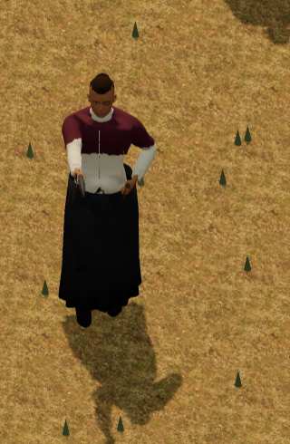
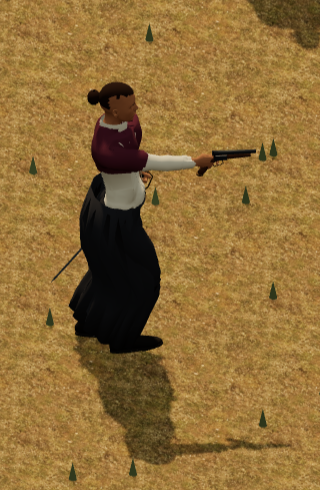
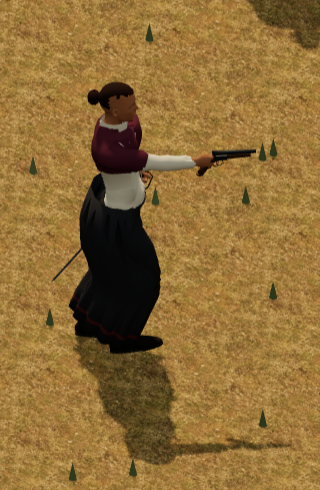

# Woman with shawl: inset rust skirt trim

The current full-body sprite reference has a narrow rust stripe above the skirt edge. The native skirt had a uniform charcoal colour after the separate palette correction. This increment adds that stripe to the sewn skirt at all three body LODs. The burgundy shawl is retained.

## Reference and scope

The review used all three [sprite consistency pages](../assets/previews/sprite-consistency/woman-shawl-1.png), [page two](../assets/previews/sprite-consistency/woman-shawl-2.png), [page three](../assets/previews/sprite-consistency/woman-shawl-3.png), the retained [full-body identity reference](../assets/source/illustrated-sprites/woman-shawl-s-identity-reference.png), and its existing prompts. The face/hand skin maps are not full-body references. This is a source-derived detail correction; it does not record new user approval or establish a historically measured fabric colour.

In the 444 × 443 identity reference, the non-magenta figure is 367 pixels tall. A restricted skirt region supplies 484 rust pixels, with median shaded RGB `(105,50,39.5)`, rounded to `#693228`. The median visible stripe is four pixels wide, with a two-to-six-pixel range. Central columns clear of the boots put its centre about 16 pixels above the skirt edge. At the retained 1.76 m native body height, these ratios imply approximately 19 mm width and 77 mm centre inset. The image contains lighting and curved edges, so these are an appearance recipe, not historical dimensions or an unlit material measurement.

The new texture has five rust rows in a 32 × 256 charcoal map. Its nominal native band is 19.047619 mm wide, with centre inset 76.730245 mm and 67.206436 mm of charcoal below the nominal band. Linear filtering gives a full-rust plateau about 15.24 mm wide and a nonzero influence about 22.86 mm wide. Both remain inset above the edge.

The source audit also found a simplified shawl shell without the reference's overlapping drape/fringe, and no satchel or diagonal strap. Those details remain separate work. This cut changes the hem only.

## Native boundary

The published legwear primitive contains both skirt and native trousers. An independent index-connectivity check identifies the 675-vertex, 1,350-face sewn skirt component from its authored bottom edge. The 1,370 trouser vertices and 1,832 trouser faces remain a separate component. No triangle interpolates between these two classifications. The postpass refuses a changed or joined sewn component.

Only the sewn component receives the height-based `TEXCOORD_1` stripe chart. Every trouser vertex uses the fixed charcoal point `(.5,.25)`, regardless of posture. All 111 repeated skirt-height groups have identical stripe phase. The exported skirt has no exact or one-micrometre coincident seam pairs; this review does not invent such pairs.

The new base-colour map uses UV1. The original UV0 component bytes, normal map, roughness map, metallic map, sampler, vertex colours, normals, positions, triangle indices, three cloth shapes, native rig, inverse binds and all animation clips remain exact. The shawl and all other material resources retain their previous atlas pixels and bindings. Triangles and draw calls are unchanged. The three bodies plus the one 233-byte PNG grow by 52,933 bytes in total.

LOD0 retains the original binary chunk as an exact prefix and appends the UV data. LOD1/2 pass through the existing canonical coarse packer. Their binary layout changes, while every old decoded component byte remains exact. Whole binary-chunk equality is therefore claimed only for the retained LOD0 prefix, not the coarse packed files. Both current coarse donor records point to the new close-body identity.

An ideal mip reference stays charcoal at the underlayer point through the two-row level. The final one-pixel mip averages 1.953125% rust texels into a small uniform tint: approximately `#323131` for encoded-byte averaging or `#333131` for linear-light averaging. The underlayer's constant UV has no implicit UV gradient and carries no authored stripe. Actual GPU mip selection and quantization were not measured; exact charcoal at every mip is not claimed.

## Normal game review

The paired review uses ordinary Ocho roster selection, owned pistol selection, posture orders, camera controls and zoom. It covers standing, crouched and prone at all three actual LODs: 18 before/after views. A second review covers four ordinary standing facing angles before and after: eight views. All browser error lists are empty. The source and model/texture network pins match at the start and end.

The subject is unselected through ordinary roster controls so the selection ring does not obscure the hem. The detail images are direct browser screenshot crops from the full normal HUD frames. The line is narrow and subtle at tactical scale; the front and side views show the retained dark border below it.

| Retained charcoal skirt | Inset rust trim |
| --- | --- |
|  |  |
|  |  |

Full HUD: [before](../artifacts/three-woman-shawl-rust-hem-review/baseline-standing-lod0.png), [after](../artifacts/three-woman-shawl-rust-hem-review/candidate-standing-lod0.png).

The first angle helper tried an unavailable fourth zoom step and failed before capture. That failed report, the earlier 81.9 mm inset trial, and the all-legwear height-chart trial are retained in the private review evidence. The accepted helper uses enabled normal controls and the sewn-only chart.

## Validation and rebuild limit

The accepted basis assets equal current main `9c3a119e` for the manifest, both banks, profile, actor runtime and appearance sources. The male bank remains `49f5d77a…`, the female bank `509a9c2c…`; both retain the current prone-heal support records. The independent preservation check proves all other 100 model files and the profile exact. All input pins are unchanged at the end.

Forty affected checks pass: 23 garment/support checks, eight palette/hem checks, and nine current prone-heal arm checks. The type check, locomotion profile check and native library verifier pass. The real GLTF parser confirms base colour on UV1 and normal/roughness/metallic channels on UV0. The sewn-component test rejects a joined underlayer. The hem postpass and the current coarse donor builder both repeat with zero byte growth and identical output hashes.

Reproduce the published detail with the separate narrow postpass, followed by the existing coarse donor pass:

```sh
python3 tools/characters-3d/build-woman-shawl-hem.py
python3 tools/characters-3d/build-reviewed-long-cloth-lods.py
node --test tests/characters-long-garments.test.mjs tests/three-long-cloth-boot-clearance.test.mjs tests/three-coarse-long-cloth-boot-clearance.test.mjs tests/three-woman-shawl-palette.test.mjs tests/three-woman-shawl-hem.test.mjs tests/three-prone-heal-arm-support.test.mjs
node tools/characters-3d/compile-locomotion-profile.mjs --check
npm run typecheck
python3 tools/characters-3d/verify-library.py
```

This cut does not claim that a complete Blender library rebuild already invokes the palette, coarse-donor and hem passes in the reviewed order. Full pipeline preservation and a targeted fresh woman-shawl export are the next separate increment. Gameplay state, paid action timing, supplies, outcomes and all cue/runtime files are unchanged. Sustained frame rate and general cloth/body polish are outside this detail acceptance.
